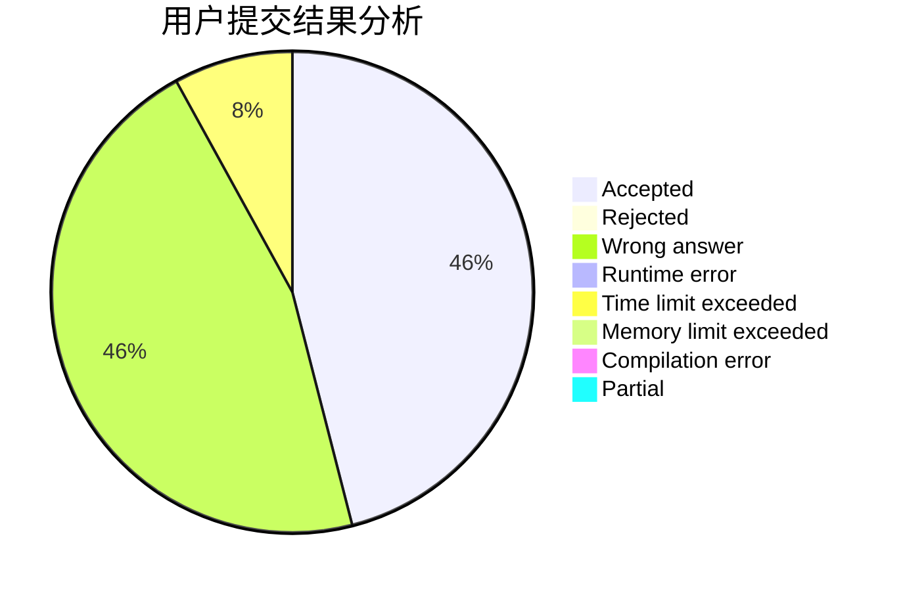
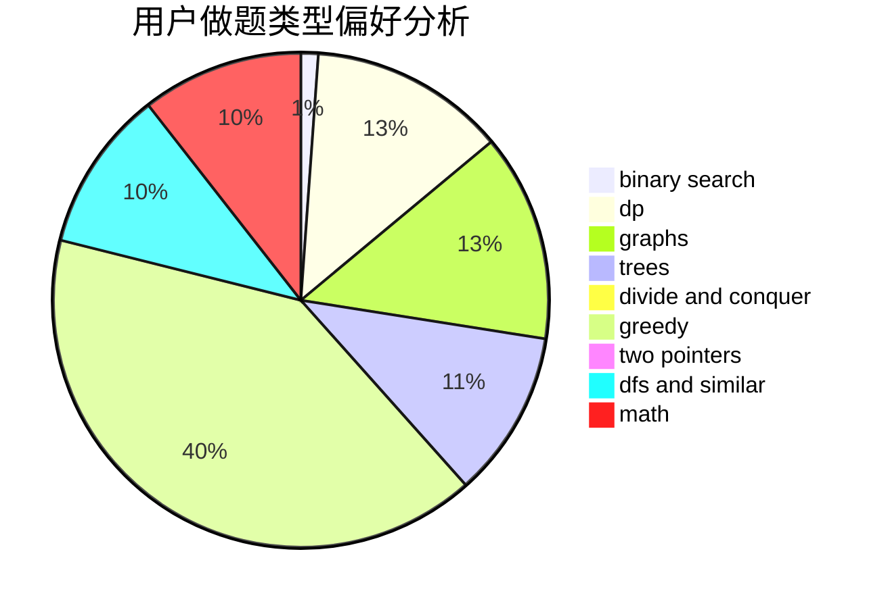

# Cyj7x

<!-- tabs:start -->

#### **用户提交结果分析**

#### **用户做题类型偏好分析**

<!-- tabs:end -->
# 推荐题目
[732B](https://codeforces.com/contest/732/problem/B)
[766E](https://codeforces.com/contest/766/problem/E)
[603B](https://codeforces.com/contest/603/problem/B)
[32B](https://codeforces.com/contest/32/problem/B)
[1342F](https://codeforces.com/contest/1342/problem/F)
[767A](https://codeforces.com/contest/767/problem/A)
[590A](https://codeforces.com/contest/590/problem/A)
[474A](https://codeforces.com/contest/474/problem/A)
[604C](https://codeforces.com/contest/604/problem/C)
[611E](https://codeforces.com/contest/611/problem/E)
