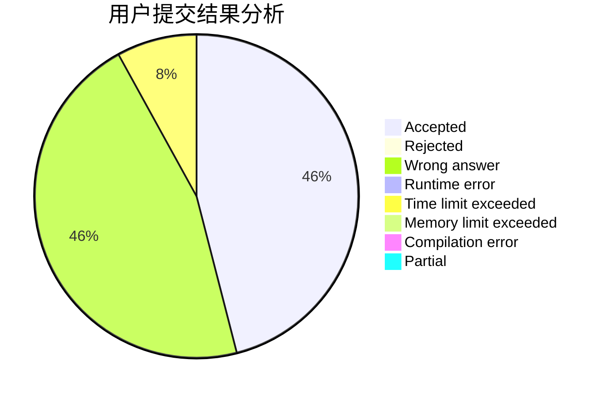
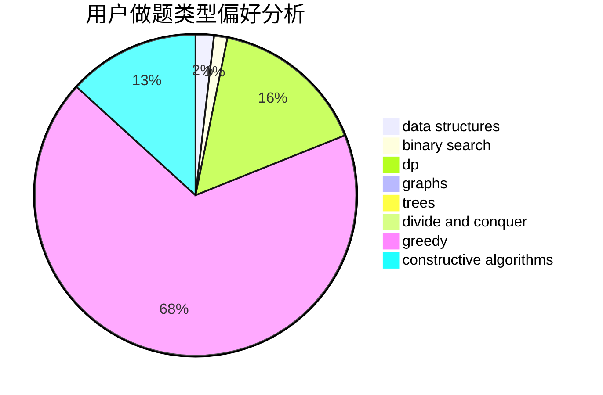

# Cyj7x

<!-- tabs:start -->

#### **用户提交结果分析**

#### **用户做题类型偏好分析**

#### **用户错题知识点分析**

<!-- tabs:end -->
# 推荐题目
[713A](https://codeforces.com/contest/713/problem/A)		data structures,
                        implementation		  
[747B](https://codeforces.com/contest/747/problem/B)		implementation,
                        strings		  
[582B](https://codeforces.com/contest/582/problem/B)		constructive algorithms,
                        dp,
                        matrices		  
[309C](https://codeforces.com/contest/309/problem/C)		binary search,
                        bitmasks,
                        greedy		  
[1335E2](https://codeforces.com/contest/1335E/problem/2)		brute force,
                        data structures,
                        dp,
                        two pointers		  
[747D](https://codeforces.com/contest/747/problem/D)		dp,
                        greedy,
                        sortings		  
[56E](https://codeforces.com/contest/56/problem/E)		binary search,
                        data structures,
                        sortings		  
[452A](https://codeforces.com/contest/452/problem/A)		brute force,
                        implementation,
                        strings		  
[584C](https://codeforces.com/contest/584/problem/C)		constructive algorithms,
                        greedy,
                        strings		  
[592C](https://codeforces.com/contest/592/problem/C)		math		  
