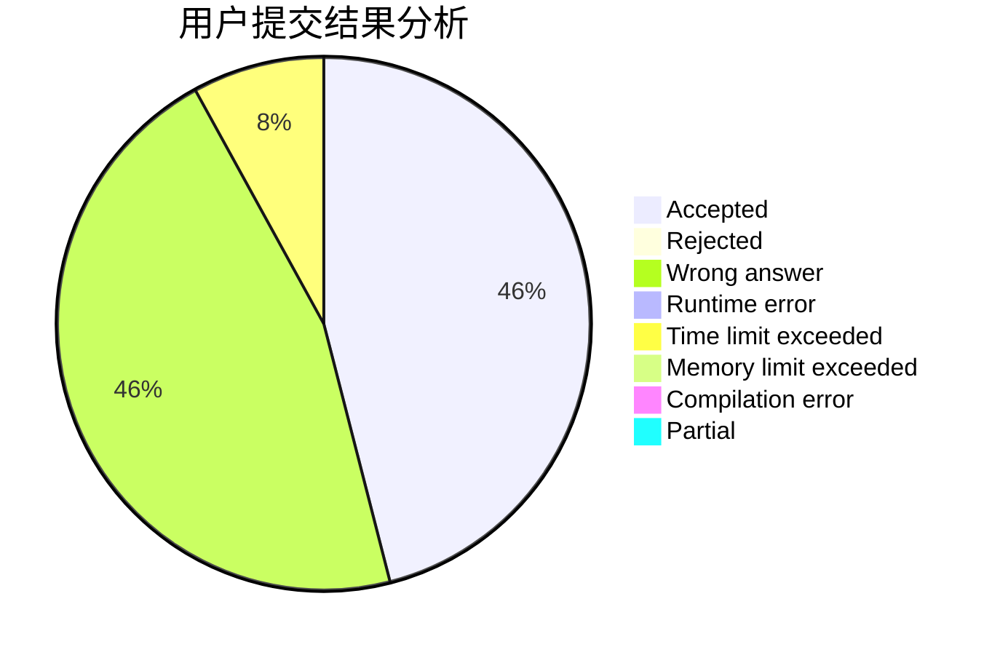
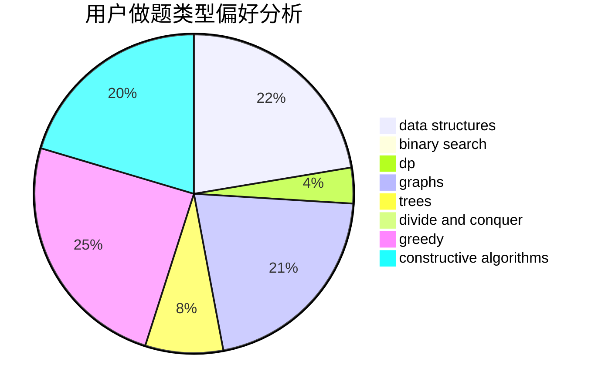

# Cyj7x

<!-- tabs:start -->

#### **用户提交结果分析**

#### **用户做题类型偏好分析**

#### **用户错题知识点分析**

<!-- tabs:end -->
# 推荐题目
[732B](https://codeforces.com/contest/732/problem/B)		dp,
                        greedy		  
[766E](https://codeforces.com/contest/766/problem/E)		bitmasks,
                        constructive algorithms,
                        data structures,
                        dfs and similar,
                        dp,
                        math,
                        trees		  
[603B](https://codeforces.com/contest/603/problem/B)		combinatorics,
                        dfs and similar,
                        dsu,
                        math,
                        number theory		  
[32B](https://codeforces.com/contest/32/problem/B)		expression parsing,
                        implementation		  
[1342F](https://codeforces.com/contest/1342/problem/F)		bitmasks,
                        brute force,
                        dp		  
[767A](https://codeforces.com/contest/767/problem/A)		data structures,
                        implementation		  
[590A](https://codeforces.com/contest/590/problem/A)		implementation		  
[474A](https://codeforces.com/contest/474/problem/A)		implementation		  
[604C](https://codeforces.com/contest/604/problem/C)		dsu,graphs,sortings,trees		  
[611E](https://codeforces.com/contest/611/problem/E)		data structures,
                        greedy,
                        sortings		  
