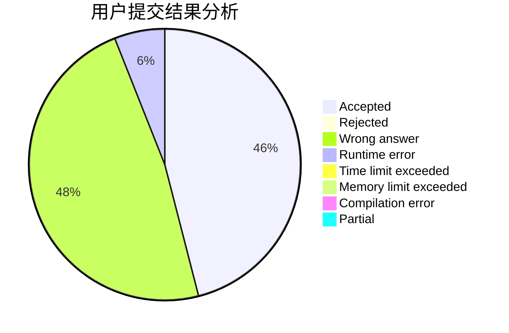
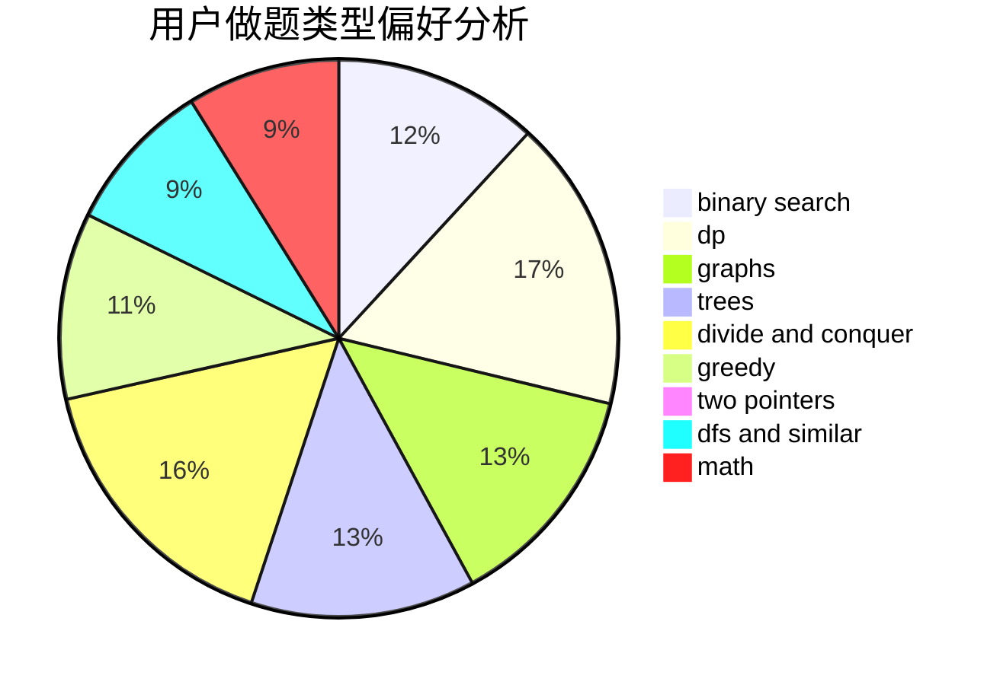

# Cyprien

<!-- tabs:start -->

#### **用户提交结果分析**

#### **用户做题类型偏好分析**

<!-- tabs:end -->
# 推荐题目
[360D](https://codeforces.com/contest/360/problem/D)
[1089A](https://codeforces.com/contest/1089/problem/A)
[1001I](https://codeforces.com/contest/1001/problem/I)
[232E](https://codeforces.com/contest/232/problem/E)
[767D](https://codeforces.com/contest/767/problem/D)
[1243D](https://codeforces.com/contest/1243/problem/D)
[19A](https://codeforces.com/contest/19/problem/A)
[46F](https://codeforces.com/contest/46/problem/F)
[611E](https://codeforces.com/contest/611/problem/E)
[1119B](https://codeforces.com/contest/1119/problem/B)
