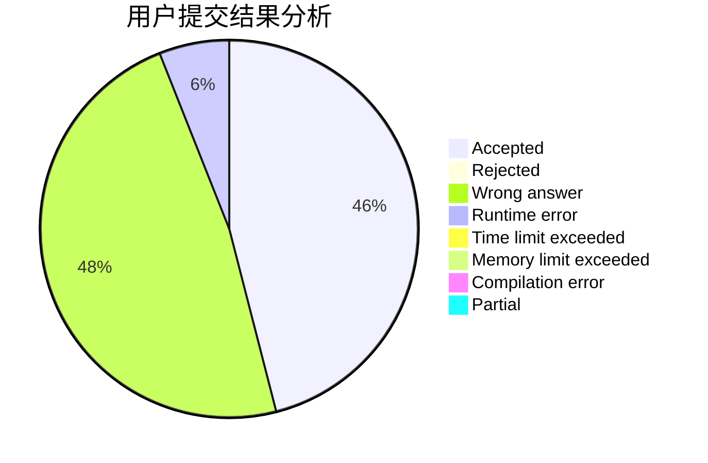
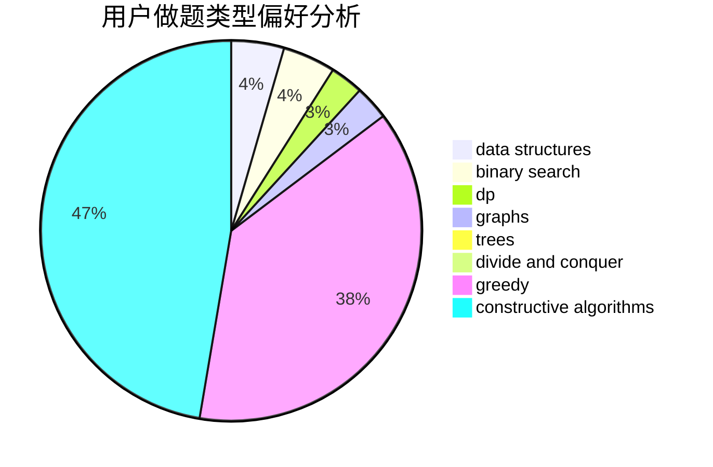
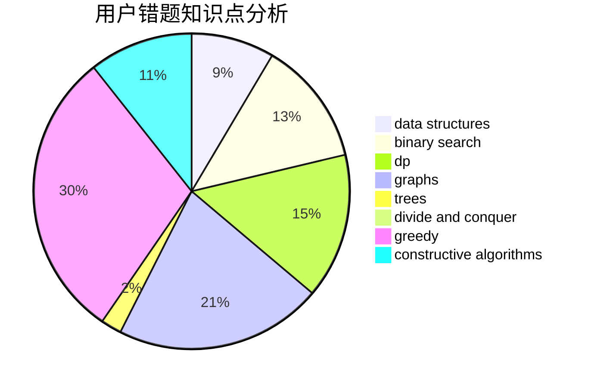

# Cyprien

<!-- tabs:start -->

#### **用户提交结果分析**

#### **用户做题类型偏好分析**

#### **用户错题知识点分析**

<!-- tabs:end -->
# 推荐题目
[334B](https://codeforces.com/contest/334/problem/B)		sortings		  
[1088D](https://codeforces.com/contest/1088/problem/D)		bitmasks,
                        constructive algorithms,
                        implementation,
                        interactive		  
[1001I](https://codeforces.com/contest/1001/problem/I)		*special problem		  
[213C](https://codeforces.com/contest/213/problem/C)		dp		  
[748C](https://codeforces.com/contest/748/problem/C)		constructive algorithms,
                        math		  
[1238D](https://codeforces.com/contest/1238/problem/D)		binary search,
                        combinatorics,
                        dp,
                        strings		  
[171H](https://codeforces.com/contest/171/problem/H)		*special problem,
                        implementation		  
[44A](https://codeforces.com/contest/44/problem/A)		implementation		  
[592C](https://codeforces.com/contest/592/problem/C)		math		  
[1117C](https://codeforces.com/contest/1117/problem/C)		binary search		  
