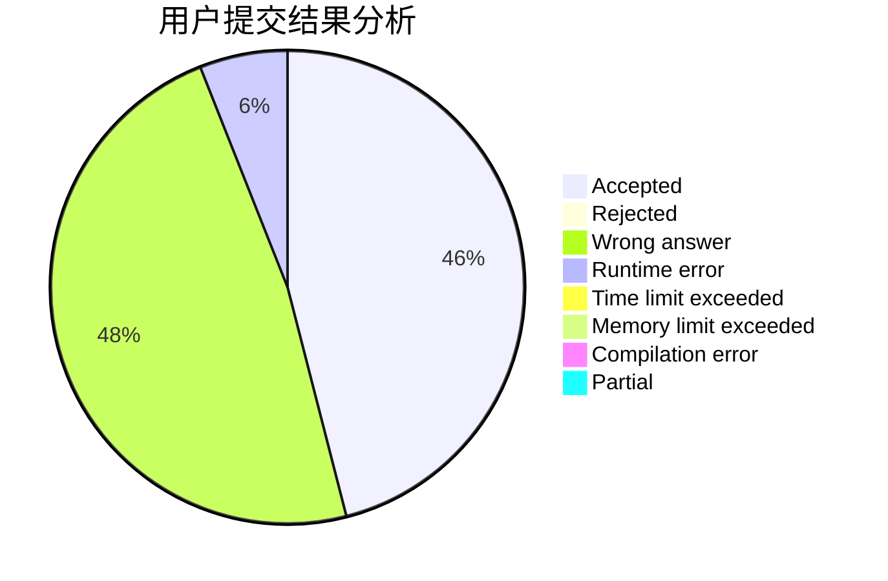
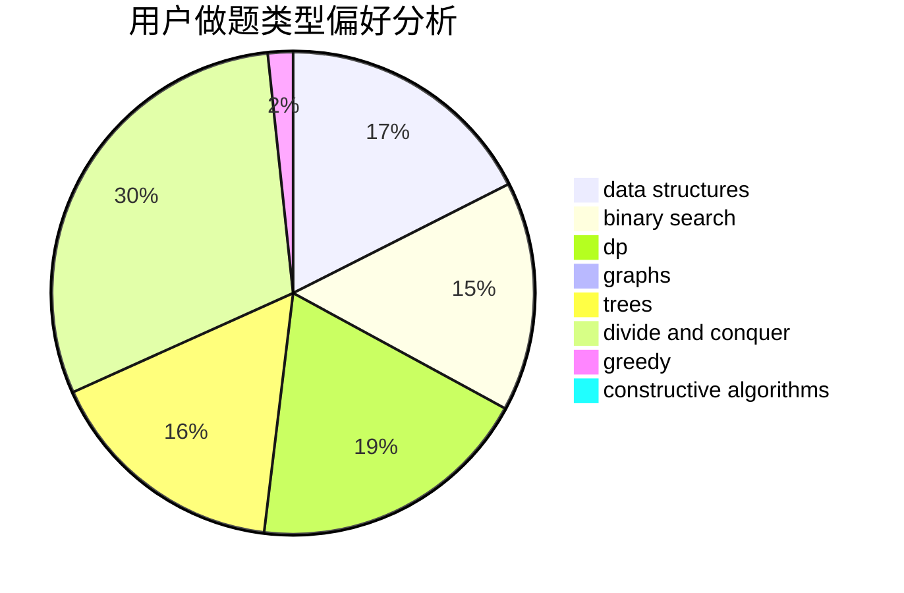
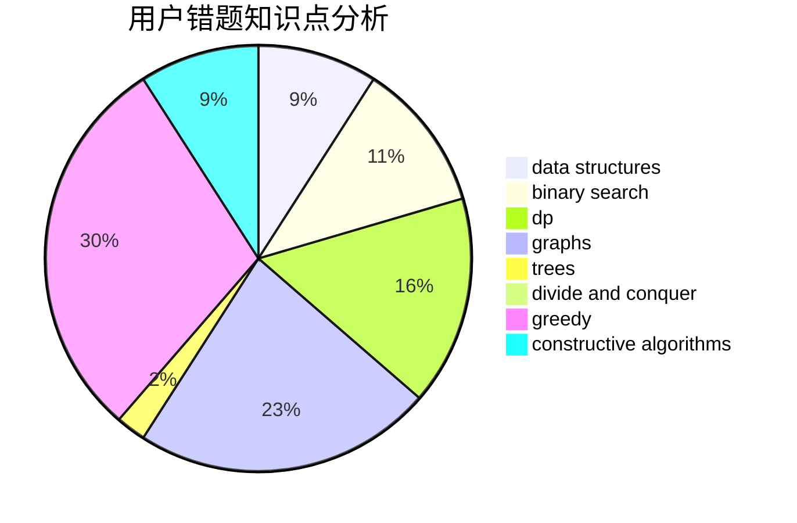

# Cyprien

<!-- tabs:start -->

#### **用户提交结果分析**

#### **用户做题类型偏好分析**

#### **用户错题知识点分析**

<!-- tabs:end -->
# 推荐题目
[360D](https://codeforces.com/contest/360/problem/D)		number theory		  
[1089A](https://codeforces.com/contest/1089/problem/A)		dp		  
[1001I](https://codeforces.com/contest/1001/problem/I)		*special problem		  
[232E](https://codeforces.com/contest/232/problem/E)		bitmasks,
                        divide and conquer,
                        dp		  
[767D](https://codeforces.com/contest/767/problem/D)		binary search,
                        data structures,
                        greedy,
                        sortings,
                        two pointers		  
[1243D](https://codeforces.com/contest/1243/problem/D)		dsu,graphs,sortings,trees		  
[19A](https://codeforces.com/contest/19/problem/A)		implementation		  
[46F](https://codeforces.com/contest/46/problem/F)		dsu,
                        graphs		  
[611E](https://codeforces.com/contest/611/problem/E)		data structures,
                        greedy,
                        sortings		  
[1119B](https://codeforces.com/contest/1119/problem/B)		binary search,
                        flows,
                        greedy,
                        sortings		  
