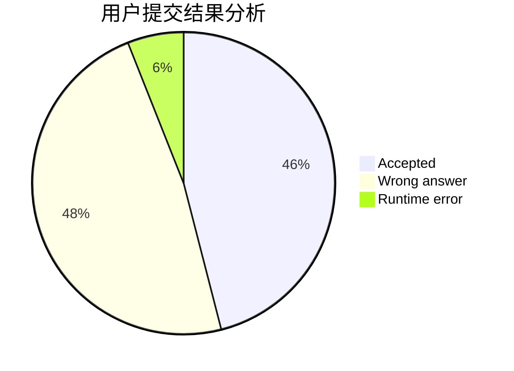
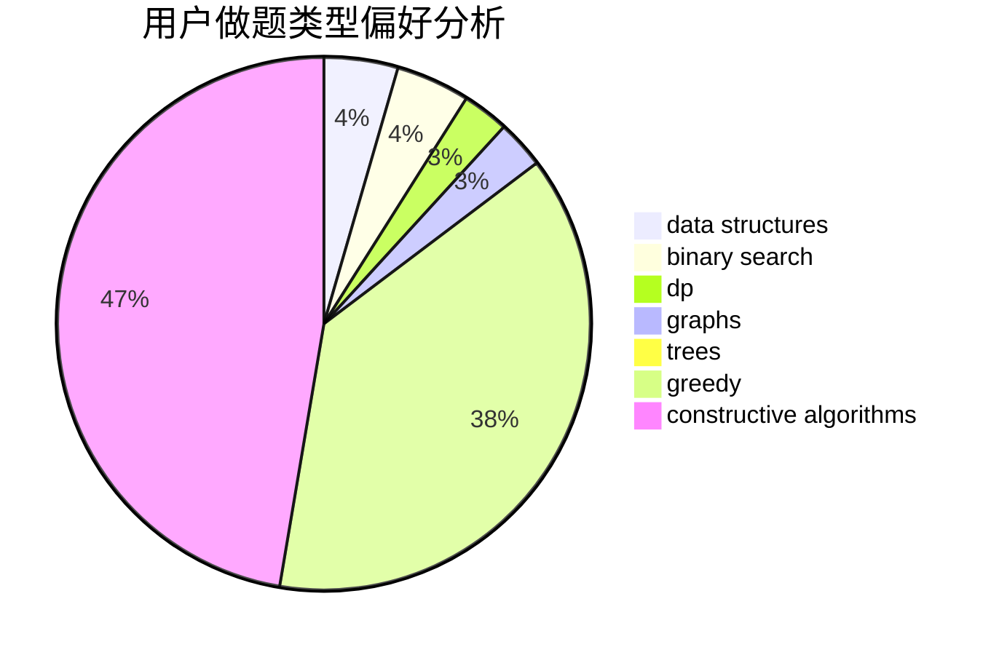
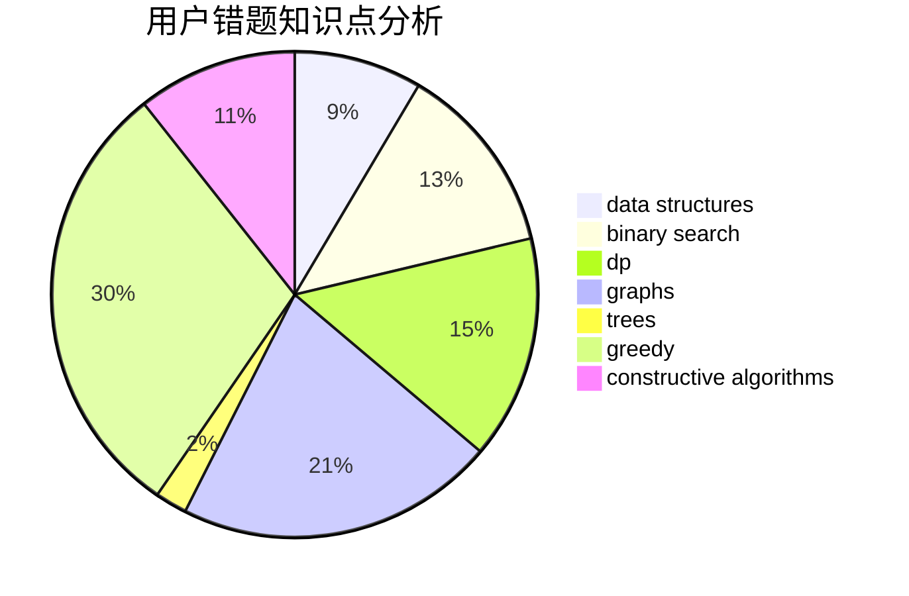

# Cyprien
<!-- tabs:start -->
#### **用户提交结果分析**

#### **用户做题类型偏好分析**

#### **用户错题知识点分析**

<!-- tabs:end -->
# 推荐题目
[Eight Point Sets](http://codeforces.com/problemset/problem/334/B)		sortings		  
[The Big Race](http://codeforces.com/problemset/problem/592/C)		math		  
[Santa Claus and Robot](http://codeforces.com/problemset/problem/748/C)		constructive algorithms,
                        math		  
[Ehab and another another xor problem](http://codeforces.com/problemset/problem/1088/D)		bitmasks,
                        constructive algorithms,
                        implementation,
                        interactive		  
[Indian Summer](http://codeforces.com/problemset/problem/44/A)		implementation		  
[Deutsch-Jozsa algorithm](http://codeforces.com/problemset/problem/1001/I)		*special problem		  
[Data Center Drama](https://codeforces.com/contest/528/problem/C)		dfs and similar,
                        graphs		  
[Relay Race](http://codeforces.com/problemset/problem/213/C)		dp		  
[AB-string](http://codeforces.com/problemset/problem/1238/D)		binary search,
                        combinatorics,
                        dp,
                        strings		  
[Two Teams Composing](http://codeforces.com/problemset/problem/1335/C)		binary search,
                        greedy,
                        implementation,
                        sortings		  
<!-- tabs:start -->
#### **data structures**
[Journey](http://codeforces.com/problemset/problem/1336/F)		data structures,
                        divide and conquer,
                        graphs,
                        trees		  
[Dune II: Battle For Arrakis](http://codeforces.com/problemset/problem/1346/F)		*special problem,
                        data structures,
                        greedy,
                        math		  
[Tree Generator™](https://codeforces.com/contest/1150/problem/E)		data structures,
                        implementation,
                        trees		  
[Santa Claus and a Palindrome](http://codeforces.com/problemset/problem/748/D)		constructive algorithms,
                        data structures,
                        greedy		  
[Maximum width](http://codeforces.com/problemset/problem/1492/C)		binary search,
                        data structures,
                        dp,
                        greedy,
                        two pointers		  
[Old Floppy Drive](http://codeforces.com/problemset/problem/1490/G)		binary search,
                        data structures,
                        math		  
[Odd Mineral Resource](http://codeforces.com/problemset/problem/1479/D)		binary search,
                        bitmasks,
                        brute force,
                        data structures,
                        probabilities,
                        trees		  
[Meximization](http://codeforces.com/problemset/problem/1497/A)		brute force,
                        data structures,
                        greedy,
                        sortings		  
[Pekora and Trampoline](http://codeforces.com/problemset/problem/1491/C)		brute force,
                        data structures,
                        dp,
                        greedy,
                        implementation		  
[Card Deck](http://codeforces.com/problemset/problem/1492/B)		data structures,
                        greedy,
                        math		  
#### **binary search**
[AB-string](http://codeforces.com/problemset/problem/1238/D)		binary search,
                        combinatorics,
                        dp,
                        strings		  
[Two Teams Composing](http://codeforces.com/problemset/problem/1335/C)		binary search,
                        greedy,
                        implementation,
                        sortings		  
[Verse For Santa](http://codeforces.com/problemset/problem/1279/B)		binary search,
                        brute force,
                        implementation		  
[Magic Ship](http://codeforces.com/problemset/problem/1117/C)		binary search		  
[Hack it!](http://codeforces.com/problemset/problem/468/C)		binary search,
                        constructive algorithms,
                        math		  
[Maximum width](http://codeforces.com/problemset/problem/1492/C)		binary search,
                        data structures,
                        dp,
                        greedy,
                        two pointers		  
[Pairs](http://codeforces.com/problemset/problem/1463/D)		binary search,
                        constructive algorithms,
                        greedy,
                        two pointers		  
[Old Floppy Drive](http://codeforces.com/problemset/problem/1490/G)		binary search,
                        data structures,
                        math		  
[Odd Mineral Resource](http://codeforces.com/problemset/problem/1479/D)		binary search,
                        bitmasks,
                        brute force,
                        data structures,
                        probabilities,
                        trees		  
[Complicated Computations](http://codeforces.com/problemset/problem/1436/E)		binary search,
                        data structures,
                        two pointers		  
#### **dp**
[Relay Race](http://codeforces.com/problemset/problem/213/C)		dp		  
[AB-string](http://codeforces.com/problemset/problem/1238/D)		binary search,
                        combinatorics,
                        dp,
                        strings		  
[Creating the Contest](http://codeforces.com/problemset/problem/1029/B)		dp,
                        greedy,
                        math		  
[Marbles](http://codeforces.com/problemset/problem/1215/E)		bitmasks,
                        dp		  
[Omkar and Last Floor](http://codeforces.com/problemset/problem/1372/E)		dp,
                        greedy,
                        two pointers		  
[Maximum width](http://codeforces.com/problemset/problem/1492/C)		binary search,
                        data structures,
                        dp,
                        greedy,
                        two pointers		  
[Bouncing Ball](https://codeforces.com/contest/1457/problem/C)		brute force,
                        dp,
                        implementation		  
[Pekora and Trampoline](http://codeforces.com/problemset/problem/1491/C)		brute force,
                        data structures,
                        dp,
                        greedy,
                        implementation		  
[Chef Monocarp](http://codeforces.com/problemset/problem/1437/C)		dp,
                        flows,
                        graph matchings,
                        greedy,
                        math,
                        sortings		  
[Binary Removals](http://codeforces.com/problemset/problem/1499/B)		brute force,
                        dp,
                        greedy,
                        implementation		  
#### **graph**
[Data Center Drama](https://codeforces.com/contest/528/problem/C)		dfs and similar,
                        graphs		  
[Planar Perimeter](http://codeforces.com/problemset/problem/1242/E)		constructive algorithms,
                        graphs		  
[Journey](http://codeforces.com/problemset/problem/1336/F)		data structures,
                        divide and conquer,
                        graphs,
                        trees		  
[Minimum Ties](http://codeforces.com/problemset/problem/1487/C)		brute force,
                        constructive algorithms,
                        dfs and similar,
                        graphs,
                        greedy,
                        implementation,
                        math		  
[Chef Monocarp](http://codeforces.com/problemset/problem/1437/C)		dp,
                        flows,
                        graph matchings,
                        greedy,
                        math,
                        sortings		  
[Strange Housing](http://codeforces.com/problemset/problem/1470/D)		constructive algorithms,
                        dfs and similar,
                        graph matchings,
                        graphs,
                        greedy		  
[Longest Simple Cycle](http://codeforces.com/problemset/problem/1476/C)		dp,
                        graphs,
                        greedy		  
[Shortest and Longest LIS](http://codeforces.com/problemset/problem/1304/D)		constructive algorithms,
                        graphs,
                        greedy,
                        two pointers		  
[Ball in Berland](http://codeforces.com/problemset/problem/1475/C)		combinatorics,
                        graphs,
                        math		  
[Kyoya and Train](http://codeforces.com/problemset/problem/553/E)		dp,
                        fft,
                        graphs,
                        math,
                        probabilities		  
#### **trees**
[Journey](http://codeforces.com/problemset/problem/1336/F)		data structures,
                        divide and conquer,
                        graphs,
                        trees		  
[Tree Generator™](https://codeforces.com/contest/1150/problem/E)		data structures,
                        implementation,
                        trees		  
[Odd Mineral Resource](http://codeforces.com/problemset/problem/1479/D)		binary search,
                        bitmasks,
                        brute force,
                        data structures,
                        probabilities,
                        trees		  
[Yet Another Card Deck](http://codeforces.com/problemset/problem/1511/C)		brute force,
                        data structures,
                        implementation,
                        trees		  
[Diameter Cuts](http://codeforces.com/problemset/problem/1499/F)		combinatorics,
                        dfs and similar,
                        dp,
                        trees		  
[Fib-tree](http://codeforces.com/problemset/problem/1491/E)		brute force,
                        dfs and similar,
                        divide and conquer,
                        number theory,
                        trees		  
[13th Labour of Heracles](http://codeforces.com/problemset/problem/1466/D)		data structures,
                        greedy,
                        sortings,
                        trees		  
[BFS Trees](http://codeforces.com/problemset/problem/1495/D)		combinatorics,
                        dfs and similar,
                        graphs,
                        math,
                        shortest paths,
                        trees		  
[Sum of Prefix Sums](http://codeforces.com/problemset/problem/1303/G)		data structures,
                        divide and conquer,
                        geometry,
                        trees		  
[Number of Simple Paths](http://codeforces.com/problemset/problem/1454/E)		combinatorics,
                        dfs and similar,
                        graphs,
                        trees		  
#### **divide and conquer**
[Journey](http://codeforces.com/problemset/problem/1336/F)		data structures,
                        divide and conquer,
                        graphs,
                        trees		  
[Divide and Summarize](http://codeforces.com/problemset/problem/1461/D)		binary search,
                        brute force,
                        data structures,
                        divide and conquer,
                        implementation,
                        sortings		  
[Song of the Sirens](http://codeforces.com/problemset/problem/1466/G)		combinatorics,
                        divide and conquer,
                        hashing,
                        math,
                        string suffix structures,
                        strings		  
[Permutation Transformation](http://codeforces.com/problemset/problem/1490/D)		dfs and similar,
                        divide and conquer,
                        implementation		  
[Skyline Photo](https://codeforces.com/contest/1483/problem/C)		data structures,
                        divide and conquer,
                        dp		  
[Fib-tree](http://codeforces.com/problemset/problem/1491/E)		brute force,
                        dfs and similar,
                        divide and conquer,
                        number theory,
                        trees		  
[Sum of Prefix Sums](http://codeforces.com/problemset/problem/1303/G)		data structures,
                        divide and conquer,
                        geometry,
                        trees		  
[Dogeforces](http://codeforces.com/problemset/problem/1494/D)		constructive algorithms,
                        data structures,
                        dfs and similar,
                        divide and conquer,
                        dsu,
                        greedy,
                        sortings,
                        trees		  
[Logistical Questions](http://codeforces.com/problemset/problem/566/C)		dfs and similar,
                        divide and conquer,
                        trees		  
[Fruit Sequences](http://codeforces.com/problemset/problem/1428/F)		binary search,
                        data structures,
                        divide and conquer,
                        dp,
                        two pointers		  
#### **greedy**
[Two Teams Composing](http://codeforces.com/problemset/problem/1335/C)		binary search,
                        greedy,
                        implementation,
                        sortings		  
[Creating the Contest](http://codeforces.com/problemset/problem/1029/B)		dp,
                        greedy,
                        math		  
[Bachgold Problem](http://codeforces.com/problemset/problem/749/A)		greedy,
                        implementation,
                        math,
                        number theory		  
[Dune II: Battle For Arrakis](http://codeforces.com/problemset/problem/1346/F)		*special problem,
                        data structures,
                        greedy,
                        math		  
[Polygons](http://codeforces.com/problemset/problem/1208/G)		greedy,
                        math,
                        number theory		  
[Santa Claus and a Palindrome](http://codeforces.com/problemset/problem/748/D)		constructive algorithms,
                        data structures,
                        greedy		  
[Omkar and Last Floor](http://codeforces.com/problemset/problem/1372/E)		dp,
                        greedy,
                        two pointers		  
[Array Rearrangment](http://codeforces.com/problemset/problem/1445/A)		greedy,
                        sortings		  
[Maximum width](http://codeforces.com/problemset/problem/1492/C)		binary search,
                        data structures,
                        dp,
                        greedy,
                        two pointers		  
[Diamond Miner](https://codeforces.com/contest/1496/problem/C)		geometry,
                        greedy,
                        math,
                        sortings		  
#### **constructive algorithms**
[Santa Claus and Robot](http://codeforces.com/problemset/problem/748/C)		constructive algorithms,
                        math		  
[Ehab and another another xor problem](http://codeforces.com/problemset/problem/1088/D)		bitmasks,
                        constructive algorithms,
                        implementation,
                        interactive		  
[Planar Perimeter](http://codeforces.com/problemset/problem/1242/E)		constructive algorithms,
                        graphs		  
[Santa Claus and a Palindrome](http://codeforces.com/problemset/problem/748/D)		constructive algorithms,
                        data structures,
                        greedy		  
[Hack it!](http://codeforces.com/problemset/problem/468/C)		binary search,
                        constructive algorithms,
                        math		  
[Anti-knapsack](http://codeforces.com/problemset/problem/1493/A)		constructive algorithms,
                        greedy		  
[Pairs](http://codeforces.com/problemset/problem/1463/D)		binary search,
                        constructive algorithms,
                        greedy,
                        two pointers		  
[XOR-gun](https://codeforces.com/contest/1456/problem/B)		bitmasks,
                        brute force,
                        constructive algorithms		  
[Genius's Gambit](http://codeforces.com/problemset/problem/1492/D)		bitmasks,
                        constructive algorithms,
                        greedy,
                        math		  
[3-Coloring](https://codeforces.com/contest/1504/problem/D)		constructive algorithms,
                        games,
                        interactive		  
#### **sortings**
[Eight Point Sets](http://codeforces.com/problemset/problem/334/B)		sortings		  
[Two Teams Composing](http://codeforces.com/problemset/problem/1335/C)		binary search,
                        greedy,
                        implementation,
                        sortings		  
[Array Rearrangment](http://codeforces.com/problemset/problem/1445/A)		greedy,
                        sortings		  
[Diamond Miner](https://codeforces.com/contest/1496/problem/C)		geometry,
                        greedy,
                        math,
                        sortings		  
[Meximization](http://codeforces.com/problemset/problem/1497/A)		brute force,
                        data structures,
                        greedy,
                        sortings		  
[Avoiding Zero](http://codeforces.com/problemset/problem/1427/A)		math,
                        sortings		  
[Divide and Summarize](http://codeforces.com/problemset/problem/1461/D)		binary search,
                        brute force,
                        data structures,
                        divide and conquer,
                        implementation,
                        sortings		  
[Chef Monocarp](http://codeforces.com/problemset/problem/1437/C)		dp,
                        flows,
                        graph matchings,
                        greedy,
                        math,
                        sortings		  
[Replacing Elements](http://codeforces.com/problemset/problem/1473/A)		greedy,
                        implementation,
                        math,
                        sortings		  
[Eastern Exhibition](http://codeforces.com/problemset/problem/1486/B)		binary search,
                        geometry,
                        shortest paths,
                        sortings		  
<!-- tabs:end -->
