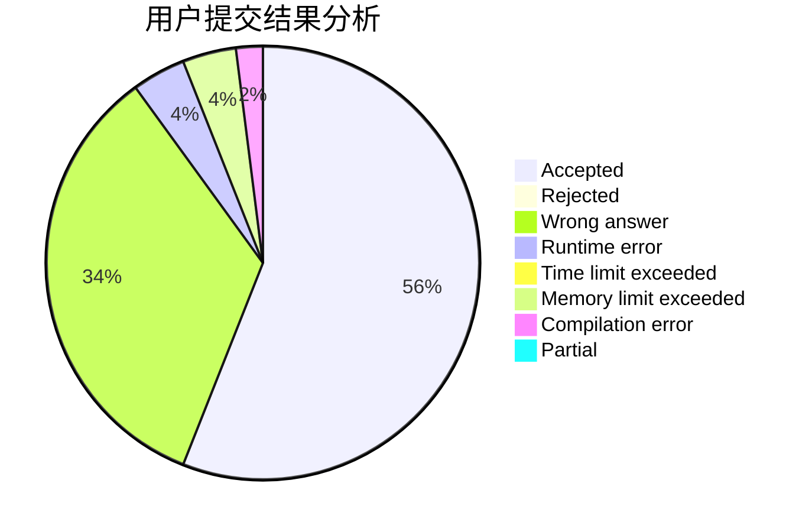
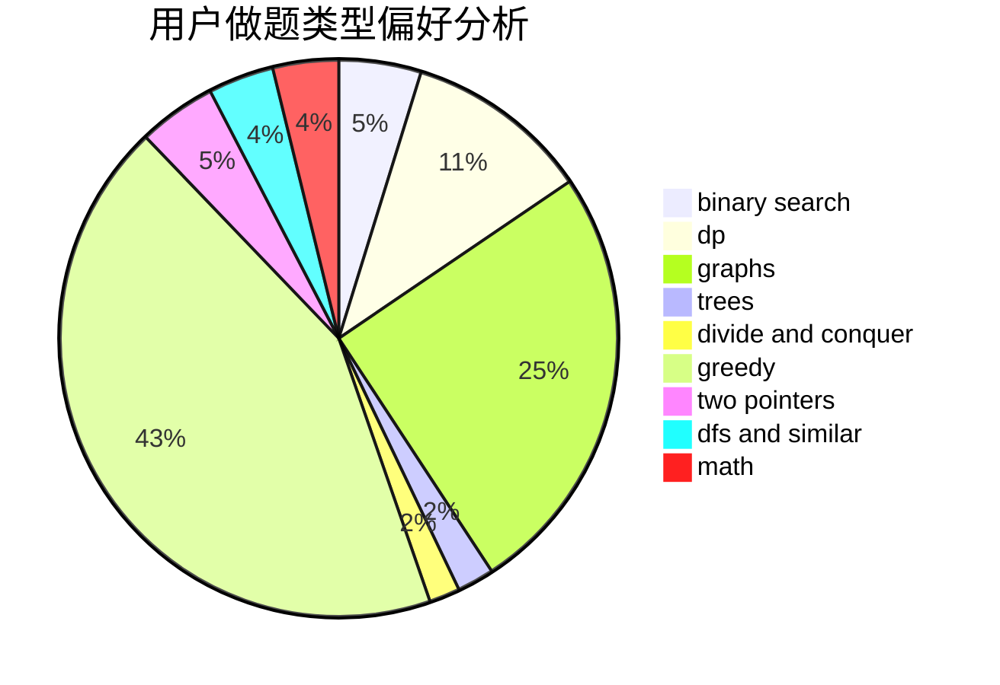

# Czhgugugu

<!-- tabs:start -->

#### **用户提交结果分析**

#### **用户做题类型偏好分析**

<!-- tabs:end -->
# 推荐题目
[1141D](https://codeforces.com/contest/1141/problem/D)
[1156A](https://codeforces.com/contest/1156/problem/A)
[323C](https://codeforces.com/contest/323/problem/C)
[23B](https://codeforces.com/contest/23/problem/B)
[1183H](https://codeforces.com/contest/1183/problem/H)
[14D](https://codeforces.com/contest/14/problem/D)
[1159C](https://codeforces.com/contest/1159/problem/C)
[1111C](https://codeforces.com/contest/1111/problem/C)
[240E](https://codeforces.com/contest/240/problem/E)
[13932](https://codeforces.com/contest/1393/problem/2)
