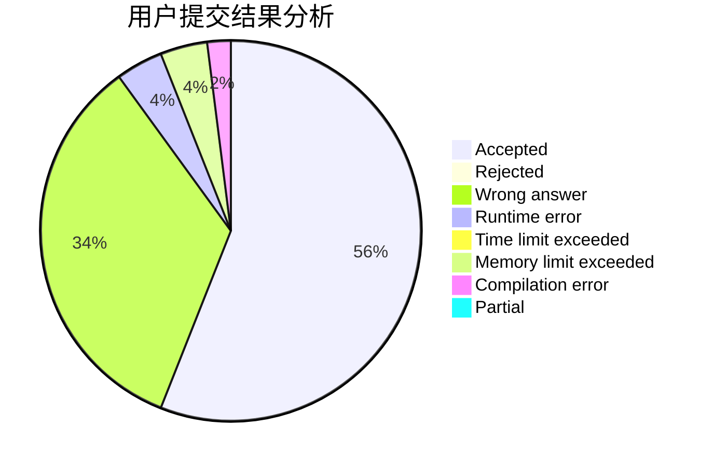
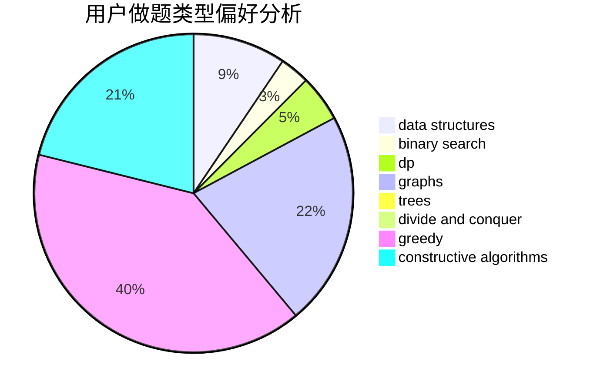
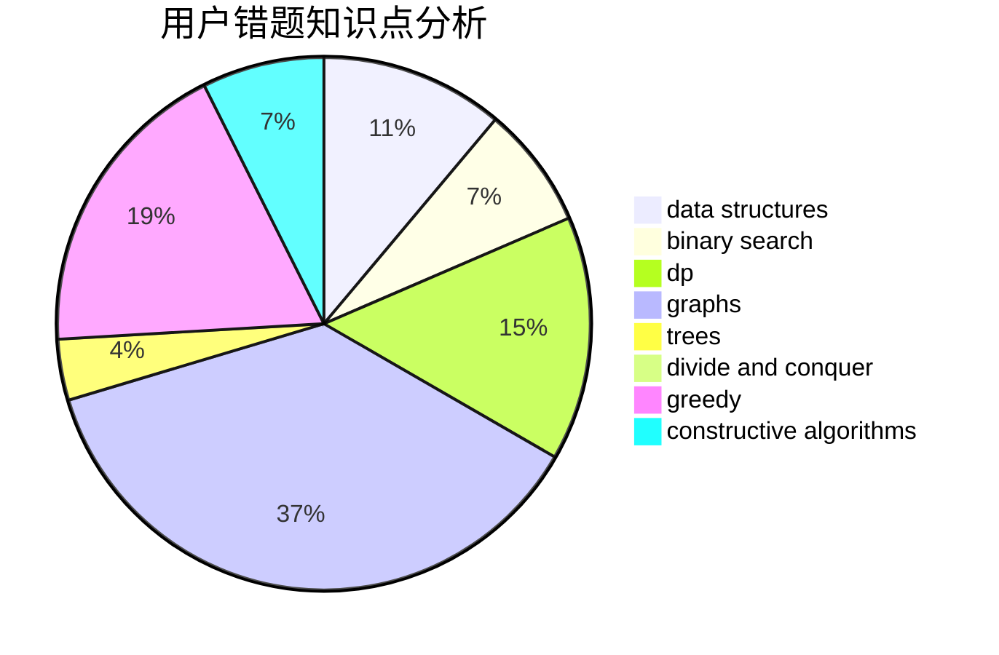

# Czhgugugu

<!-- tabs:start -->

#### **用户提交结果分析**

#### **用户做题类型偏好分析**

#### **用户错题知识点分析**

<!-- tabs:end -->
# 推荐题目
[1141D](https://codeforces.com/contest/1141/problem/D)		greedy,
                        implementation		  
[1156A](https://codeforces.com/contest/1156/problem/A)		geometry		  
[323C](https://codeforces.com/contest/323/problem/C)		data structures		  
[23B](https://codeforces.com/contest/23/problem/B)		constructive algorithms,
                        graphs,
                        math		  
[1183H](https://codeforces.com/contest/1183/problem/H)		dp,
                        strings		  
[14D](https://codeforces.com/contest/14/problem/D)		dfs and similar,
                        dp,
                        graphs,
                        shortest paths,
                        trees,
                        two pointers		  
[1159C](https://codeforces.com/contest/1159/problem/C)		dsu,graphs,sortings,trees		  
[1111C](https://codeforces.com/contest/1111/problem/C)		binary search,
                        brute force,
                        divide and conquer,
                        math		  
[240E](https://codeforces.com/contest/240/problem/E)		dfs and similar,
                        graphs,
                        greedy		  
[13932](https://codeforces.com/contest/1393/problem/2)		dsu,graphs,sortings,trees		  
