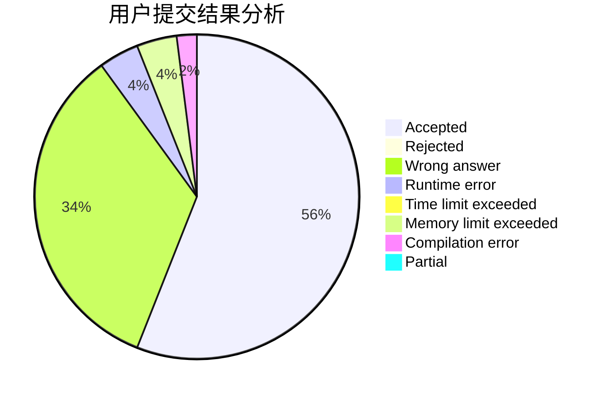
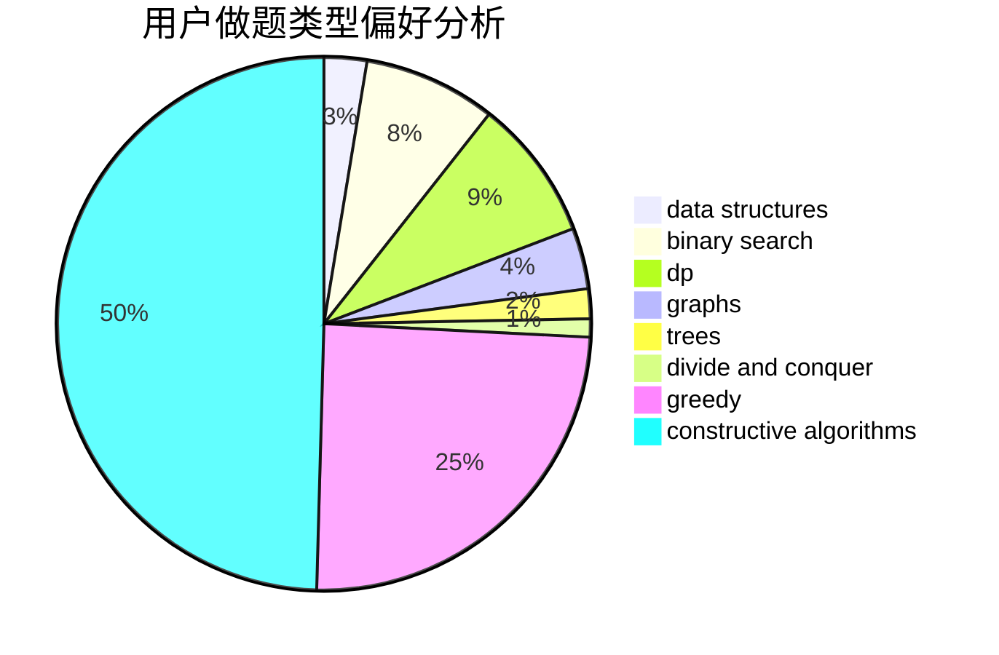
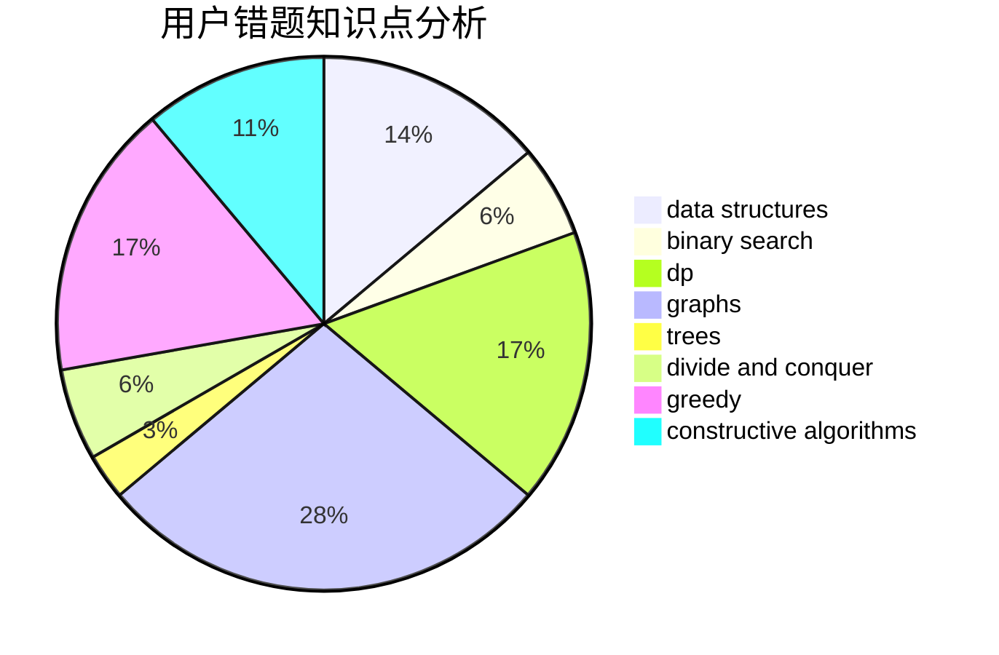

# Czhgugugu

<!-- tabs:start -->

#### **用户提交结果分析**

#### **用户做题类型偏好分析**

#### **用户错题知识点分析**

<!-- tabs:end -->
# 推荐题目
[113D](https://codeforces.com/contest/113/problem/D)		math,
                        matrices,
                        probabilities		  
[1154A](https://codeforces.com/contest/1154/problem/A)		math		  
[304B](https://codeforces.com/contest/304/problem/B)		brute force,
                        implementation		  
[21D](https://codeforces.com/contest/21/problem/D)		bitmasks,
                        graph matchings,
                        graphs		  
[1181C](https://codeforces.com/contest/1181/problem/C)		brute force,
                        combinatorics,
                        dp,
                        implementation		  
[1491G](https://codeforces.com/contest/1491/problem/G)		constructive algorithms,
                        graphs,
                        math		  
[1157C1](https://codeforces.com/contest/1157C/problem/1)		greedy		  
[1110H](https://codeforces.com/contest/1110/problem/H)		dp,
                        strings		  
[220E](https://codeforces.com/contest/220/problem/E)		data structures,
                        two pointers		  
[1383C](https://codeforces.com/contest/1383/problem/C)		bitmasks,
                        dp,
                        graphs,
                        trees		  
