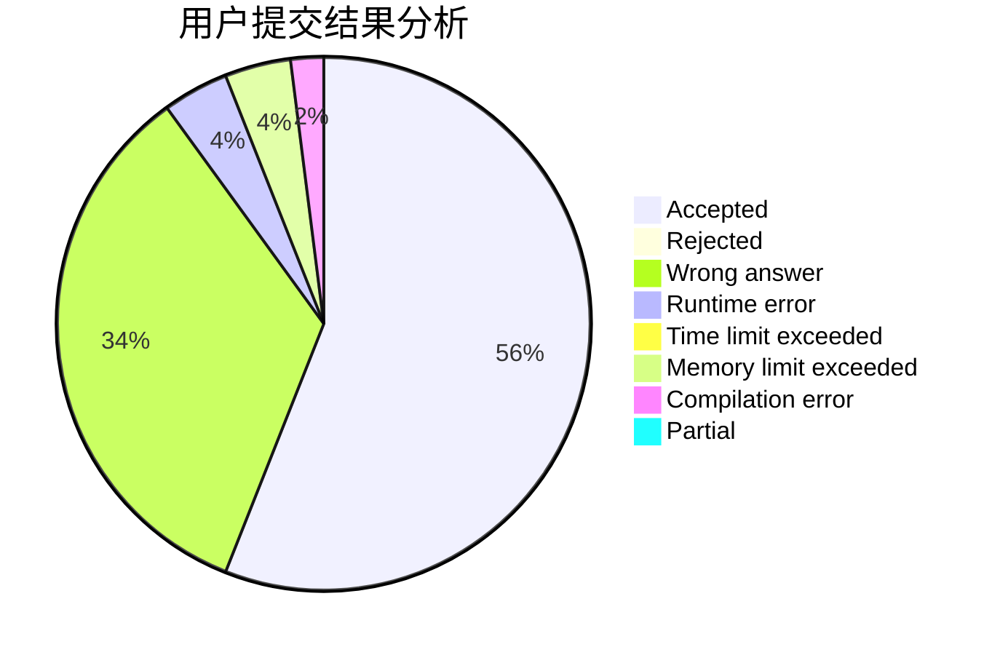
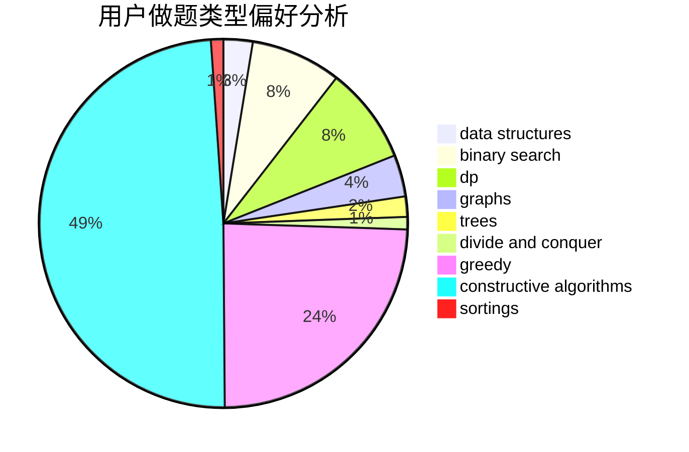
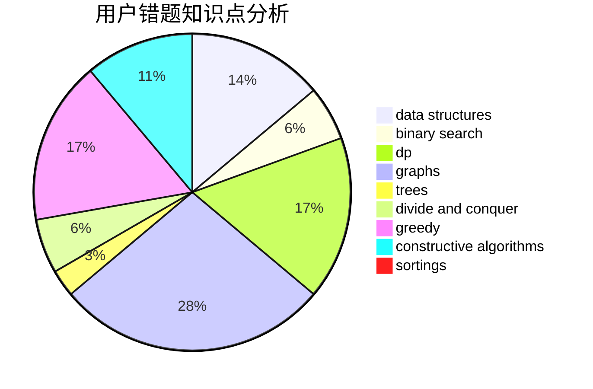

# Czhgugugu
<!-- tabs:start -->
#### **用户提交结果分析**

#### **用户做题类型偏好分析**

#### **用户错题知识点分析**

<!-- tabs:end -->
# 推荐题目
[1491G](http://codeforces.com/problemset/problem/1491/G)		constructive algorithms,
                        graphs,
                        math		  
[749E](http://codeforces.com/problemset/problem/749/E)		data structures,
                        probabilities		  
[74A](http://codeforces.com/problemset/problem/74/A)		implementation		  
[113D](http://codeforces.com/problemset/problem/113/D)		math,
                        matrices,
                        probabilities		  
[21D](http://codeforces.com/problemset/problem/21/D)		bitmasks,
                        graph matchings,
                        graphs		  
[1154A](http://codeforces.com/problemset/problem/1154/A)		math		  
[304B](http://codeforces.com/problemset/problem/304/B)		brute force,
                        implementation		  
[1156F](http://codeforces.com/problemset/problem/1156/F)		dp,
                        math,
                        probabilities		  
[749B](http://codeforces.com/problemset/problem/749/B)		brute force,
                        constructive algorithms,
                        geometry		  
[1356A1](http://codeforces.com/problemset/problem/1356/A1)		*special problem		  
<!-- tabs:start -->
#### **data structures**
[749E](http://codeforces.com/problemset/problem/749/E)		data structures,
                        probabilities		  
[601B](http://codeforces.com/problemset/problem/601/B)		data structures,
                        math		  
[749D](http://codeforces.com/problemset/problem/749/D)		binary search,
                        data structures		  
[220E](http://codeforces.com/problemset/problem/220/E)		data structures,
                        two pointers		  
[1154E](http://codeforces.com/problemset/problem/1154/E)		data structures,
                        implementation,
                        sortings		  
[1492C](http://codeforces.com/problemset/problem/1492/C)		binary search,
                        data structures,
                        dp,
                        greedy,
                        two pointers		  
[1490G](http://codeforces.com/problemset/problem/1490/G)		binary search,
                        data structures,
                        math		  
[1479D](http://codeforces.com/problemset/problem/1479/D)		binary search,
                        bitmasks,
                        brute force,
                        data structures,
                        probabilities,
                        trees		  
[1497A](http://codeforces.com/problemset/problem/1497/A)		brute force,
                        data structures,
                        greedy,
                        sortings		  
[1491C](http://codeforces.com/problemset/problem/1491/C)		brute force,
                        data structures,
                        dp,
                        greedy,
                        implementation		  
#### **binary search**
[749D](http://codeforces.com/problemset/problem/749/D)		binary search,
                        data structures		  
[1225E](http://codeforces.com/problemset/problem/1225/E)		binary search,
                        dp		  
[1360H](http://codeforces.com/problemset/problem/1360/H)		binary search,
                        bitmasks,
                        brute force,
                        constructive algorithms		  
[1492C](http://codeforces.com/problemset/problem/1492/C)		binary search,
                        data structures,
                        dp,
                        greedy,
                        two pointers		  
[1463D](http://codeforces.com/problemset/problem/1463/D)		binary search,
                        constructive algorithms,
                        greedy,
                        two pointers		  
[1490G](http://codeforces.com/problemset/problem/1490/G)		binary search,
                        data structures,
                        math		  
[1479D](http://codeforces.com/problemset/problem/1479/D)		binary search,
                        bitmasks,
                        brute force,
                        data structures,
                        probabilities,
                        trees		  
[1436E](http://codeforces.com/problemset/problem/1436/E)		binary search,
                        data structures,
                        two pointers		  
[1461D](http://codeforces.com/problemset/problem/1461/D)		binary search,
                        brute force,
                        data structures,
                        divide and conquer,
                        implementation,
                        sortings		  
[1493C](http://codeforces.com/problemset/problem/1493/C)		binary search,
                        brute force,
                        constructive algorithms,
                        greedy,
                        strings		  
#### **dp**
[1156F](http://codeforces.com/problemset/problem/1156/F)		dp,
                        math,
                        probabilities		  
[1295F](http://codeforces.com/problemset/problem/1295/F)		combinatorics,
                        dp,
                        probabilities		  
[74B](http://codeforces.com/problemset/problem/74/B)		dp,
                        games,
                        greedy		  
[1383C](http://codeforces.com/problemset/problem/1383/C)		bitmasks,
                        dp,
                        graphs,
                        trees		  
[1110H](http://codeforces.com/problemset/problem/1110/H)		dp,
                        strings		  
[1181C](http://codeforces.com/problemset/problem/1181/C)		brute force,
                        combinatorics,
                        dp,
                        implementation		  
[1225E](http://codeforces.com/problemset/problem/1225/E)		binary search,
                        dp		  
[590D](http://codeforces.com/problemset/problem/590/D)		dp		  
[1109A](http://codeforces.com/problemset/problem/1109/A)		dp,
                        implementation		  
[518D](http://codeforces.com/problemset/problem/518/D)		combinatorics,
                        dp,
                        math,
                        probabilities		  
#### **graph**
[1491G](http://codeforces.com/problemset/problem/1491/G)		constructive algorithms,
                        graphs,
                        math		  
[21D](http://codeforces.com/problemset/problem/21/D)		bitmasks,
                        graph matchings,
                        graphs		  
[1383C](http://codeforces.com/problemset/problem/1383/C)		bitmasks,
                        dp,
                        graphs,
                        trees		  
[491C](http://codeforces.com/problemset/problem/491/C)		flows,
                        graph matchings		  
[1487C](http://codeforces.com/problemset/problem/1487/C)		brute force,
                        constructive algorithms,
                        dfs and similar,
                        graphs,
                        greedy,
                        implementation,
                        math		  
[1437C](http://codeforces.com/problemset/problem/1437/C)		dp,
                        flows,
                        graph matchings,
                        greedy,
                        math,
                        sortings		  
[1470D](http://codeforces.com/problemset/problem/1470/D)		constructive algorithms,
                        dfs and similar,
                        graph matchings,
                        graphs,
                        greedy		  
[1476C](http://codeforces.com/problemset/problem/1476/C)		dp,
                        graphs,
                        greedy		  
[1304D](http://codeforces.com/problemset/problem/1304/D)		constructive algorithms,
                        graphs,
                        greedy,
                        two pointers		  
[1475C](http://codeforces.com/problemset/problem/1475/C)		combinatorics,
                        graphs,
                        math		  
#### **trees**
[1383C](http://codeforces.com/problemset/problem/1383/C)		bitmasks,
                        dp,
                        graphs,
                        trees		  
[1479D](http://codeforces.com/problemset/problem/1479/D)		binary search,
                        bitmasks,
                        brute force,
                        data structures,
                        probabilities,
                        trees		  
[1511C](http://codeforces.com/problemset/problem/1511/C)		brute force,
                        data structures,
                        implementation,
                        trees		  
[1499F](http://codeforces.com/problemset/problem/1499/F)		combinatorics,
                        dfs and similar,
                        dp,
                        trees		  
[1491E](http://codeforces.com/problemset/problem/1491/E)		brute force,
                        dfs and similar,
                        divide and conquer,
                        number theory,
                        trees		  
[1466D](http://codeforces.com/problemset/problem/1466/D)		data structures,
                        greedy,
                        sortings,
                        trees		  
[1495D](http://codeforces.com/problemset/problem/1495/D)		combinatorics,
                        dfs and similar,
                        graphs,
                        math,
                        shortest paths,
                        trees		  
[1303G](http://codeforces.com/problemset/problem/1303/G)		data structures,
                        divide and conquer,
                        geometry,
                        trees		  
[1454E](http://codeforces.com/problemset/problem/1454/E)		combinatorics,
                        dfs and similar,
                        graphs,
                        trees		  
[1494D](http://codeforces.com/problemset/problem/1494/D)		constructive algorithms,
                        data structures,
                        dfs and similar,
                        divide and conquer,
                        dsu,
                        greedy,
                        sortings,
                        trees		  
#### **divide and conquer**
[1461D](http://codeforces.com/problemset/problem/1461/D)		binary search,
                        brute force,
                        data structures,
                        divide and conquer,
                        implementation,
                        sortings		  
[1466G](http://codeforces.com/problemset/problem/1466/G)		combinatorics,
                        divide and conquer,
                        hashing,
                        math,
                        string suffix structures,
                        strings		  
[1490D](http://codeforces.com/problemset/problem/1490/D)		dfs and similar,
                        divide and conquer,
                        implementation		  
[1483C](https://codeforces.com/contest/1483/problem/C)		data structures,
                        divide and conquer,
                        dp		  
[1491E](http://codeforces.com/problemset/problem/1491/E)		brute force,
                        dfs and similar,
                        divide and conquer,
                        number theory,
                        trees		  
[1303G](http://codeforces.com/problemset/problem/1303/G)		data structures,
                        divide and conquer,
                        geometry,
                        trees		  
[1494D](http://codeforces.com/problemset/problem/1494/D)		constructive algorithms,
                        data structures,
                        dfs and similar,
                        divide and conquer,
                        dsu,
                        greedy,
                        sortings,
                        trees		  
[1482E](http://codeforces.com/problemset/problem/1482/E)		data structures,
                        divide and conquer,
                        dp		  
[566C](http://codeforces.com/problemset/problem/566/C)		dfs and similar,
                        divide and conquer,
                        trees		  
[1428F](http://codeforces.com/problemset/problem/1428/F)		binary search,
                        data structures,
                        divide and conquer,
                        dp,
                        two pointers		  
#### **greedy**
[749C](http://codeforces.com/problemset/problem/749/C)		greedy,
                        implementation,
                        two pointers		  
[74B](http://codeforces.com/problemset/problem/74/B)		dp,
                        games,
                        greedy		  
[1157C1](http://codeforces.com/problemset/problem/1157/C1)		greedy		  
[588A](http://codeforces.com/problemset/problem/588/A)		greedy		  
[486B](http://codeforces.com/problemset/problem/486/B)		greedy,
                        hashing,
                        implementation		  
[254C](http://codeforces.com/problemset/problem/254/C)		greedy,
                        strings		  
[1037B](http://codeforces.com/problemset/problem/1037/B)		greedy		  
[1401B](http://codeforces.com/problemset/problem/1401/B)		constructive algorithms,
                        greedy,
                        math		  
[489C](http://codeforces.com/problemset/problem/489/C)		dp,
                        greedy,
                        implementation		  
[1492C](http://codeforces.com/problemset/problem/1492/C)		binary search,
                        data structures,
                        dp,
                        greedy,
                        two pointers		  
#### **constructive algorithms**
[1491G](http://codeforces.com/problemset/problem/1491/G)		constructive algorithms,
                        graphs,
                        math		  
[749B](http://codeforces.com/problemset/problem/749/B)		brute force,
                        constructive algorithms,
                        geometry		  
[1347E](https://codeforces.com/contest/1347/problem/E)		constructive algorithms,
                        probabilities		  
[1286C2](http://codeforces.com/problemset/problem/1286/C2)		brute force,
                        constructive algorithms,
                        hashing,
                        interactive,
                        math		  
[1401B](http://codeforces.com/problemset/problem/1401/B)		constructive algorithms,
                        greedy,
                        math		  
[1360H](http://codeforces.com/problemset/problem/1360/H)		binary search,
                        bitmasks,
                        brute force,
                        constructive algorithms		  
[1493A](http://codeforces.com/problemset/problem/1493/A)		constructive algorithms,
                        greedy		  
[1463D](http://codeforces.com/problemset/problem/1463/D)		binary search,
                        constructive algorithms,
                        greedy,
                        two pointers		  
[1456B](https://codeforces.com/contest/1456/problem/B)		bitmasks,
                        brute force,
                        constructive algorithms		  
[1492D](http://codeforces.com/problemset/problem/1492/D)		bitmasks,
                        constructive algorithms,
                        greedy,
                        math		  
#### **sortings**
[1154E](http://codeforces.com/problemset/problem/1154/E)		data structures,
                        implementation,
                        sortings		  
[1294B](http://codeforces.com/problemset/problem/1294/B)		implementation,
                        sortings		  
[1496C](https://codeforces.com/contest/1496/problem/C)		geometry,
                        greedy,
                        math,
                        sortings		  
[1495A](http://codeforces.com/problemset/problem/1495/A)		geometry,
                        greedy,
                        math,
                        sortings		  
[1497A](http://codeforces.com/problemset/problem/1497/A)		brute force,
                        data structures,
                        greedy,
                        sortings		  
[1427A](http://codeforces.com/problemset/problem/1427/A)		math,
                        sortings		  
[1461D](http://codeforces.com/problemset/problem/1461/D)		binary search,
                        brute force,
                        data structures,
                        divide and conquer,
                        implementation,
                        sortings		  
[1437C](http://codeforces.com/problemset/problem/1437/C)		dp,
                        flows,
                        graph matchings,
                        greedy,
                        math,
                        sortings		  
[1473A](http://codeforces.com/problemset/problem/1473/A)		greedy,
                        implementation,
                        math,
                        sortings		  
[1486B](http://codeforces.com/problemset/problem/1486/B)		binary search,
                        geometry,
                        shortest paths,
                        sortings		  
<!-- tabs:end -->
