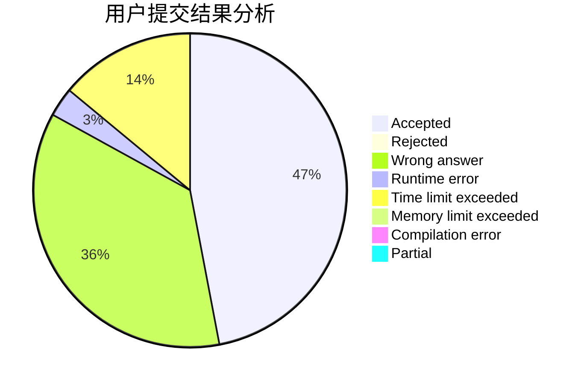
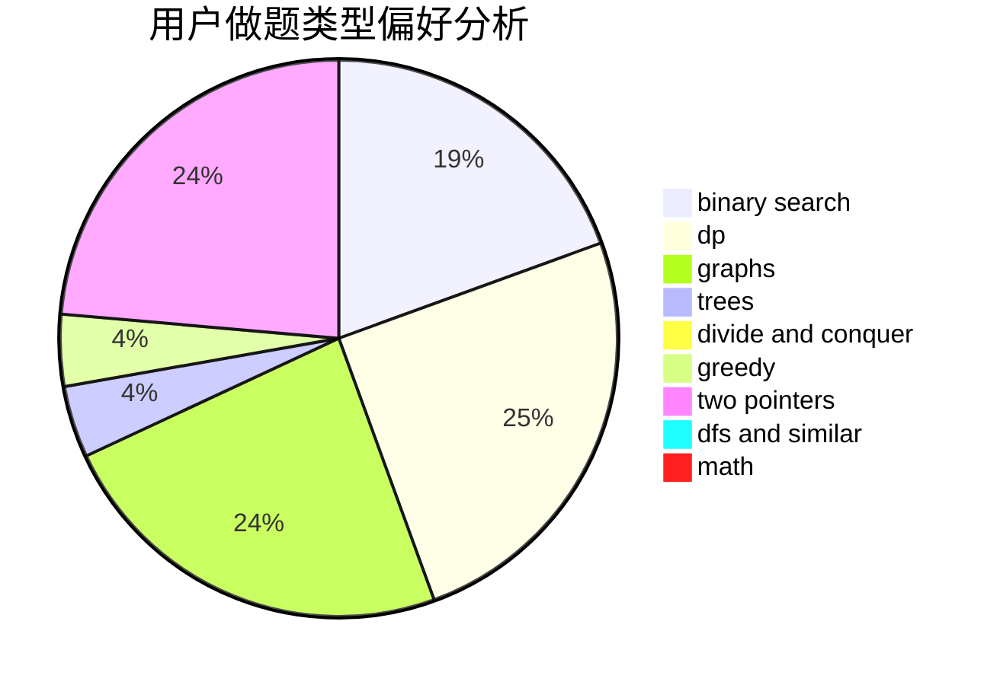

# DDOSvoid

<!-- tabs:start -->

#### **用户提交结果分析**

#### **用户做题类型偏好分析**

<!-- tabs:end -->
# 推荐题目
[76B](https://codeforces.com/contest/76/problem/B)
[76A](https://codeforces.com/contest/76/problem/A)
[115E](https://codeforces.com/contest/115/problem/E)
[1490C](https://codeforces.com/contest/1490/problem/C)
[1497B](https://codeforces.com/contest/1497/problem/B)
[1491C](https://codeforces.com/contest/1491/problem/C)
[1484C](https://codeforces.com/contest/1484/problem/C)
[1480A](https://codeforces.com/contest/1480/problem/A)
[1513C](https://codeforces.com/contest/1513/problem/C)
[1487B](https://codeforces.com/contest/1487/problem/B)
