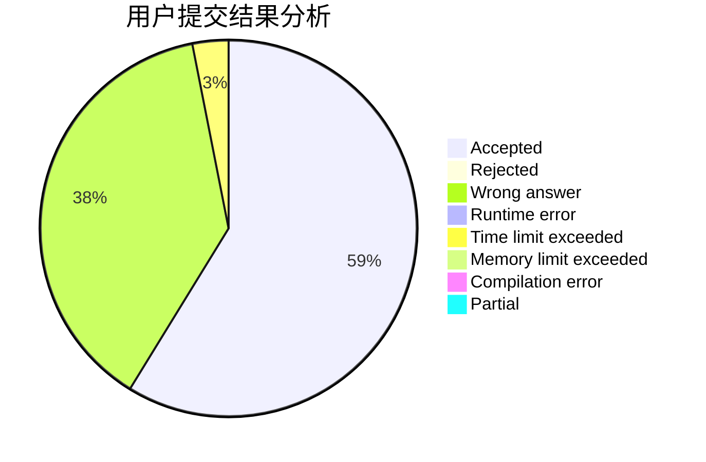
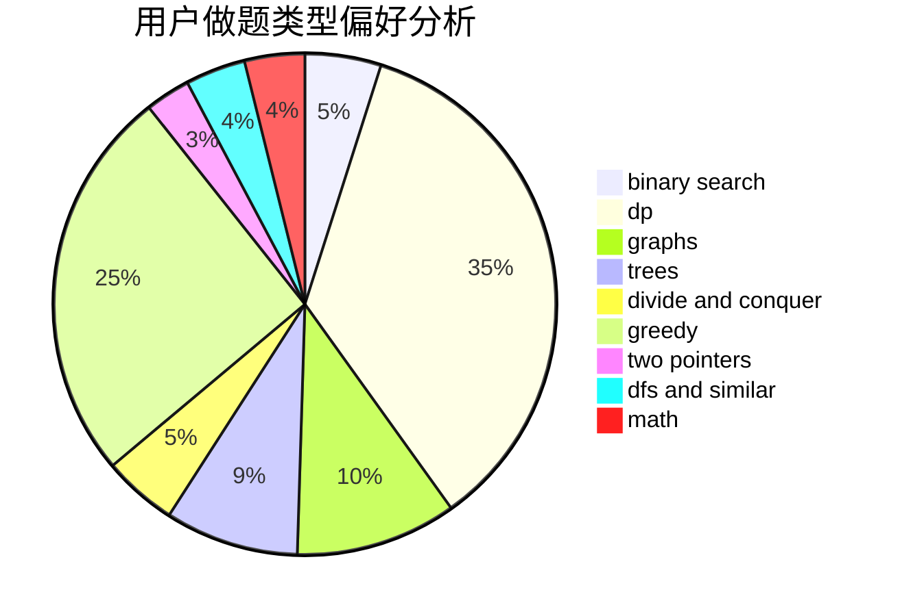

# DD_BOND

<!-- tabs:start -->

#### **用户提交结果分析**

#### **用户做题类型偏好分析**

<!-- tabs:end -->
# 推荐题目
[76C](https://codeforces.com/contest/76/problem/C)
[1167D](https://codeforces.com/contest/1167/problem/D)
[1292D](https://codeforces.com/contest/1292/problem/D)
[282C](https://codeforces.com/contest/282/problem/C)
[1161B](https://codeforces.com/contest/1161/problem/B)
[771C](https://codeforces.com/contest/771/problem/C)
[1245D](https://codeforces.com/contest/1245/problem/D)
[1297C](https://codeforces.com/contest/1297/problem/C)
[76D](https://codeforces.com/contest/76/problem/D)
[243D](https://codeforces.com/contest/243/problem/D)
