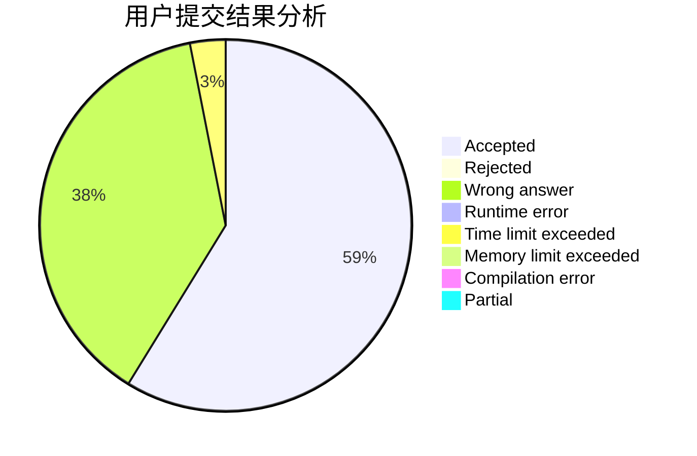
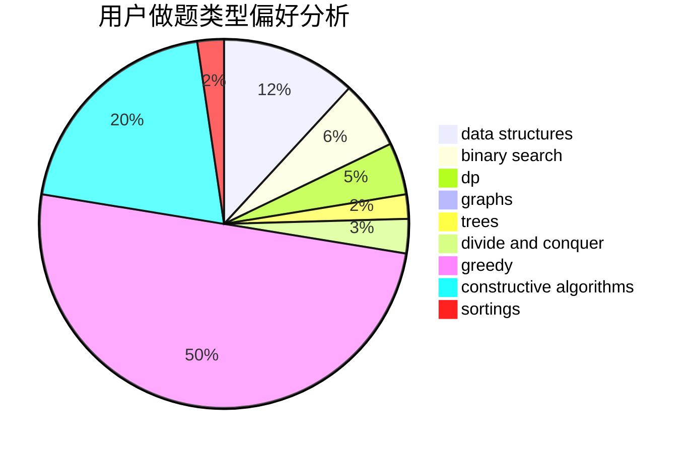

# DD_BOND
<!-- tabs:start -->
#### **用户提交结果分析**

#### **用户做题类型偏好分析**

#### **用户错题知识点分析**

<!-- tabs:end -->
# 推荐题目
[750G](http://codeforces.com/problemset/problem/750/G)		bitmasks,
                        brute force,
                        combinatorics,
                        dp		  
[1238E](http://codeforces.com/problemset/problem/1238/E)		bitmasks,
                        dp		  
[508D](http://codeforces.com/problemset/problem/508/D)		dfs and similar,
                        graphs		  
[750C](http://codeforces.com/problemset/problem/750/C)		binary search,
                        greedy,
                        math		  
[266D](http://codeforces.com/problemset/problem/266/D)		graphs,
                        math,
                        shortest paths		  
[750D](http://codeforces.com/problemset/problem/750/D)		brute force,
                        data structures,
                        dfs and similar,
                        dp,
                        implementation		  
[750H](http://codeforces.com/problemset/problem/750/H)		dfs and similar,
                        dsu,
                        graphs,
                        interactive		  
[1158C](http://codeforces.com/problemset/problem/1158/C)		constructive algorithms,
                        data structures,
                        dfs and similar,
                        graphs,
                        greedy,
                        math,
                        sortings		  
[1240A](https://codeforces.com/contest/1240/problem/A)		binary search,
                        greedy		  
[228B](http://codeforces.com/problemset/problem/228/B)		brute force,
                        implementation		  
<!-- tabs:start -->
#### **data structures**
[750D](http://codeforces.com/problemset/problem/750/D)		brute force,
                        data structures,
                        dfs and similar,
                        dp,
                        implementation		  
[1158C](http://codeforces.com/problemset/problem/1158/C)		constructive algorithms,
                        data structures,
                        dfs and similar,
                        graphs,
                        greedy,
                        math,
                        sortings		  
[750E](http://codeforces.com/problemset/problem/750/E)		data structures,
                        divide and conquer,
                        dp,
                        matrices		  
[1165B](http://codeforces.com/problemset/problem/1165/B)		data structures,
                        greedy,
                        sortings		  
[229B](http://codeforces.com/problemset/problem/229/B)		binary search,
                        data structures,
                        graphs,
                        shortest paths		  
[1279C](http://codeforces.com/problemset/problem/1279/C)		data structures,
                        implementation		  
[1492C](http://codeforces.com/problemset/problem/1492/C)		binary search,
                        data structures,
                        dp,
                        greedy,
                        two pointers		  
[1490G](http://codeforces.com/problemset/problem/1490/G)		binary search,
                        data structures,
                        math		  
[1479D](http://codeforces.com/problemset/problem/1479/D)		binary search,
                        bitmasks,
                        brute force,
                        data structures,
                        probabilities,
                        trees		  
[1497A](http://codeforces.com/problemset/problem/1497/A)		brute force,
                        data structures,
                        greedy,
                        sortings		  
#### **binary search**
[750C](http://codeforces.com/problemset/problem/750/C)		binary search,
                        greedy,
                        math		  
[1240A](https://codeforces.com/contest/1240/problem/A)		binary search,
                        greedy		  
[1008E](https://codeforces.com/contest/1008/problem/E)		binary search,
                        interactive		  
[1190E](http://codeforces.com/problemset/problem/1190/E)		binary search,
                        greedy		  
[1201D](http://codeforces.com/problemset/problem/1201/D)		binary search,
                        dp,
                        greedy,
                        implementation		  
[229B](http://codeforces.com/problemset/problem/229/B)		binary search,
                        data structures,
                        graphs,
                        shortest paths		  
[1492C](http://codeforces.com/problemset/problem/1492/C)		binary search,
                        data structures,
                        dp,
                        greedy,
                        two pointers		  
[1463D](http://codeforces.com/problemset/problem/1463/D)		binary search,
                        constructive algorithms,
                        greedy,
                        two pointers		  
[1490G](http://codeforces.com/problemset/problem/1490/G)		binary search,
                        data structures,
                        math		  
[1479D](http://codeforces.com/problemset/problem/1479/D)		binary search,
                        bitmasks,
                        brute force,
                        data structures,
                        probabilities,
                        trees		  
#### **dp**
[750G](http://codeforces.com/problemset/problem/750/G)		bitmasks,
                        brute force,
                        combinatorics,
                        dp		  
[1238E](http://codeforces.com/problemset/problem/1238/E)		bitmasks,
                        dp		  
[750D](http://codeforces.com/problemset/problem/750/D)		brute force,
                        data structures,
                        dfs and similar,
                        dp,
                        implementation		  
[611D](http://codeforces.com/problemset/problem/611/D)		dp,
                        hashing,
                        strings		  
[1029B](http://codeforces.com/problemset/problem/1029/B)		dp,
                        greedy,
                        math		  
[1290F](http://codeforces.com/problemset/problem/1290/F)		dp		  
[750E](http://codeforces.com/problemset/problem/750/E)		data structures,
                        divide and conquer,
                        dp,
                        matrices		  
[294B](http://codeforces.com/problemset/problem/294/B)		dp,
                        greedy		  
[1201D](http://codeforces.com/problemset/problem/1201/D)		binary search,
                        dp,
                        greedy,
                        implementation		  
[1418C](http://codeforces.com/problemset/problem/1418/C)		dp,
                        graphs,
                        greedy,
                        shortest paths		  
#### **graph**
[508D](http://codeforces.com/problemset/problem/508/D)		dfs and similar,
                        graphs		  
[266D](http://codeforces.com/problemset/problem/266/D)		graphs,
                        math,
                        shortest paths		  
[750H](http://codeforces.com/problemset/problem/750/H)		dfs and similar,
                        dsu,
                        graphs,
                        interactive		  
[1158C](http://codeforces.com/problemset/problem/1158/C)		constructive algorithms,
                        data structures,
                        dfs and similar,
                        graphs,
                        greedy,
                        math,
                        sortings		  
[402C](http://codeforces.com/problemset/problem/402/C)		brute force,
                        constructive algorithms,
                        graphs		  
[225D](http://codeforces.com/problemset/problem/225/D)		bitmasks,
                        dfs and similar,
                        graphs,
                        implementation		  
[1471F](https://codeforces.com/contest/1471/problem/F)		constructive algorithms,
                        dfs and similar,
                        graph matchings,
                        graphs,
                        greedy		  
[229B](http://codeforces.com/problemset/problem/229/B)		binary search,
                        data structures,
                        graphs,
                        shortest paths		  
[1037E](http://codeforces.com/problemset/problem/1037/E)		graphs		  
[1418C](http://codeforces.com/problemset/problem/1418/C)		dp,
                        graphs,
                        greedy,
                        shortest paths		  
#### **trees**
[750F](http://codeforces.com/problemset/problem/750/F)		constructive algorithms,
                        implementation,
                        interactive,
                        trees		  
[1479D](http://codeforces.com/problemset/problem/1479/D)		binary search,
                        bitmasks,
                        brute force,
                        data structures,
                        probabilities,
                        trees		  
[1511C](http://codeforces.com/problemset/problem/1511/C)		brute force,
                        data structures,
                        implementation,
                        trees		  
[1499F](http://codeforces.com/problemset/problem/1499/F)		combinatorics,
                        dfs and similar,
                        dp,
                        trees		  
[1491E](http://codeforces.com/problemset/problem/1491/E)		brute force,
                        dfs and similar,
                        divide and conquer,
                        number theory,
                        trees		  
[1466D](http://codeforces.com/problemset/problem/1466/D)		data structures,
                        greedy,
                        sortings,
                        trees		  
[1495D](http://codeforces.com/problemset/problem/1495/D)		combinatorics,
                        dfs and similar,
                        graphs,
                        math,
                        shortest paths,
                        trees		  
[1303G](http://codeforces.com/problemset/problem/1303/G)		data structures,
                        divide and conquer,
                        geometry,
                        trees		  
[1454E](http://codeforces.com/problemset/problem/1454/E)		combinatorics,
                        dfs and similar,
                        graphs,
                        trees		  
[1494D](http://codeforces.com/problemset/problem/1494/D)		constructive algorithms,
                        data structures,
                        dfs and similar,
                        divide and conquer,
                        dsu,
                        greedy,
                        sortings,
                        trees		  
#### **divide and conquer**
[750E](http://codeforces.com/problemset/problem/750/E)		data structures,
                        divide and conquer,
                        dp,
                        matrices		  
[1461D](http://codeforces.com/problemset/problem/1461/D)		binary search,
                        brute force,
                        data structures,
                        divide and conquer,
                        implementation,
                        sortings		  
[1466G](http://codeforces.com/problemset/problem/1466/G)		combinatorics,
                        divide and conquer,
                        hashing,
                        math,
                        string suffix structures,
                        strings		  
[1490D](http://codeforces.com/problemset/problem/1490/D)		dfs and similar,
                        divide and conquer,
                        implementation		  
[1483C](https://codeforces.com/contest/1483/problem/C)		data structures,
                        divide and conquer,
                        dp		  
[1491E](http://codeforces.com/problemset/problem/1491/E)		brute force,
                        dfs and similar,
                        divide and conquer,
                        number theory,
                        trees		  
[1303G](http://codeforces.com/problemset/problem/1303/G)		data structures,
                        divide and conquer,
                        geometry,
                        trees		  
[1494D](http://codeforces.com/problemset/problem/1494/D)		constructive algorithms,
                        data structures,
                        dfs and similar,
                        divide and conquer,
                        dsu,
                        greedy,
                        sortings,
                        trees		  
[1482E](http://codeforces.com/problemset/problem/1482/E)		data structures,
                        divide and conquer,
                        dp		  
[566C](http://codeforces.com/problemset/problem/566/C)		dfs and similar,
                        divide and conquer,
                        trees		  
#### **greedy**
[750C](http://codeforces.com/problemset/problem/750/C)		binary search,
                        greedy,
                        math		  
[1158C](http://codeforces.com/problemset/problem/1158/C)		constructive algorithms,
                        data structures,
                        dfs and similar,
                        graphs,
                        greedy,
                        math,
                        sortings		  
[1240A](https://codeforces.com/contest/1240/problem/A)		binary search,
                        greedy		  
[628C](http://codeforces.com/problemset/problem/628/C)		greedy,
                        strings		  
[115B](http://codeforces.com/problemset/problem/115/B)		greedy,
                        sortings		  
[1029B](http://codeforces.com/problemset/problem/1029/B)		dp,
                        greedy,
                        math		  
[1471F](https://codeforces.com/contest/1471/problem/F)		constructive algorithms,
                        dfs and similar,
                        graph matchings,
                        graphs,
                        greedy		  
[1165B](http://codeforces.com/problemset/problem/1165/B)		data structures,
                        greedy,
                        sortings		  
[1190E](http://codeforces.com/problemset/problem/1190/E)		binary search,
                        greedy		  
[294B](http://codeforces.com/problemset/problem/294/B)		dp,
                        greedy		  
#### **constructive algorithms**
[1158C](http://codeforces.com/problemset/problem/1158/C)		constructive algorithms,
                        data structures,
                        dfs and similar,
                        graphs,
                        greedy,
                        math,
                        sortings		  
[402C](http://codeforces.com/problemset/problem/402/C)		brute force,
                        constructive algorithms,
                        graphs		  
[441C](http://codeforces.com/problemset/problem/441/C)		constructive algorithms,
                        dfs and similar,
                        implementation		  
[1471F](https://codeforces.com/contest/1471/problem/F)		constructive algorithms,
                        dfs and similar,
                        graph matchings,
                        graphs,
                        greedy		  
[1158B](http://codeforces.com/problemset/problem/1158/B)		constructive algorithms,
                        math,
                        strings		  
[750F](http://codeforces.com/problemset/problem/750/F)		constructive algorithms,
                        implementation,
                        interactive,
                        trees		  
[1493A](http://codeforces.com/problemset/problem/1493/A)		constructive algorithms,
                        greedy		  
[1463D](http://codeforces.com/problemset/problem/1463/D)		binary search,
                        constructive algorithms,
                        greedy,
                        two pointers		  
[1456B](https://codeforces.com/contest/1456/problem/B)		bitmasks,
                        brute force,
                        constructive algorithms		  
[1492D](http://codeforces.com/problemset/problem/1492/D)		bitmasks,
                        constructive algorithms,
                        greedy,
                        math		  
#### **sortings**
[1158C](http://codeforces.com/problemset/problem/1158/C)		constructive algorithms,
                        data structures,
                        dfs and similar,
                        graphs,
                        greedy,
                        math,
                        sortings		  
[115B](http://codeforces.com/problemset/problem/115/B)		greedy,
                        sortings		  
[1165B](http://codeforces.com/problemset/problem/1165/B)		data structures,
                        greedy,
                        sortings		  
[1496C](https://codeforces.com/contest/1496/problem/C)		geometry,
                        greedy,
                        math,
                        sortings		  
[1495A](http://codeforces.com/problemset/problem/1495/A)		geometry,
                        greedy,
                        math,
                        sortings		  
[1497A](http://codeforces.com/problemset/problem/1497/A)		brute force,
                        data structures,
                        greedy,
                        sortings		  
[1427A](http://codeforces.com/problemset/problem/1427/A)		math,
                        sortings		  
[1461D](http://codeforces.com/problemset/problem/1461/D)		binary search,
                        brute force,
                        data structures,
                        divide and conquer,
                        implementation,
                        sortings		  
[1437C](http://codeforces.com/problemset/problem/1437/C)		dp,
                        flows,
                        graph matchings,
                        greedy,
                        math,
                        sortings		  
[1473A](http://codeforces.com/problemset/problem/1473/A)		greedy,
                        implementation,
                        math,
                        sortings		  
<!-- tabs:end -->
