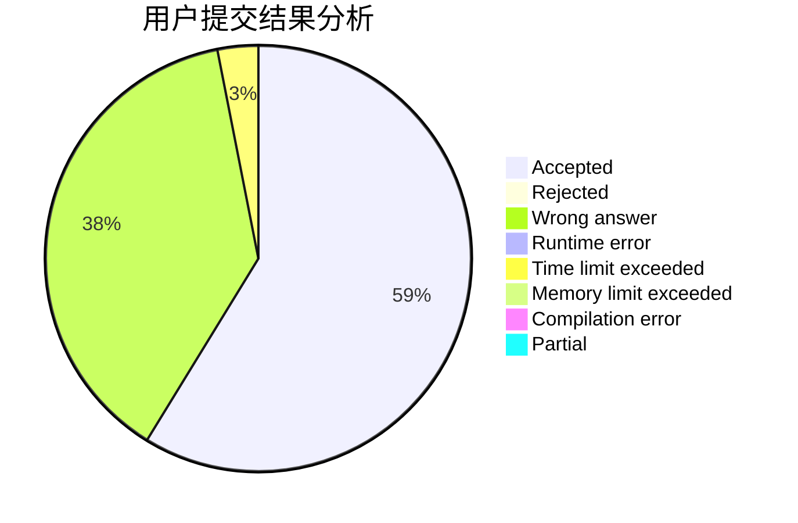
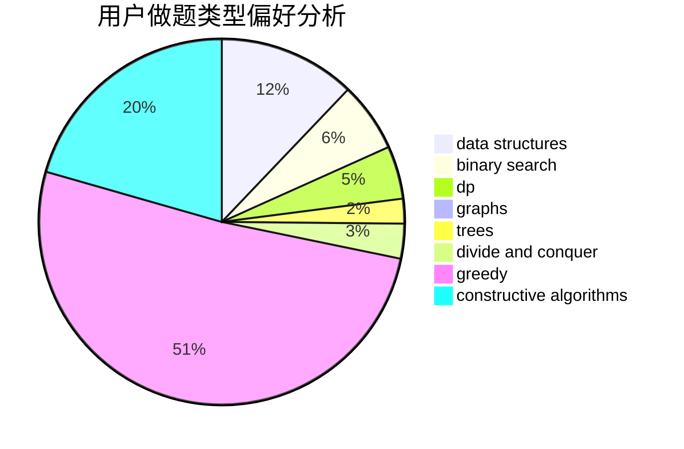

# DD_BOND
<!-- tabs:start -->
#### **用户提交结果分析**

#### **用户做题类型偏好分析**

#### **用户错题知识点分析**

<!-- tabs:end -->
# 推荐题目
[New Year and Binary Tree Paths](http://codeforces.com/problemset/problem/750/G)		bitmasks,
                        brute force,
                        combinatorics,
                        dp		  
[Keyboard Purchase](http://codeforces.com/problemset/problem/1238/E)		bitmasks,
                        dp		  
[Tanya and Password](http://codeforces.com/problemset/problem/508/D)		dfs and similar,
                        graphs		  
[New Year and Rating](http://codeforces.com/problemset/problem/750/C)		binary search,
                        greedy,
                        math		  
[BerDonalds](http://codeforces.com/problemset/problem/266/D)		graphs,
                        math,
                        shortest paths		  
[New Year and Fireworks](http://codeforces.com/problemset/problem/750/D)		brute force,
                        data structures,
                        dfs and similar,
                        dp,
                        implementation		  
[New Year and Snowy Grid](http://codeforces.com/problemset/problem/750/H)		dfs and similar,
                        dsu,
                        graphs,
                        interactive		  
[Permutation recovery](http://codeforces.com/problemset/problem/1158/C)		constructive algorithms,
                        data structures,
                        dfs and similar,
                        graphs,
                        greedy,
                        math,
                        sortings		  
[Save the Nature](https://codeforces.com/contest/1240/problem/A)		binary search,
                        greedy		  
[Two Tables](http://codeforces.com/problemset/problem/228/B)		brute force,
                        implementation		  
<!-- tabs:start -->
#### **data structures**
[New Year and Fireworks](http://codeforces.com/problemset/problem/750/D)		brute force,
                        data structures,
                        dfs and similar,
                        dp,
                        implementation		  
[Permutation recovery](http://codeforces.com/problemset/problem/1158/C)		constructive algorithms,
                        data structures,
                        dfs and similar,
                        graphs,
                        greedy,
                        math,
                        sortings		  
[New Year and Old Subsequence](http://codeforces.com/problemset/problem/750/E)		data structures,
                        divide and conquer,
                        dp,
                        matrices		  
[Polycarp Training](http://codeforces.com/problemset/problem/1165/B)		data structures,
                        greedy,
                        sortings		  
[Planets](http://codeforces.com/problemset/problem/229/B)		binary search,
                        data structures,
                        graphs,
                        shortest paths		  
[Stack of Presents](http://codeforces.com/problemset/problem/1279/C)		data structures,
                        implementation		  
[Maximum width](http://codeforces.com/problemset/problem/1492/C)		binary search,
                        data structures,
                        dp,
                        greedy,
                        two pointers		  
[Old Floppy Drive](http://codeforces.com/problemset/problem/1490/G)		binary search,
                        data structures,
                        math		  
[Odd Mineral Resource](http://codeforces.com/problemset/problem/1479/D)		binary search,
                        bitmasks,
                        brute force,
                        data structures,
                        probabilities,
                        trees		  
[Meximization](http://codeforces.com/problemset/problem/1497/A)		brute force,
                        data structures,
                        greedy,
                        sortings		  
#### **binary search**
[New Year and Rating](http://codeforces.com/problemset/problem/750/C)		binary search,
                        greedy,
                        math		  
[Save the Nature](https://codeforces.com/contest/1240/problem/A)		binary search,
                        greedy		  
[Guess two numbers](https://codeforces.com/contest/1008/problem/E)		binary search,
                        interactive		  
[Tokitsukaze and Explosion](http://codeforces.com/problemset/problem/1190/E)		binary search,
                        greedy		  
[Treasure Hunting](http://codeforces.com/problemset/problem/1201/D)		binary search,
                        dp,
                        greedy,
                        implementation		  
[Planets](http://codeforces.com/problemset/problem/229/B)		binary search,
                        data structures,
                        graphs,
                        shortest paths		  
[Maximum width](http://codeforces.com/problemset/problem/1492/C)		binary search,
                        data structures,
                        dp,
                        greedy,
                        two pointers		  
[Pairs](http://codeforces.com/problemset/problem/1463/D)		binary search,
                        constructive algorithms,
                        greedy,
                        two pointers		  
[Old Floppy Drive](http://codeforces.com/problemset/problem/1490/G)		binary search,
                        data structures,
                        math		  
[Odd Mineral Resource](http://codeforces.com/problemset/problem/1479/D)		binary search,
                        bitmasks,
                        brute force,
                        data structures,
                        probabilities,
                        trees		  
#### **dp**
[New Year and Binary Tree Paths](http://codeforces.com/problemset/problem/750/G)		bitmasks,
                        brute force,
                        combinatorics,
                        dp		  
[Keyboard Purchase](http://codeforces.com/problemset/problem/1238/E)		bitmasks,
                        dp		  
[New Year and Fireworks](http://codeforces.com/problemset/problem/750/D)		brute force,
                        data structures,
                        dfs and similar,
                        dp,
                        implementation		  
[New Year and Ancient Prophecy](http://codeforces.com/problemset/problem/611/D)		dp,
                        hashing,
                        strings		  
[Creating the Contest](http://codeforces.com/problemset/problem/1029/B)		dp,
                        greedy,
                        math		  
[Making Shapes](http://codeforces.com/problemset/problem/1290/F)		dp		  
[New Year and Old Subsequence](http://codeforces.com/problemset/problem/750/E)		data structures,
                        divide and conquer,
                        dp,
                        matrices		  
[Shaass and Bookshelf](http://codeforces.com/problemset/problem/294/B)		dp,
                        greedy		  
[Treasure Hunting](http://codeforces.com/problemset/problem/1201/D)		binary search,
                        dp,
                        greedy,
                        implementation		  
[Mortal Kombat Tower](http://codeforces.com/problemset/problem/1418/C)		dp,
                        graphs,
                        greedy,
                        shortest paths		  
#### **graph**
[Tanya and Password](http://codeforces.com/problemset/problem/508/D)		dfs and similar,
                        graphs		  
[BerDonalds](http://codeforces.com/problemset/problem/266/D)		graphs,
                        math,
                        shortest paths		  
[New Year and Snowy Grid](http://codeforces.com/problemset/problem/750/H)		dfs and similar,
                        dsu,
                        graphs,
                        interactive		  
[Permutation recovery](http://codeforces.com/problemset/problem/1158/C)		constructive algorithms,
                        data structures,
                        dfs and similar,
                        graphs,
                        greedy,
                        math,
                        sortings		  
[Searching for Graph](http://codeforces.com/problemset/problem/402/C)		brute force,
                        constructive algorithms,
                        graphs		  
[Snake](http://codeforces.com/problemset/problem/225/D)		bitmasks,
                        dfs and similar,
                        graphs,
                        implementation		  
[Strange Housing](https://codeforces.com/contest/1471/problem/F)		constructive algorithms,
                        dfs and similar,
                        graph matchings,
                        graphs,
                        greedy		  
[Planets](http://codeforces.com/problemset/problem/229/B)		binary search,
                        data structures,
                        graphs,
                        shortest paths		  
[Trips](http://codeforces.com/problemset/problem/1037/E)		graphs		  
[Mortal Kombat Tower](http://codeforces.com/problemset/problem/1418/C)		dp,
                        graphs,
                        greedy,
                        shortest paths		  
#### **trees**
[New Year and Finding Roots](http://codeforces.com/problemset/problem/750/F)		constructive algorithms,
                        implementation,
                        interactive,
                        trees		  
[Odd Mineral Resource](http://codeforces.com/problemset/problem/1479/D)		binary search,
                        bitmasks,
                        brute force,
                        data structures,
                        probabilities,
                        trees		  
[Yet Another Card Deck](http://codeforces.com/problemset/problem/1511/C)		brute force,
                        data structures,
                        implementation,
                        trees		  
[Diameter Cuts](http://codeforces.com/problemset/problem/1499/F)		combinatorics,
                        dfs and similar,
                        dp,
                        trees		  
[Fib-tree](http://codeforces.com/problemset/problem/1491/E)		brute force,
                        dfs and similar,
                        divide and conquer,
                        number theory,
                        trees		  
[13th Labour of Heracles](http://codeforces.com/problemset/problem/1466/D)		data structures,
                        greedy,
                        sortings,
                        trees		  
[BFS Trees](http://codeforces.com/problemset/problem/1495/D)		combinatorics,
                        dfs and similar,
                        graphs,
                        math,
                        shortest paths,
                        trees		  
[Sum of Prefix Sums](http://codeforces.com/problemset/problem/1303/G)		data structures,
                        divide and conquer,
                        geometry,
                        trees		  
[Number of Simple Paths](http://codeforces.com/problemset/problem/1454/E)		combinatorics,
                        dfs and similar,
                        graphs,
                        trees		  
[Dogeforces](http://codeforces.com/problemset/problem/1494/D)		constructive algorithms,
                        data structures,
                        dfs and similar,
                        divide and conquer,
                        dsu,
                        greedy,
                        sortings,
                        trees		  
#### **divide and conquer**
[New Year and Old Subsequence](http://codeforces.com/problemset/problem/750/E)		data structures,
                        divide and conquer,
                        dp,
                        matrices		  
[Divide and Summarize](http://codeforces.com/problemset/problem/1461/D)		binary search,
                        brute force,
                        data structures,
                        divide and conquer,
                        implementation,
                        sortings		  
[Song of the Sirens](http://codeforces.com/problemset/problem/1466/G)		combinatorics,
                        divide and conquer,
                        hashing,
                        math,
                        string suffix structures,
                        strings		  
[Permutation Transformation](http://codeforces.com/problemset/problem/1490/D)		dfs and similar,
                        divide and conquer,
                        implementation		  
[Skyline Photo](https://codeforces.com/contest/1483/problem/C)		data structures,
                        divide and conquer,
                        dp		  
[Fib-tree](http://codeforces.com/problemset/problem/1491/E)		brute force,
                        dfs and similar,
                        divide and conquer,
                        number theory,
                        trees		  
[Sum of Prefix Sums](http://codeforces.com/problemset/problem/1303/G)		data structures,
                        divide and conquer,
                        geometry,
                        trees		  
[Dogeforces](http://codeforces.com/problemset/problem/1494/D)		constructive algorithms,
                        data structures,
                        dfs and similar,
                        divide and conquer,
                        dsu,
                        greedy,
                        sortings,
                        trees		  
[Logistical Questions](http://codeforces.com/problemset/problem/566/C)		dfs and similar,
                        divide and conquer,
                        trees		  
[Fruit Sequences](http://codeforces.com/problemset/problem/1428/F)		binary search,
                        data structures,
                        divide and conquer,
                        dp,
                        two pointers		  
#### **greedy**
[New Year and Rating](http://codeforces.com/problemset/problem/750/C)		binary search,
                        greedy,
                        math		  
[Permutation recovery](http://codeforces.com/problemset/problem/1158/C)		constructive algorithms,
                        data structures,
                        dfs and similar,
                        graphs,
                        greedy,
                        math,
                        sortings		  
[Save the Nature](https://codeforces.com/contest/1240/problem/A)		binary search,
                        greedy		  
[Bear and String Distance](http://codeforces.com/problemset/problem/628/C)		greedy,
                        strings		  
[Lawnmower](http://codeforces.com/problemset/problem/115/B)		greedy,
                        sortings		  
[Creating the Contest](http://codeforces.com/problemset/problem/1029/B)		dp,
                        greedy,
                        math		  
[Strange Housing](https://codeforces.com/contest/1471/problem/F)		constructive algorithms,
                        dfs and similar,
                        graph matchings,
                        graphs,
                        greedy		  
[Polycarp Training](http://codeforces.com/problemset/problem/1165/B)		data structures,
                        greedy,
                        sortings		  
[Tokitsukaze and Explosion](http://codeforces.com/problemset/problem/1190/E)		binary search,
                        greedy		  
[Shaass and Bookshelf](http://codeforces.com/problemset/problem/294/B)		dp,
                        greedy		  
#### **constructive algorithms**
[Permutation recovery](http://codeforces.com/problemset/problem/1158/C)		constructive algorithms,
                        data structures,
                        dfs and similar,
                        graphs,
                        greedy,
                        math,
                        sortings		  
[Searching for Graph](http://codeforces.com/problemset/problem/402/C)		brute force,
                        constructive algorithms,
                        graphs		  
[Valera and Tubes](http://codeforces.com/problemset/problem/441/C)		constructive algorithms,
                        dfs and similar,
                        implementation		  
[Strange Housing](https://codeforces.com/contest/1471/problem/F)		constructive algorithms,
                        dfs and similar,
                        graph matchings,
                        graphs,
                        greedy		  
[The minimal unique substring](http://codeforces.com/problemset/problem/1158/B)		constructive algorithms,
                        math,
                        strings		  
[New Year and Finding Roots](http://codeforces.com/problemset/problem/750/F)		constructive algorithms,
                        implementation,
                        interactive,
                        trees		  
[Anti-knapsack](http://codeforces.com/problemset/problem/1493/A)		constructive algorithms,
                        greedy		  
[Pairs](http://codeforces.com/problemset/problem/1463/D)		binary search,
                        constructive algorithms,
                        greedy,
                        two pointers		  
[XOR-gun](https://codeforces.com/contest/1456/problem/B)		bitmasks,
                        brute force,
                        constructive algorithms		  
[Genius's Gambit](http://codeforces.com/problemset/problem/1492/D)		bitmasks,
                        constructive algorithms,
                        greedy,
                        math		  
#### **sortings**
[Permutation recovery](http://codeforces.com/problemset/problem/1158/C)		constructive algorithms,
                        data structures,
                        dfs and similar,
                        graphs,
                        greedy,
                        math,
                        sortings		  
[Lawnmower](http://codeforces.com/problemset/problem/115/B)		greedy,
                        sortings		  
[Polycarp Training](http://codeforces.com/problemset/problem/1165/B)		data structures,
                        greedy,
                        sortings		  
[Diamond Miner](https://codeforces.com/contest/1496/problem/C)		geometry,
                        greedy,
                        math,
                        sortings		  
[Meximization](http://codeforces.com/problemset/problem/1497/A)		brute force,
                        data structures,
                        greedy,
                        sortings		  
[Avoiding Zero](http://codeforces.com/problemset/problem/1427/A)		math,
                        sortings		  
[Divide and Summarize](http://codeforces.com/problemset/problem/1461/D)		binary search,
                        brute force,
                        data structures,
                        divide and conquer,
                        implementation,
                        sortings		  
[Chef Monocarp](http://codeforces.com/problemset/problem/1437/C)		dp,
                        flows,
                        graph matchings,
                        greedy,
                        math,
                        sortings		  
[Replacing Elements](http://codeforces.com/problemset/problem/1473/A)		greedy,
                        implementation,
                        math,
                        sortings		  
[Eastern Exhibition](http://codeforces.com/problemset/problem/1486/B)		binary search,
                        geometry,
                        shortest paths,
                        sortings		  
<!-- tabs:end -->
