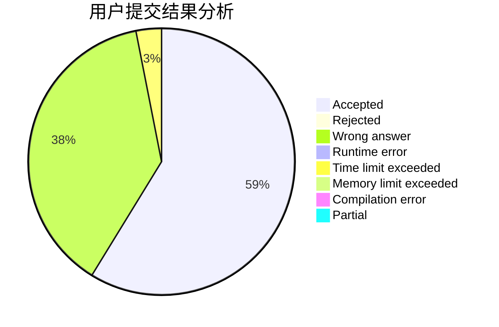
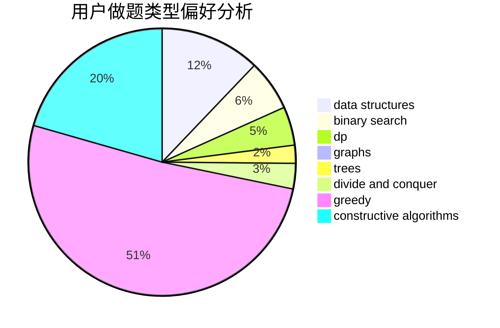

# DD_BOND

<!-- tabs:start -->

#### **用户提交结果分析**

#### **用户做题类型偏好分析**

#### **用户错题知识点分析**

<!-- tabs:end -->
# 推荐题目
[750C](https://codeforces.com/contest/750/problem/C)		binary search,
                        greedy,
                        math		  
[1165B](https://codeforces.com/contest/1165/problem/B)		data structures,
                        greedy,
                        sortings		  
[1285C](https://codeforces.com/contest/1285/problem/C)		brute force,
                        math,
                        number theory		  
[266D](https://codeforces.com/contest/266/problem/D)		graphs,
                        math,
                        shortest paths		  
[1158C](https://codeforces.com/contest/1158/problem/C)		constructive algorithms,
                        data structures,
                        dfs and similar,
                        graphs,
                        greedy,
                        math,
                        sortings		  
[750G](https://codeforces.com/contest/750/problem/G)		bitmasks,
                        brute force,
                        combinatorics,
                        dp		  
[1240A](https://codeforces.com/contest/1240/problem/A)		dsu,graphs,sortings,trees		  
[1290F](https://codeforces.com/contest/1290/problem/F)		dp		  
[750D](https://codeforces.com/contest/750/problem/D)		brute force,
                        data structures,
                        dfs and similar,
                        dp,
                        implementation		  
[225D](https://codeforces.com/contest/225/problem/D)		bitmasks,
                        dfs and similar,
                        graphs,
                        implementation		  
