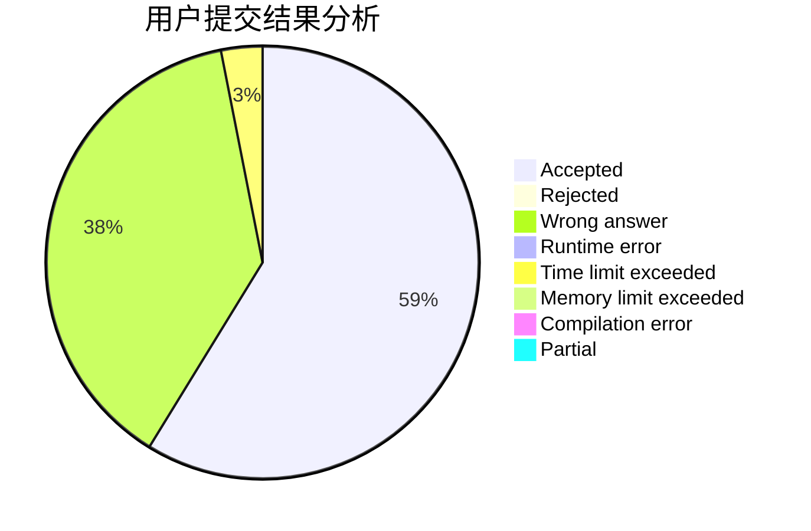
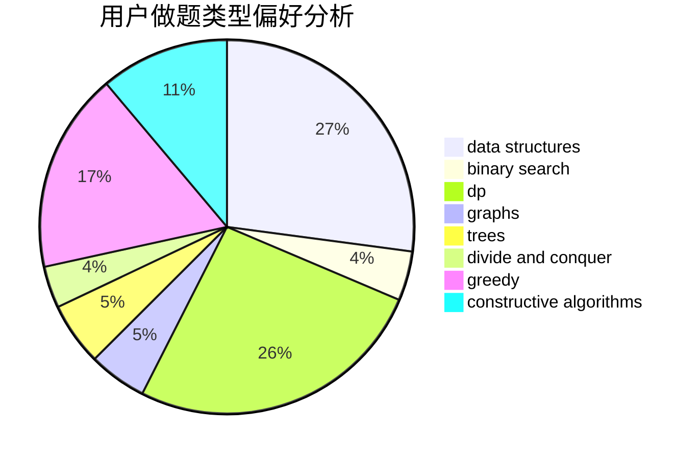

# DD_BOND

<!-- tabs:start -->

#### **用户提交结果分析**

#### **用户做题类型偏好分析**

#### **用户错题知识点分析**

<!-- tabs:end -->
# 推荐题目
[76C](https://codeforces.com/contest/76/problem/C)		bitmasks,
                        dp,
                        math		  
[1167D](https://codeforces.com/contest/1167/problem/D)		constructive algorithms,
                        greedy		  
[1292D](https://codeforces.com/contest/1292/problem/D)		dp,
                        graphs,
                        greedy,
                        math,
                        number theory,
                        trees		  
[282C](https://codeforces.com/contest/282/problem/C)		constructive algorithms,
                        implementation,
                        math		  
[1161B](https://codeforces.com/contest/1161/problem/B)		dsu,graphs,sortings,trees		  
[771C](https://codeforces.com/contest/771/problem/C)		dfs and similar,
                        dp,
                        trees		  
[1245D](https://codeforces.com/contest/1245/problem/D)		dsu,
                        graphs,
                        greedy,
                        shortest paths,
                        trees		  
[1297C](https://codeforces.com/contest/1297/problem/C)		*special problem,
                        greedy		  
[76D](https://codeforces.com/contest/76/problem/D)		dp,
                        greedy,
                        math		  
[243D](https://codeforces.com/contest/243/problem/D)		data structures,
                        dp,
                        geometry,
                        two pointers		  
