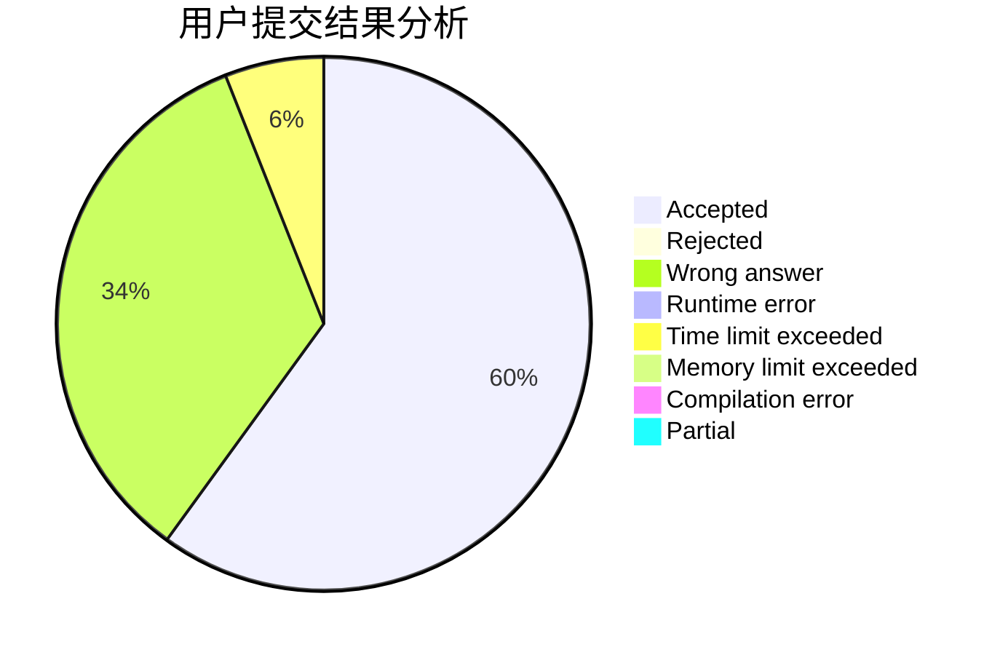
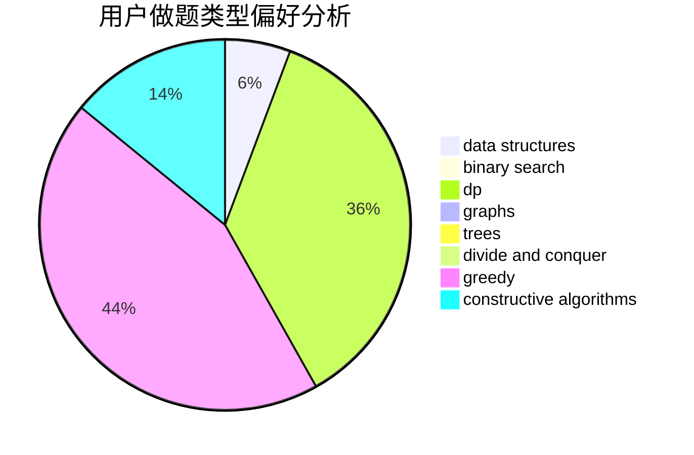
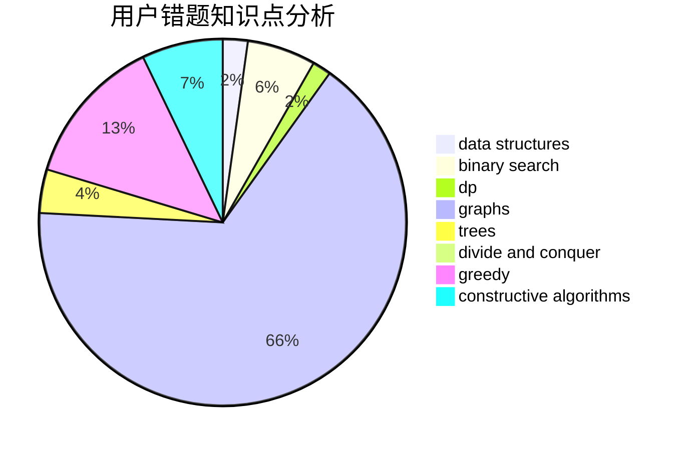

# 1Dream

<!-- tabs:start -->

#### **用户提交结果分析**

#### **用户做题类型偏好分析**

#### **用户错题知识点分析**

<!-- tabs:end -->
# 推荐题目
[1207G](https://codeforces.com/contest/1207/problem/G)		data structures,
                        dfs and similar,
                        hashing,
                        string suffix structures,
                        strings,
                        trees		  
[1208B](https://codeforces.com/contest/1208/problem/B)		binary search,
                        brute force,
                        implementation,
                        two pointers		  
[1207B](https://codeforces.com/contest/1207/problem/B)		constructive algorithms,
                        greedy,
                        implementation		  
[1206D](https://codeforces.com/contest/1206/problem/D)		dsu,graphs,sortings,trees		  
[1205E](https://codeforces.com/contest/1205/problem/E)		combinatorics,
                        strings		  
[1208F](https://codeforces.com/contest/1208/problem/F)		bitmasks,
                        dfs and similar,
                        dp,
                        greedy		  
[1206C](https://codeforces.com/contest/1206/problem/C)		dsu,graphs,sortings,trees		  
[1207F](https://codeforces.com/contest/1207/problem/F)		brute force,
                        data structures,
                        implementation		  
[1207D](https://codeforces.com/contest/1207/problem/D)		combinatorics		  
[1206A](https://codeforces.com/contest/1206/problem/A)		math,
                        sortings		  
