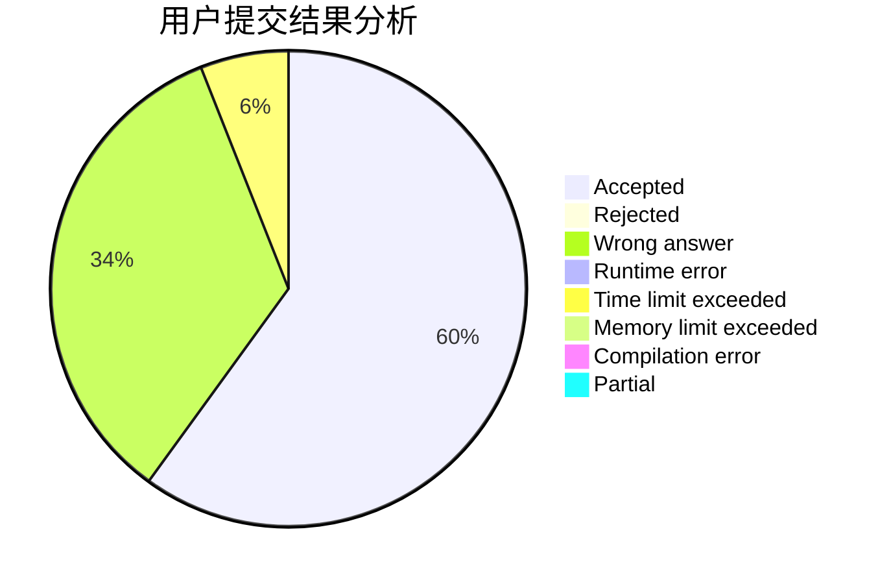
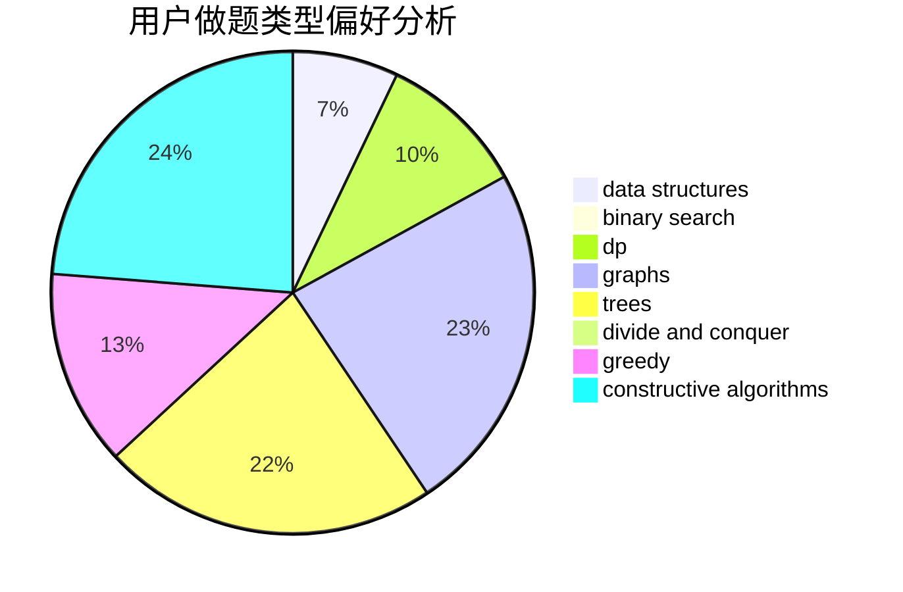
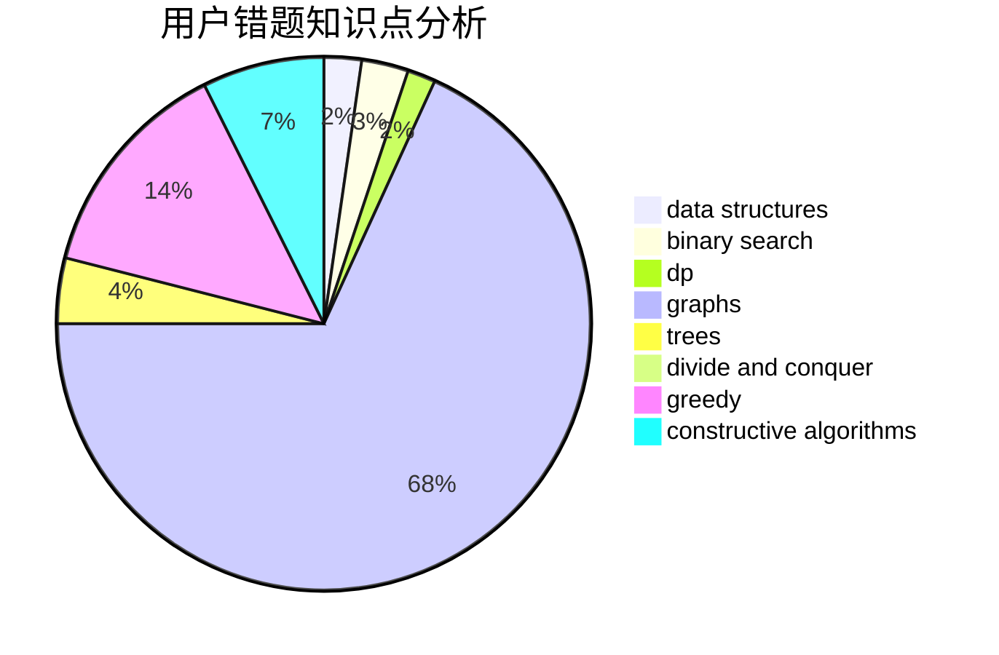

# 1Dream

<!-- tabs:start -->

#### **用户提交结果分析**

#### **用户做题类型偏好分析**

#### **用户错题知识点分析**

<!-- tabs:end -->
# 推荐题目
[1213C](https://codeforces.com/contest/1213/problem/C)		math		  
[1213F](https://codeforces.com/contest/1213/problem/F)		data structures,
                        dfs and similar,
                        dsu,
                        graphs,
                        greedy,
                        implementation,
                        strings		  
[1211B](https://codeforces.com/contest/1211/problem/B)		*special problem,
                        implementation		  
[1210E](https://codeforces.com/contest/1210/problem/E)		math		  
[120H](https://codeforces.com/contest/120/problem/H)		graph matchings		  
[1214C](https://codeforces.com/contest/1214/problem/C)		data structures,
                        greedy		  
[1210D](https://codeforces.com/contest/1210/problem/D)		graphs		  
[1213B](https://codeforces.com/contest/1213/problem/B)		data structures,
                        implementation		  
[12132](https://codeforces.com/contest/1213/problem/2)		dsu,graphs,sortings,trees		  
[12102](https://codeforces.com/contest/1210/problem/2)		dsu,graphs,sortings,trees		  
