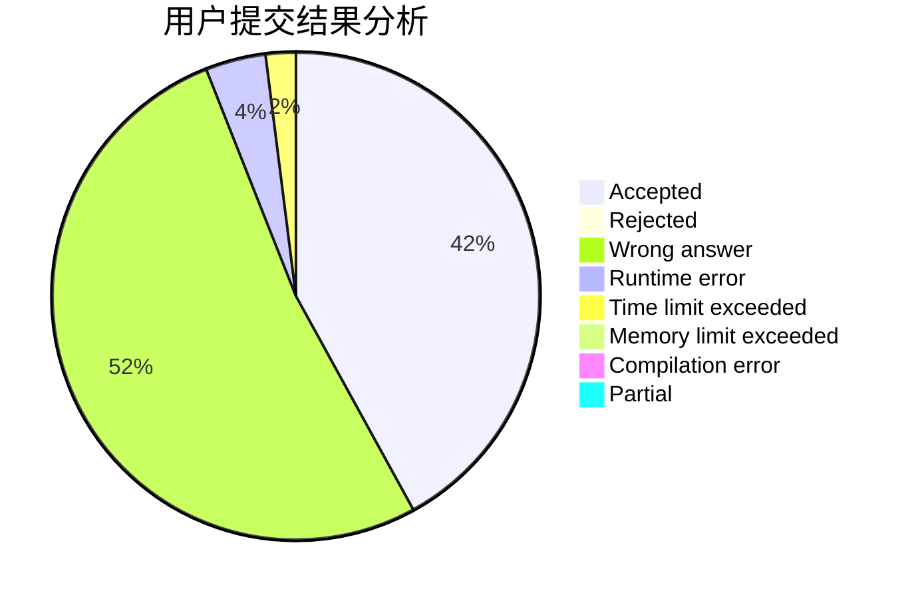
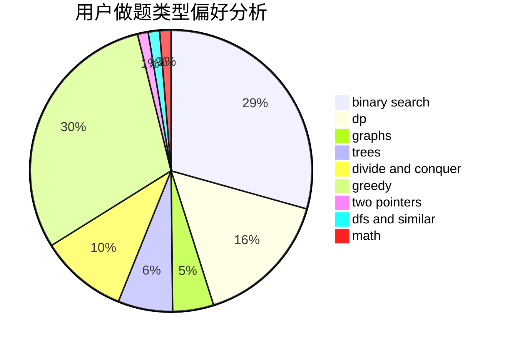

# DFS_lover

<!-- tabs:start -->

#### **用户提交结果分析**

#### **用户做题类型偏好分析**

<!-- tabs:end -->
# 推荐题目
[551E](https://codeforces.com/contest/551/problem/E)
[1477F](https://codeforces.com/contest/1477/problem/F)
[1085F](https://codeforces.com/contest/1085/problem/F)
[758B](https://codeforces.com/contest/758/problem/B)
[1164P](https://codeforces.com/contest/1164/problem/P)
[772A](https://codeforces.com/contest/772/problem/A)
[771E](https://codeforces.com/contest/771/problem/E)
[253A](https://codeforces.com/contest/253/problem/A)
[237A](https://codeforces.com/contest/237/problem/A)
[1172F](https://codeforces.com/contest/1172/problem/F)
