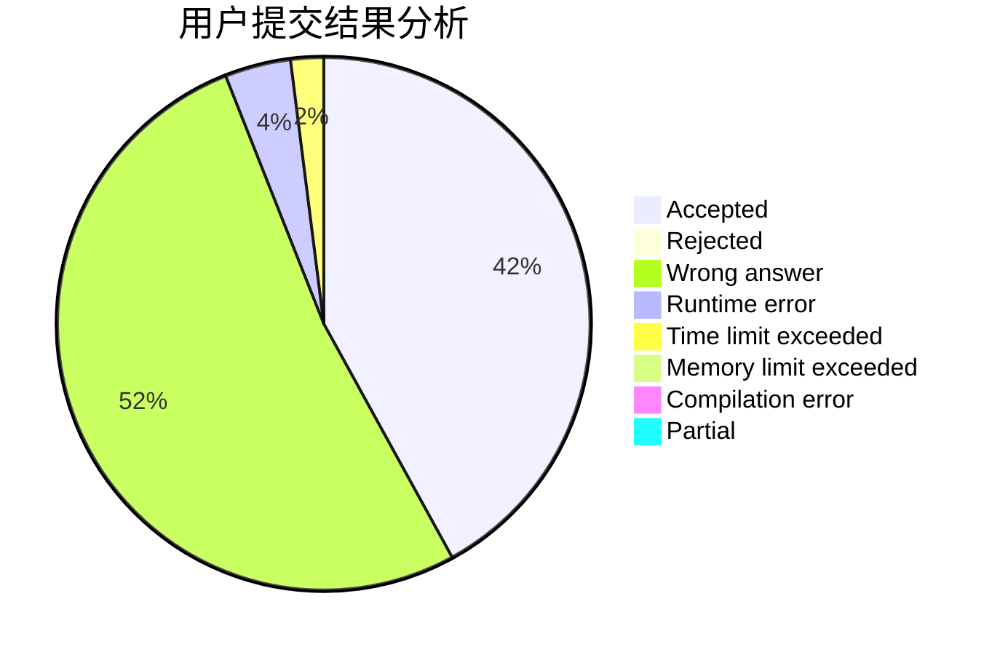
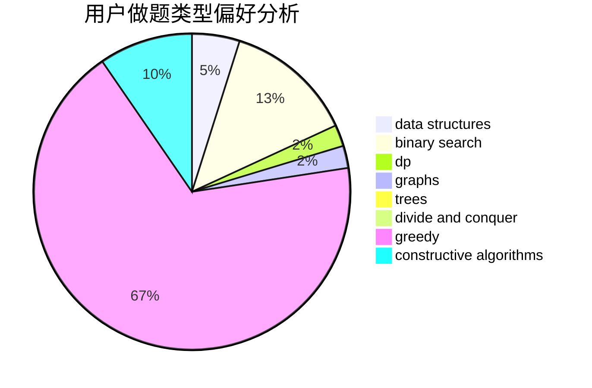
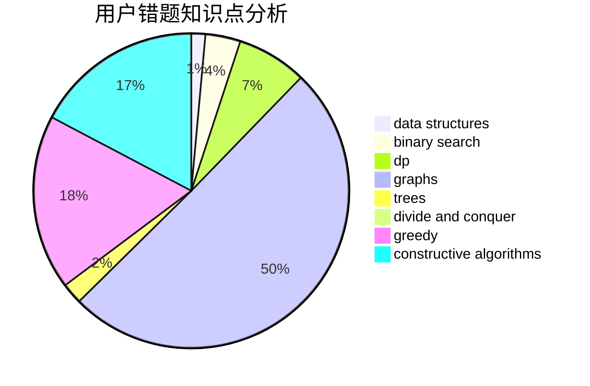

# DFS_lover
<!-- tabs:start -->
#### **用户提交结果分析**

#### **用户做题类型偏好分析**

#### **用户错题知识点分析**

<!-- tabs:end -->
# 推荐题目
[Data Center Drama](http://codeforces.com/problemset/problem/527/E)		dfs and similar,
                        graphs		  
[Right-Left Cipher](http://codeforces.com/problemset/problem/1085/A)		implementation,
                        strings		  
[Interactive Bulls and Cows (Hard)](http://codeforces.com/problemset/problem/753/C)		brute force,
                        constructive algorithms,
                        interactive		  
[Cat Party (Easy Edition)](http://codeforces.com/problemset/problem/1163/B1)		data structures,
                        implementation		  
[Permutations](http://codeforces.com/problemset/problem/736/D)		math,
                        matrices		  
[Vova and Trophies](http://codeforces.com/problemset/problem/1082/B)		greedy		  
[The Monster and the Squirrel](http://codeforces.com/problemset/problem/592/B)		math		  
[Exams](https://codeforces.com/contest/480/problem/A)		binary search,
                        greedy,
                        sortings		  
[Strange Housing](https://codeforces.com/contest/1471/problem/F)		constructive algorithms,
                        dfs and similar,
                        graph matchings,
                        graphs,
                        greedy		  
[To Add or Not to Add](http://codeforces.com/problemset/problem/231/C)		binary search,
                        sortings,
                        two pointers		  
<!-- tabs:start -->
#### **data structures**
[Data Center Drama](http://codeforces.com/problemset/problem/1163/B1)		data structures,
                        implementation		  
[Right-Left Cipher](http://codeforces.com/problemset/problem/1151/E)		combinatorics,
                        data structures,
                        dp,
                        math		  
[Interactive Bulls and Cows (Hard)](http://codeforces.com/problemset/problem/1492/C)		binary search,
                        data structures,
                        dp,
                        greedy,
                        two pointers		  
[Cat Party (Easy Edition)](http://codeforces.com/problemset/problem/1490/G)		binary search,
                        data structures,
                        math		  
[Permutations](http://codeforces.com/problemset/problem/1479/D)		binary search,
                        bitmasks,
                        brute force,
                        data structures,
                        probabilities,
                        trees		  
[Vova and Trophies](http://codeforces.com/problemset/problem/1497/A)		brute force,
                        data structures,
                        greedy,
                        sortings		  
[The Monster and the Squirrel](http://codeforces.com/problemset/problem/1491/C)		brute force,
                        data structures,
                        dp,
                        greedy,
                        implementation		  
[Exams](http://codeforces.com/problemset/problem/1492/B)		data structures,
                        greedy,
                        math		  
[Strange Housing](http://codeforces.com/problemset/problem/1436/E)		binary search,
                        data structures,
                        two pointers		  
[To Add or Not to Add](http://codeforces.com/problemset/problem/1461/D)		binary search,
                        brute force,
                        data structures,
                        divide and conquer,
                        implementation,
                        sortings		  
#### **binary search**
[Data Center Drama](https://codeforces.com/contest/480/problem/A)		binary search,
                        greedy,
                        sortings		  
[Right-Left Cipher](http://codeforces.com/problemset/problem/231/C)		binary search,
                        sortings,
                        two pointers		  
[Interactive Bulls and Cows (Hard)](https://codeforces.com/contest/1345/problem/F)		binary search,
                        greedy,
                        math		  
[Cat Party (Easy Edition)](http://codeforces.com/problemset/problem/1492/C)		binary search,
                        data structures,
                        dp,
                        greedy,
                        two pointers		  
[Permutations](http://codeforces.com/problemset/problem/1463/D)		binary search,
                        constructive algorithms,
                        greedy,
                        two pointers		  
[Vova and Trophies](http://codeforces.com/problemset/problem/1490/G)		binary search,
                        data structures,
                        math		  
[The Monster and the Squirrel](http://codeforces.com/problemset/problem/1479/D)		binary search,
                        bitmasks,
                        brute force,
                        data structures,
                        probabilities,
                        trees		  
[Exams](http://codeforces.com/problemset/problem/1436/E)		binary search,
                        data structures,
                        two pointers		  
[Strange Housing](http://codeforces.com/problemset/problem/1461/D)		binary search,
                        brute force,
                        data structures,
                        divide and conquer,
                        implementation,
                        sortings		  
[To Add or Not to Add](http://codeforces.com/problemset/problem/1493/C)		binary search,
                        brute force,
                        constructive algorithms,
                        greedy,
                        strings		  
#### **dp**
[Data Center Drama](http://codeforces.com/problemset/problem/51/F)		dfs and similar,
                        dp,
                        graphs,
                        trees		  
[Right-Left Cipher](http://codeforces.com/problemset/problem/463/D)		dfs and similar,
                        dp,
                        graphs,
                        implementation		  
[Interactive Bulls and Cows (Hard)](http://codeforces.com/problemset/problem/1425/B)		divide and conquer,
                        dp		  
[Cat Party (Easy Edition)](https://codeforces.com/contest/1447/problem/D)		dp,
                        strings		  
[Permutations](http://codeforces.com/problemset/problem/1151/E)		combinatorics,
                        data structures,
                        dp,
                        math		  
[Vova and Trophies](http://codeforces.com/problemset/problem/1395/C)		bitmasks,
                        brute force,
                        dp,
                        greedy		  
[The Monster and the Squirrel](http://codeforces.com/problemset/problem/1492/C)		binary search,
                        data structures,
                        dp,
                        greedy,
                        two pointers		  
[Exams](https://codeforces.com/contest/1457/problem/C)		brute force,
                        dp,
                        implementation		  
[Strange Housing](http://codeforces.com/problemset/problem/1491/C)		brute force,
                        data structures,
                        dp,
                        greedy,
                        implementation		  
[To Add or Not to Add](http://codeforces.com/problemset/problem/1437/C)		dp,
                        flows,
                        graph matchings,
                        greedy,
                        math,
                        sortings		  
#### **graph**
[Data Center Drama](http://codeforces.com/problemset/problem/527/E)		dfs and similar,
                        graphs		  
[Right-Left Cipher](https://codeforces.com/contest/1471/problem/F)		constructive algorithms,
                        dfs and similar,
                        graph matchings,
                        graphs,
                        greedy		  
[Interactive Bulls and Cows (Hard)](http://codeforces.com/problemset/problem/51/F)		dfs and similar,
                        dp,
                        graphs,
                        trees		  
[Cat Party (Easy Edition)](http://codeforces.com/problemset/problem/463/D)		dfs and similar,
                        dp,
                        graphs,
                        implementation		  
[Permutations](https://codeforces.com/contest/602/problem/C)		graphs,
                        shortest paths		  
[Vova and Trophies](http://codeforces.com/problemset/problem/290/C)		*special problem,
                        graph matchings,
                        implementation,
                        trees		  
[The Monster and the Squirrel](http://codeforces.com/problemset/problem/590/E)		graph matchings,
                        strings		  
[Exams](http://codeforces.com/problemset/problem/1487/C)		brute force,
                        constructive algorithms,
                        dfs and similar,
                        graphs,
                        greedy,
                        implementation,
                        math		  
[Strange Housing](http://codeforces.com/problemset/problem/1437/C)		dp,
                        flows,
                        graph matchings,
                        greedy,
                        math,
                        sortings		  
[To Add or Not to Add](http://codeforces.com/problemset/problem/1470/D)		constructive algorithms,
                        dfs and similar,
                        graph matchings,
                        graphs,
                        greedy		  
#### **trees**
[Data Center Drama](http://codeforces.com/problemset/problem/51/F)		dfs and similar,
                        dp,
                        graphs,
                        trees		  
[Right-Left Cipher](http://codeforces.com/problemset/problem/290/C)		*special problem,
                        graph matchings,
                        implementation,
                        trees		  
[Interactive Bulls and Cows (Hard)](http://codeforces.com/problemset/problem/1479/D)		binary search,
                        bitmasks,
                        brute force,
                        data structures,
                        probabilities,
                        trees		  
[Cat Party (Easy Edition)](http://codeforces.com/problemset/problem/1511/C)		brute force,
                        data structures,
                        implementation,
                        trees		  
[Permutations](http://codeforces.com/problemset/problem/1499/F)		combinatorics,
                        dfs and similar,
                        dp,
                        trees		  
[Vova and Trophies](http://codeforces.com/problemset/problem/1491/E)		brute force,
                        dfs and similar,
                        divide and conquer,
                        number theory,
                        trees		  
[The Monster and the Squirrel](http://codeforces.com/problemset/problem/1466/D)		data structures,
                        greedy,
                        sortings,
                        trees		  
[Exams](http://codeforces.com/problemset/problem/1495/D)		combinatorics,
                        dfs and similar,
                        graphs,
                        math,
                        shortest paths,
                        trees		  
[Strange Housing](http://codeforces.com/problemset/problem/1303/G)		data structures,
                        divide and conquer,
                        geometry,
                        trees		  
[To Add or Not to Add](http://codeforces.com/problemset/problem/1454/E)		combinatorics,
                        dfs and similar,
                        graphs,
                        trees		  
#### **divide and conquer**
[Data Center Drama](http://codeforces.com/problemset/problem/1425/B)		divide and conquer,
                        dp		  
[Right-Left Cipher](http://codeforces.com/problemset/problem/1167/B)		brute force,
                        divide and conquer,
                        interactive,
                        math		  
[Interactive Bulls and Cows (Hard)](http://codeforces.com/problemset/problem/1461/D)		binary search,
                        brute force,
                        data structures,
                        divide and conquer,
                        implementation,
                        sortings		  
[Cat Party (Easy Edition)](http://codeforces.com/problemset/problem/1466/G)		combinatorics,
                        divide and conquer,
                        hashing,
                        math,
                        string suffix structures,
                        strings		  
[Permutations](http://codeforces.com/problemset/problem/1490/D)		dfs and similar,
                        divide and conquer,
                        implementation		  
[Vova and Trophies](https://codeforces.com/contest/1483/problem/C)		data structures,
                        divide and conquer,
                        dp		  
[The Monster and the Squirrel](http://codeforces.com/problemset/problem/1491/E)		brute force,
                        dfs and similar,
                        divide and conquer,
                        number theory,
                        trees		  
[Exams](http://codeforces.com/problemset/problem/1303/G)		data structures,
                        divide and conquer,
                        geometry,
                        trees		  
[Strange Housing](http://codeforces.com/problemset/problem/1494/D)		constructive algorithms,
                        data structures,
                        dfs and similar,
                        divide and conquer,
                        dsu,
                        greedy,
                        sortings,
                        trees		  
[To Add or Not to Add](http://codeforces.com/problemset/problem/1482/E)		data structures,
                        divide and conquer,
                        dp		  
#### **greedy**
[Data Center Drama](http://codeforces.com/problemset/problem/1082/B)		greedy		  
[Right-Left Cipher](https://codeforces.com/contest/480/problem/A)		binary search,
                        greedy,
                        sortings		  
[Interactive Bulls and Cows (Hard)](https://codeforces.com/contest/1471/problem/F)		constructive algorithms,
                        dfs and similar,
                        graph matchings,
                        graphs,
                        greedy		  
[Cat Party (Easy Edition)](http://codeforces.com/problemset/problem/754/A)		constructive algorithms,
                        greedy,
                        implementation		  
[Permutations](https://codeforces.com/contest/1345/problem/F)		binary search,
                        greedy,
                        math		  
[Vova and Trophies](http://codeforces.com/problemset/problem/1395/C)		bitmasks,
                        brute force,
                        dp,
                        greedy		  
[The Monster and the Squirrel](http://codeforces.com/problemset/problem/1492/C)		binary search,
                        data structures,
                        dp,
                        greedy,
                        two pointers		  
[Exams](https://codeforces.com/contest/1496/problem/C)		geometry,
                        greedy,
                        math,
                        sortings		  
[Strange Housing](http://codeforces.com/problemset/problem/1493/A)		constructive algorithms,
                        greedy		  
[To Add or Not to Add](http://codeforces.com/problemset/problem/1463/D)		binary search,
                        constructive algorithms,
                        greedy,
                        two pointers		  
#### **constructive algorithms**
[Data Center Drama](http://codeforces.com/problemset/problem/753/C)		brute force,
                        constructive algorithms,
                        interactive		  
[Right-Left Cipher](https://codeforces.com/contest/1471/problem/F)		constructive algorithms,
                        dfs and similar,
                        graph matchings,
                        graphs,
                        greedy		  
[Interactive Bulls and Cows (Hard)](http://codeforces.com/problemset/problem/754/A)		constructive algorithms,
                        greedy,
                        implementation		  
[Cat Party (Easy Edition)](http://codeforces.com/problemset/problem/1493/A)		constructive algorithms,
                        greedy		  
[Permutations](http://codeforces.com/problemset/problem/1463/D)		binary search,
                        constructive algorithms,
                        greedy,
                        two pointers		  
[Vova and Trophies](https://codeforces.com/contest/1456/problem/B)		bitmasks,
                        brute force,
                        constructive algorithms		  
[The Monster and the Squirrel](http://codeforces.com/problemset/problem/1492/D)		bitmasks,
                        constructive algorithms,
                        greedy,
                        math		  
[Exams](https://codeforces.com/contest/1504/problem/D)		constructive algorithms,
                        games,
                        interactive		  
[Strange Housing](https://codeforces.com/contest/1483/problem/A)		brute force,
                        constructive algorithms,
                        greedy,
                        implementation		  
[To Add or Not to Add](https://codeforces.com/contest/1457/problem/D)		bitmasks,
                        brute force,
                        constructive algorithms		  
#### **sortings**
[Data Center Drama](https://codeforces.com/contest/480/problem/A)		binary search,
                        greedy,
                        sortings		  
[Right-Left Cipher](http://codeforces.com/problemset/problem/231/C)		binary search,
                        sortings,
                        two pointers		  
[Interactive Bulls and Cows (Hard)](http://codeforces.com/problemset/problem/593/B)		geometry,
                        sortings		  
[Cat Party (Easy Edition)](https://codeforces.com/contest/1496/problem/C)		geometry,
                        greedy,
                        math,
                        sortings		  
[Permutations](http://codeforces.com/problemset/problem/1495/A)		geometry,
                        greedy,
                        math,
                        sortings		  
[Vova and Trophies](http://codeforces.com/problemset/problem/1497/A)		brute force,
                        data structures,
                        greedy,
                        sortings		  
[The Monster and the Squirrel](http://codeforces.com/problemset/problem/1427/A)		math,
                        sortings		  
[Exams](http://codeforces.com/problemset/problem/1461/D)		binary search,
                        brute force,
                        data structures,
                        divide and conquer,
                        implementation,
                        sortings		  
[Strange Housing](http://codeforces.com/problemset/problem/1437/C)		dp,
                        flows,
                        graph matchings,
                        greedy,
                        math,
                        sortings		  
[To Add or Not to Add](http://codeforces.com/problemset/problem/1473/A)		greedy,
                        implementation,
                        math,
                        sortings		  
<!-- tabs:end -->
