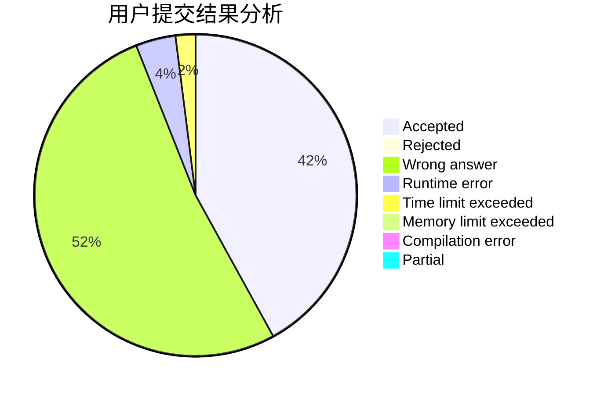
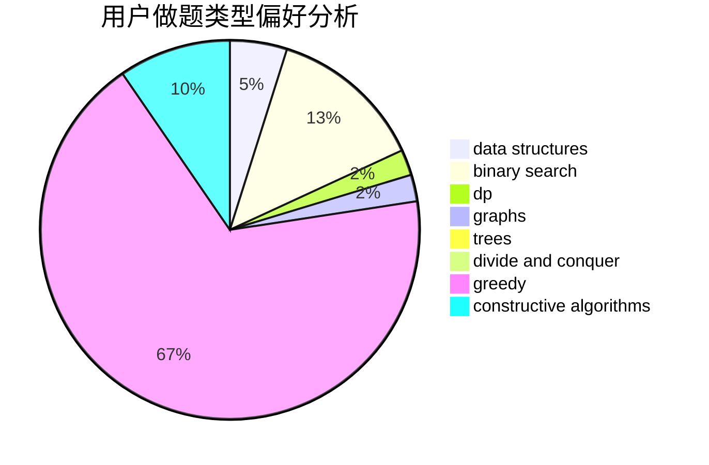
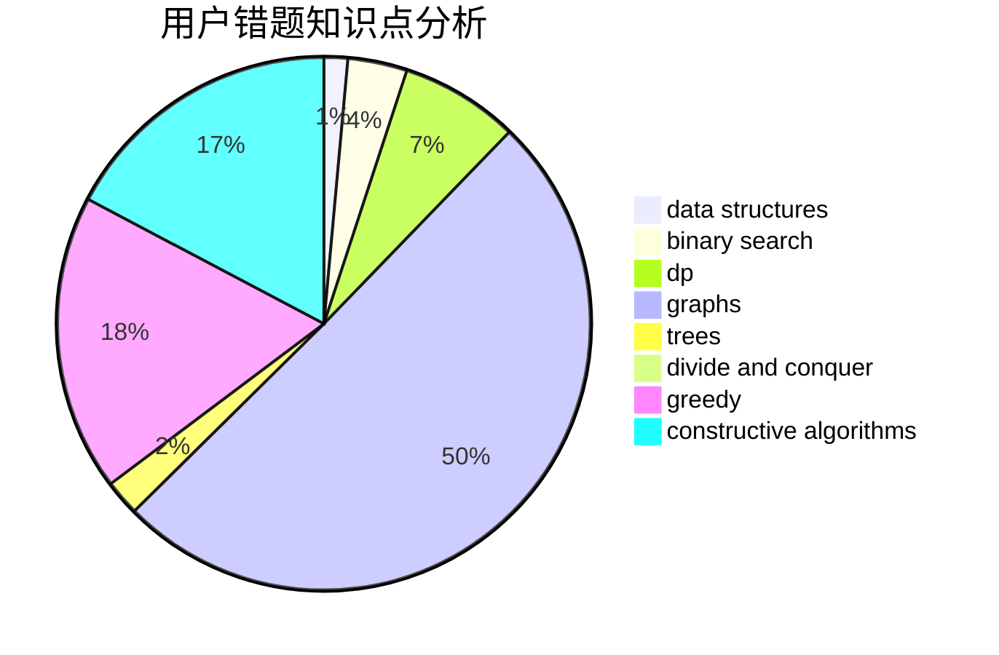

# DFS_lover

<!-- tabs:start -->

#### **用户提交结果分析**

#### **用户做题类型偏好分析**

#### **用户错题知识点分析**

<!-- tabs:end -->
# 推荐题目
[527E](https://codeforces.com/contest/527/problem/E)		dfs and similar,
                        graphs		  
[1469E](https://codeforces.com/contest/1469/problem/E)		bitmasks,
                        brute force,
                        hashing,
                        string suffix structures,
                        strings,
                        two pointers		  
[1085A](https://codeforces.com/contest/1085/problem/A)		implementation,
                        strings		  
[736D](https://codeforces.com/contest/736/problem/D)		math,
                        matrices		  
[1163B1](https://codeforces.com/contest/1163B/problem/1)		data structures,
                        implementation		  
[754A](https://codeforces.com/contest/754/problem/A)		constructive algorithms,
                        greedy,
                        implementation		  
[753C](https://codeforces.com/contest/753/problem/C)		brute force,
                        constructive algorithms,
                        interactive		  
[231C](https://codeforces.com/contest/231/problem/C)		binary search,
                        sortings,
                        two pointers		  
[218B](https://codeforces.com/contest/218/problem/B)		implementation		  
[1168B](https://codeforces.com/contest/1168/problem/B)		brute force,
                        two pointers		  
