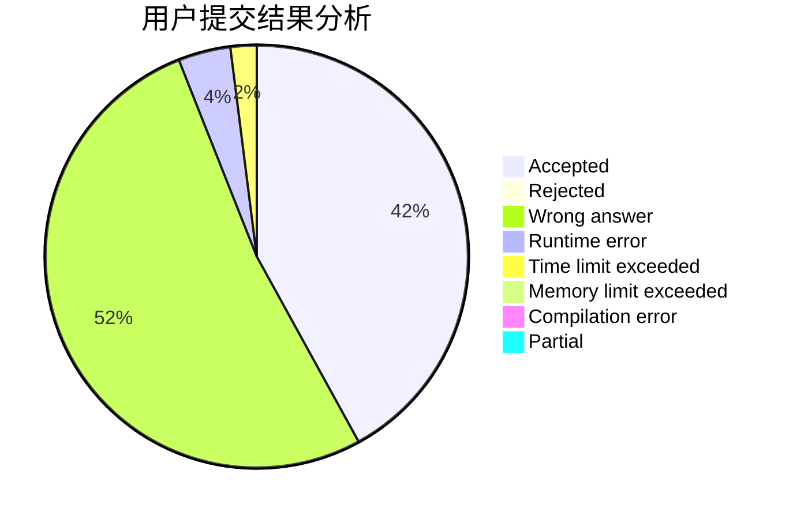
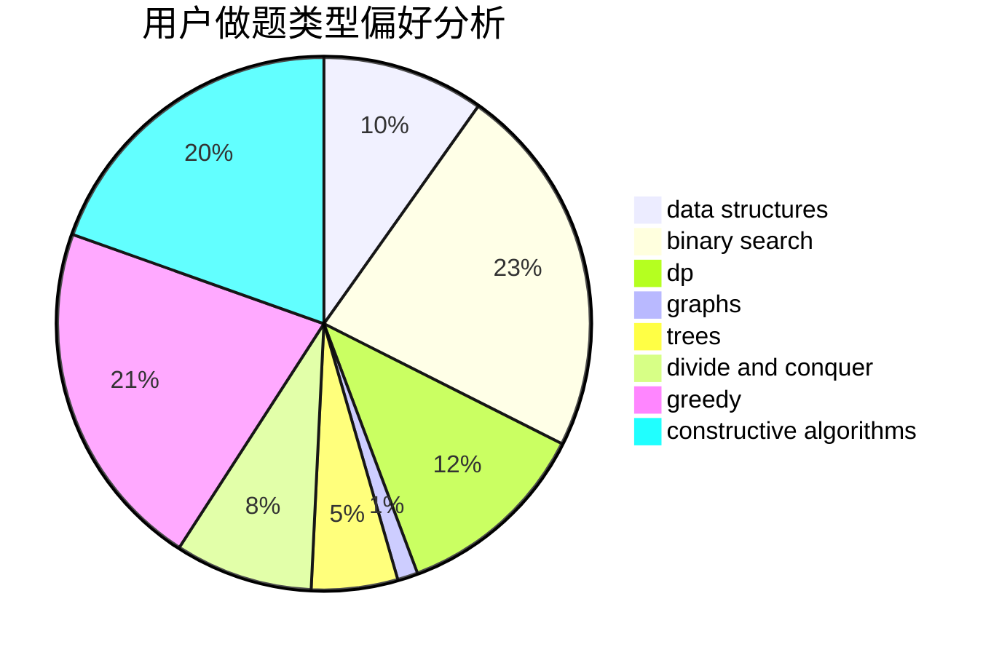
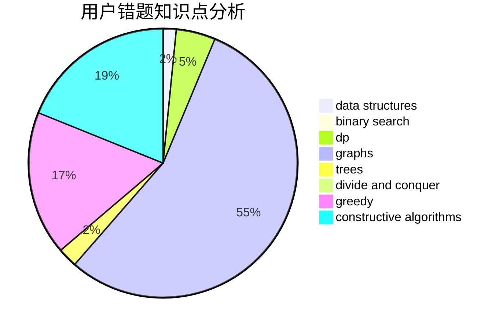

# DFS_lover

<!-- tabs:start -->

#### **用户提交结果分析**

#### **用户做题类型偏好分析**

#### **用户错题知识点分析**

<!-- tabs:end -->
# 推荐题目
[551E](https://codeforces.com/contest/551/problem/E)		binary search,
                        data structures,
                        implementation		  
[1477F](https://codeforces.com/contest/1477/problem/F)		combinatorics,
                        fft,
                        math,
                        probabilities		  
[1085F](https://codeforces.com/contest/1085/problem/F)		nan		  
[758B](https://codeforces.com/contest/758/problem/B)		brute force,
                        implementation,
                        number theory		  
[1164P](https://codeforces.com/contest/1164/problem/P)		dsu,graphs,sortings,trees		  
[772A](https://codeforces.com/contest/772/problem/A)		binary search,
                        math		  
[771E](https://codeforces.com/contest/771/problem/E)		dp,
                        greedy		  
[253A](https://codeforces.com/contest/253/problem/A)		greedy		  
[237A](https://codeforces.com/contest/237/problem/A)		implementation		  
[1172F](https://codeforces.com/contest/1172/problem/F)		data structures		  
