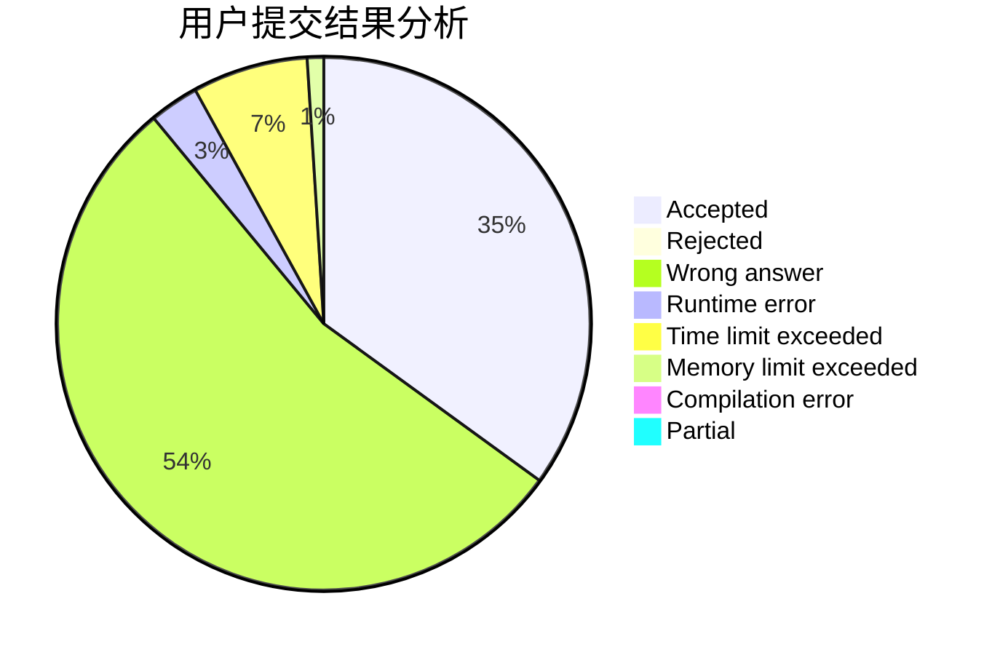
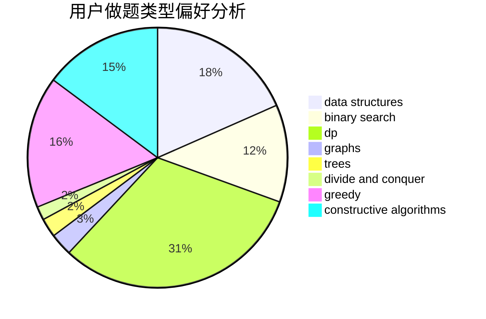
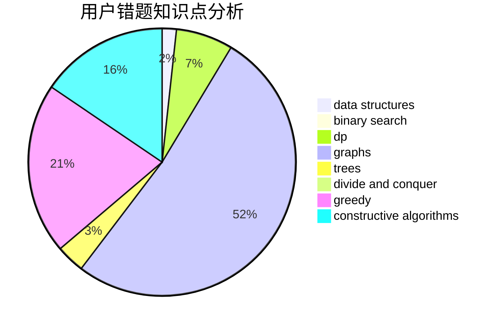

# DLUT_Zeratul

<!-- tabs:start -->

#### **用户提交结果分析**

#### **用户做题类型偏好分析**

#### **用户错题知识点分析**

<!-- tabs:end -->
# 推荐题目
[1375C](https://codeforces.com/contest/1375/problem/C)		constructive algorithms,
                        data structures,
                        greedy		  
[754C](https://codeforces.com/contest/754/problem/C)		brute force,
                        constructive algorithms,
                        dp,
                        implementation,
                        strings		  
[1181D](https://codeforces.com/contest/1181/problem/D)		binary search,
                        data structures,
                        implementation,
                        sortings,
                        trees,
                        two pointers		  
[754E](https://codeforces.com/contest/754/problem/E)		bitmasks,
                        brute force,
                        fft,
                        strings,
                        trees		  
[238C](https://codeforces.com/contest/238/problem/C)		dfs and similar,
                        dp,
                        greedy,
                        trees		  
[703B](https://codeforces.com/contest/703/problem/B)		implementation,
                        math		  
[628F](https://codeforces.com/contest/628/problem/F)		flows		  
[1173A](https://codeforces.com/contest/1173/problem/A)		greedy		  
[1399F](https://codeforces.com/contest/1399/problem/F)		data structures,
                        dp,
                        graphs,
                        sortings		  
[754D](https://codeforces.com/contest/754/problem/D)		binary search,
                        data structures,
                        greedy,
                        sortings		  
