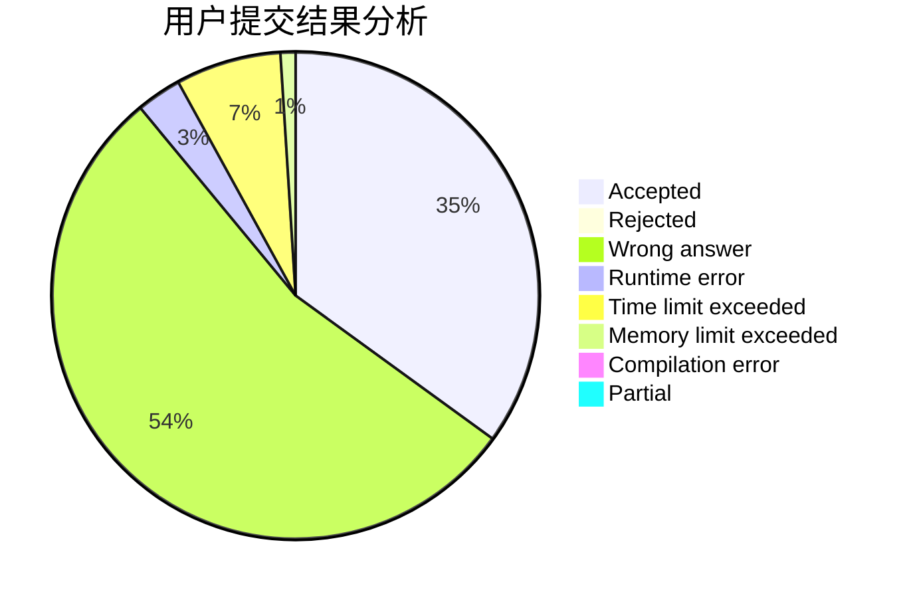
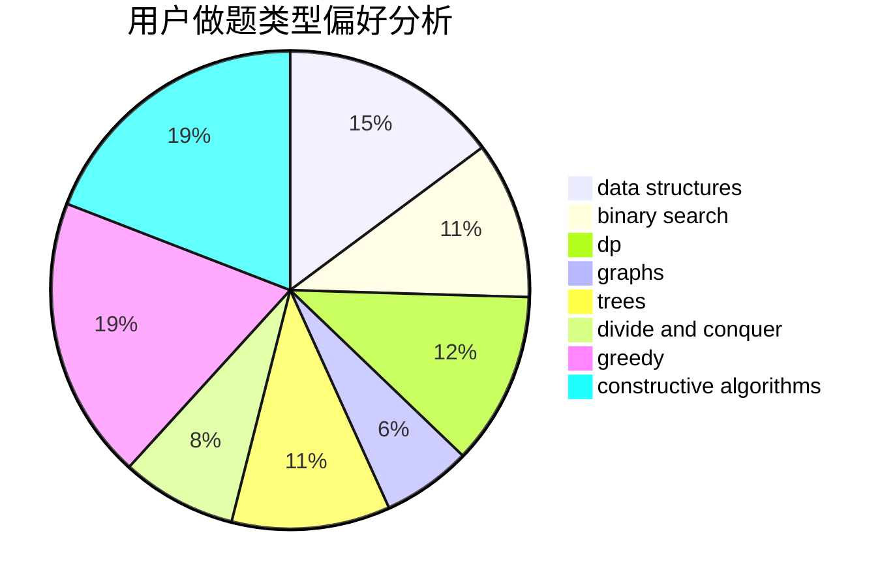
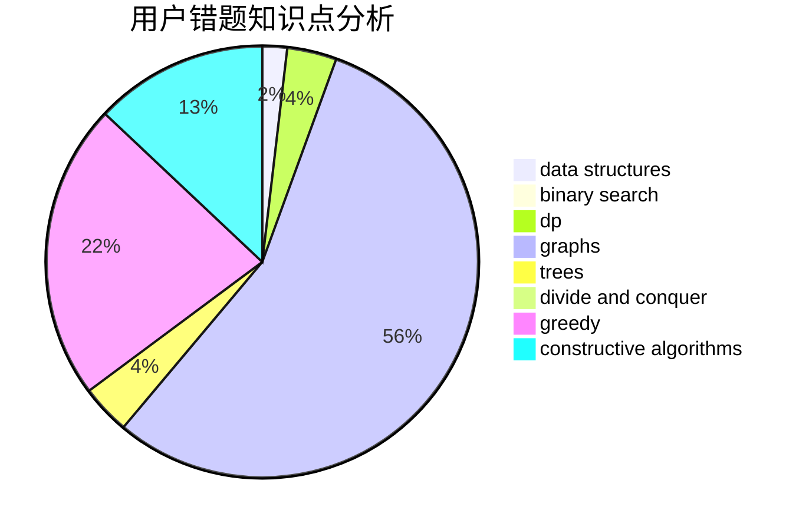

# DLUT_Zeratul

<!-- tabs:start -->

#### **用户提交结果分析**

#### **用户做题类型偏好分析**

#### **用户错题知识点分析**

<!-- tabs:end -->
# 推荐题目
[1384A](https://codeforces.com/contest/1384/problem/A)		constructive algorithms,
                        greedy,
                        strings		  
[772D](https://codeforces.com/contest/772/problem/D)		bitmasks,
                        dp		  
[11841](https://codeforces.com/contest/1184/problem/1)		dsu,graphs,sortings,trees		  
[773D](https://codeforces.com/contest/773/problem/D)		dp,
                        graphs,
                        shortest paths		  
[25E](https://codeforces.com/contest/25/problem/E)		hashing,
                        strings		  
[722C](https://codeforces.com/contest/722/problem/C)		data structures,
                        dsu		  
[656F](https://codeforces.com/contest/656/problem/F)		*special problem		  
[1175D](https://codeforces.com/contest/1175/problem/D)		greedy,
                        sortings		  
[1408H](https://codeforces.com/contest/1408/problem/H)		binary search,
                        data structures,
                        flows,
                        greedy		  
[772E](https://codeforces.com/contest/772/problem/E)		binary search,
                        divide and conquer,
                        interactive,
                        trees		  
