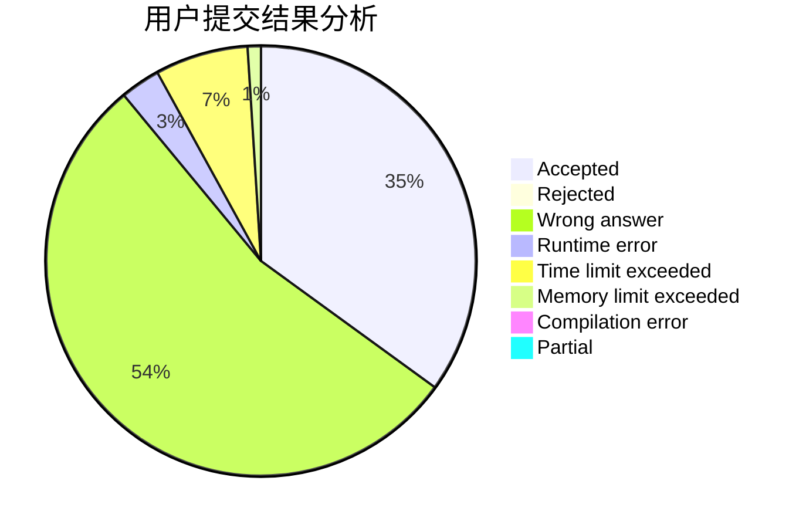
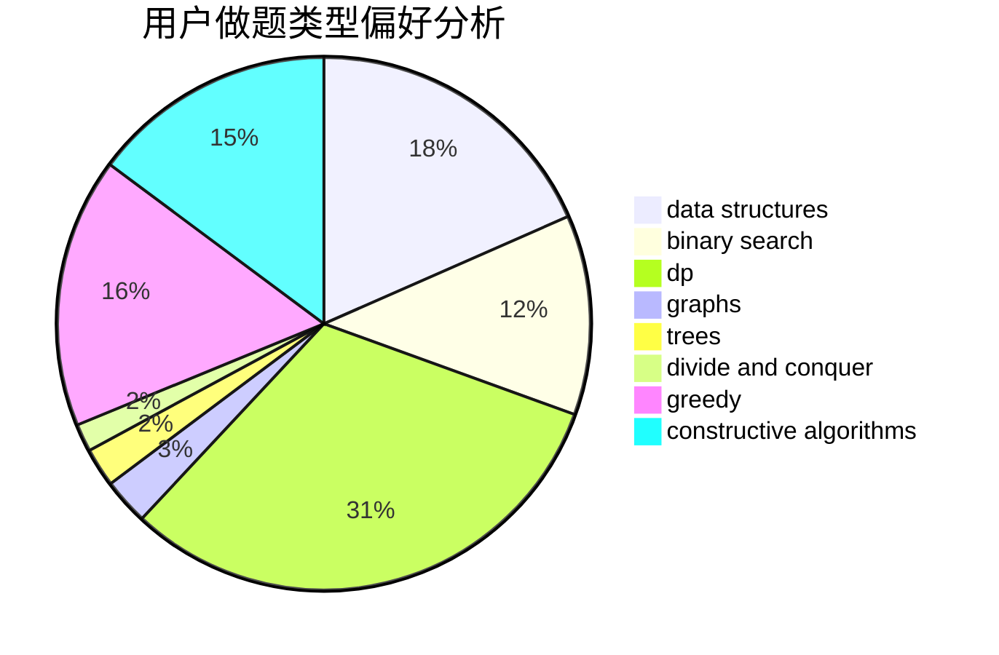
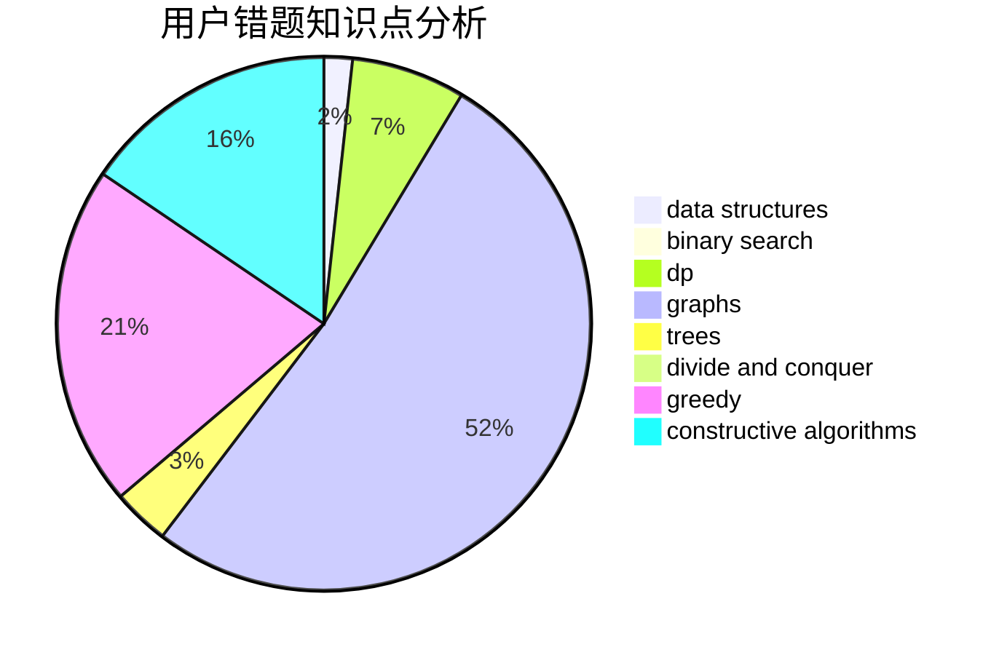

# DLUT_Zeratul
<!-- tabs:start -->
#### **用户提交结果分析**

#### **用户做题类型偏好分析**

#### **用户错题知识点分析**

<!-- tabs:end -->
# 推荐题目
[Fedor and coupons](http://codeforces.com/problemset/problem/754/D)		binary search,
                        data structures,
                        greedy,
                        sortings		  
[World Eater Brothers](http://codeforces.com/problemset/problem/238/C)		dfs and similar,
                        dp,
                        greedy,
                        trees		  
[Vladik and chat](http://codeforces.com/problemset/problem/754/C)		brute force,
                        constructive algorithms,
                        dp,
                        implementation,
                        strings		  
[Mishka and trip](http://codeforces.com/problemset/problem/703/B)		implementation,
                        math		  
[Bear and Fair Set](http://codeforces.com/problemset/problem/628/F)		flows		  
[Irrigation](http://codeforces.com/problemset/problem/1181/D)		binary search,
                        data structures,
                        implementation,
                        sortings,
                        trees,
                        two pointers		  
[Yet Another Segments Subset](http://codeforces.com/problemset/problem/1399/F)		data structures,
                        dp,
                        graphs,
                        sortings		  
[PolandBall and Gifts](http://codeforces.com/problemset/problem/755/F)		bitmasks,
                        dp,
                        greedy		  
[Power Products](https://codeforces.com/contest/1246/problem/B)		hashing,
                        math,
                        number theory		  
[PolandBall and Polygon](http://codeforces.com/problemset/problem/755/D)		data structures		  
<!-- tabs:start -->
#### **data structures**
[Fedor and coupons](http://codeforces.com/problemset/problem/754/D)		binary search,
                        data structures,
                        greedy,
                        sortings		  
[World Eater Brothers](http://codeforces.com/problemset/problem/1181/D)		binary search,
                        data structures,
                        implementation,
                        sortings,
                        trees,
                        two pointers		  
[Vladik and chat](http://codeforces.com/problemset/problem/1399/F)		data structures,
                        dp,
                        graphs,
                        sortings		  
[Mishka and trip](http://codeforces.com/problemset/problem/755/D)		data structures		  
[Bear and Fair Set](http://codeforces.com/problemset/problem/12/D)		data structures,
                        sortings		  
[Irrigation](http://codeforces.com/problemset/problem/1132/G)		data structures,
                        dp,
                        trees		  
[Yet Another Segments Subset](http://codeforces.com/problemset/problem/1375/C)		constructive algorithms,
                        data structures,
                        greedy		  
[PolandBall and Gifts](http://codeforces.com/problemset/problem/1383/E)		combinatorics,
                        data structures,
                        dp		  
[Power Products](http://codeforces.com/problemset/problem/1492/C)		binary search,
                        data structures,
                        dp,
                        greedy,
                        two pointers		  
[PolandBall and Polygon](http://codeforces.com/problemset/problem/1490/G)		binary search,
                        data structures,
                        math		  
#### **binary search**
[Fedor and coupons](http://codeforces.com/problemset/problem/754/D)		binary search,
                        data structures,
                        greedy,
                        sortings		  
[World Eater Brothers](http://codeforces.com/problemset/problem/1181/D)		binary search,
                        data structures,
                        implementation,
                        sortings,
                        trees,
                        two pointers		  
[Vladik and chat](http://codeforces.com/problemset/problem/333/E)		binary search,
                        bitmasks,
                        brute force,
                        geometry,
                        sortings		  
[Mishka and trip](https://codeforces.com/contest/1489/problem/F)		binary search,
                        implementation		  
[Bear and Fair Set](http://codeforces.com/problemset/problem/1131/C)		binary search,
                        greedy,
                        sortings		  
[Irrigation](http://codeforces.com/problemset/problem/1492/C)		binary search,
                        data structures,
                        dp,
                        greedy,
                        two pointers		  
[Yet Another Segments Subset](http://codeforces.com/problemset/problem/1463/D)		binary search,
                        constructive algorithms,
                        greedy,
                        two pointers		  
[PolandBall and Gifts](http://codeforces.com/problemset/problem/1490/G)		binary search,
                        data structures,
                        math		  
[Power Products](http://codeforces.com/problemset/problem/1479/D)		binary search,
                        bitmasks,
                        brute force,
                        data structures,
                        probabilities,
                        trees		  
[PolandBall and Polygon](http://codeforces.com/problemset/problem/1436/E)		binary search,
                        data structures,
                        two pointers		  
#### **dp**
[Fedor and coupons](http://codeforces.com/problemset/problem/238/C)		dfs and similar,
                        dp,
                        greedy,
                        trees		  
[World Eater Brothers](http://codeforces.com/problemset/problem/754/C)		brute force,
                        constructive algorithms,
                        dp,
                        implementation,
                        strings		  
[Vladik and chat](http://codeforces.com/problemset/problem/1399/F)		data structures,
                        dp,
                        graphs,
                        sortings		  
[Mishka and trip](http://codeforces.com/problemset/problem/755/F)		bitmasks,
                        dp,
                        greedy		  
[Bear and Fair Set](http://codeforces.com/problemset/problem/74/B)		dp,
                        games,
                        greedy		  
[Irrigation](http://codeforces.com/problemset/problem/1132/G)		data structures,
                        dp,
                        trees		  
[Yet Another Segments Subset](http://codeforces.com/problemset/problem/1172/C2)		dp,
                        probabilities		  
[PolandBall and Gifts](https://codeforces.com/contest/1078/problem/C)		dp,
                        trees		  
[Power Products](http://codeforces.com/problemset/problem/235/B)		dp,
                        math,
                        probabilities		  
[PolandBall and Polygon](http://codeforces.com/problemset/problem/755/G)		combinatorics,
                        divide and conquer,
                        dp,
                        fft,
                        math,
                        number theory		  
#### **graph**
[Fedor and coupons](http://codeforces.com/problemset/problem/1399/F)		data structures,
                        dp,
                        graphs,
                        sortings		  
[World Eater Brothers](http://codeforces.com/problemset/problem/755/C)		dfs and similar,
                        dsu,
                        graphs,
                        interactive,
                        trees		  
[Vladik and chat](http://codeforces.com/problemset/problem/1264/E)		constructive algorithms,
                        flows,
                        graph matchings		  
[Mishka and trip](http://codeforces.com/problemset/problem/1176/D)		dfs and similar,
                        graphs,
                        greedy,
                        number theory,
                        sortings		  
[Bear and Fair Set](http://codeforces.com/problemset/problem/103/E)		flows,
                        graph matchings		  
[Irrigation](http://codeforces.com/problemset/problem/1487/C)		brute force,
                        constructive algorithms,
                        dfs and similar,
                        graphs,
                        greedy,
                        implementation,
                        math		  
[Yet Another Segments Subset](http://codeforces.com/problemset/problem/1437/C)		dp,
                        flows,
                        graph matchings,
                        greedy,
                        math,
                        sortings		  
[PolandBall and Gifts](http://codeforces.com/problemset/problem/1470/D)		constructive algorithms,
                        dfs and similar,
                        graph matchings,
                        graphs,
                        greedy		  
[Power Products](http://codeforces.com/problemset/problem/1476/C)		dp,
                        graphs,
                        greedy		  
[PolandBall and Polygon](http://codeforces.com/problemset/problem/1304/D)		constructive algorithms,
                        graphs,
                        greedy,
                        two pointers		  
#### **trees**
[Fedor and coupons](http://codeforces.com/problemset/problem/238/C)		dfs and similar,
                        dp,
                        greedy,
                        trees		  
[World Eater Brothers](http://codeforces.com/problemset/problem/1181/D)		binary search,
                        data structures,
                        implementation,
                        sortings,
                        trees,
                        two pointers		  
[Vladik and chat](http://codeforces.com/problemset/problem/1132/G)		data structures,
                        dp,
                        trees		  
[Mishka and trip](https://codeforces.com/contest/1189/problem/D2)		constructive algorithms,
                        dfs and similar,
                        implementation,
                        trees		  
[Bear and Fair Set](http://codeforces.com/problemset/problem/754/E)		bitmasks,
                        brute force,
                        fft,
                        strings,
                        trees		  
[Irrigation](http://codeforces.com/problemset/problem/755/C)		dfs and similar,
                        dsu,
                        graphs,
                        interactive,
                        trees		  
[Yet Another Segments Subset](https://codeforces.com/contest/1078/problem/C)		dp,
                        trees		  
[PolandBall and Gifts](http://codeforces.com/problemset/problem/724/F)		combinatorics,
                        dp,
                        trees		  
[Power Products](http://codeforces.com/problemset/problem/1479/D)		binary search,
                        bitmasks,
                        brute force,
                        data structures,
                        probabilities,
                        trees		  
[PolandBall and Polygon](http://codeforces.com/problemset/problem/1511/C)		brute force,
                        data structures,
                        implementation,
                        trees		  
#### **divide and conquer**
[Fedor and coupons](http://codeforces.com/problemset/problem/755/G)		combinatorics,
                        divide and conquer,
                        dp,
                        fft,
                        math,
                        number theory		  
[World Eater Brothers](http://codeforces.com/problemset/problem/1461/D)		binary search,
                        brute force,
                        data structures,
                        divide and conquer,
                        implementation,
                        sortings		  
[Vladik and chat](http://codeforces.com/problemset/problem/1466/G)		combinatorics,
                        divide and conquer,
                        hashing,
                        math,
                        string suffix structures,
                        strings		  
[Mishka and trip](http://codeforces.com/problemset/problem/1490/D)		dfs and similar,
                        divide and conquer,
                        implementation		  
[Bear and Fair Set](https://codeforces.com/contest/1483/problem/C)		data structures,
                        divide and conquer,
                        dp		  
[Irrigation](http://codeforces.com/problemset/problem/1491/E)		brute force,
                        dfs and similar,
                        divide and conquer,
                        number theory,
                        trees		  
[Yet Another Segments Subset](http://codeforces.com/problemset/problem/1303/G)		data structures,
                        divide and conquer,
                        geometry,
                        trees		  
[PolandBall and Gifts](http://codeforces.com/problemset/problem/1494/D)		constructive algorithms,
                        data structures,
                        dfs and similar,
                        divide and conquer,
                        dsu,
                        greedy,
                        sortings,
                        trees		  
[Power Products](http://codeforces.com/problemset/problem/1482/E)		data structures,
                        divide and conquer,
                        dp		  
[PolandBall and Polygon](http://codeforces.com/problemset/problem/566/C)		dfs and similar,
                        divide and conquer,
                        trees		  
#### **greedy**
[Fedor and coupons](http://codeforces.com/problemset/problem/754/D)		binary search,
                        data structures,
                        greedy,
                        sortings		  
[World Eater Brothers](http://codeforces.com/problemset/problem/238/C)		dfs and similar,
                        dp,
                        greedy,
                        trees		  
[Vladik and chat](http://codeforces.com/problemset/problem/755/F)		bitmasks,
                        dp,
                        greedy		  
[Mishka and trip](http://codeforces.com/problemset/problem/74/B)		dp,
                        games,
                        greedy		  
[Bear and Fair Set](http://codeforces.com/problemset/problem/23/A)		brute force,
                        greedy		  
[Irrigation](http://codeforces.com/problemset/problem/1173/A)		greedy		  
[Yet Another Segments Subset](http://codeforces.com/problemset/problem/1375/C)		constructive algorithms,
                        data structures,
                        greedy		  
[PolandBall and Gifts](http://codeforces.com/problemset/problem/333/B)		greedy		  
[Power Products](http://codeforces.com/problemset/problem/1176/D)		dfs and similar,
                        graphs,
                        greedy,
                        number theory,
                        sortings		  
[PolandBall and Polygon](http://codeforces.com/problemset/problem/1385/C)		greedy		  
#### **constructive algorithms**
[Fedor and coupons](http://codeforces.com/problemset/problem/754/C)		brute force,
                        constructive algorithms,
                        dp,
                        implementation,
                        strings		  
[World Eater Brothers](http://codeforces.com/problemset/problem/756/A)		constructive algorithms,
                        dfs and similar		  
[Vladik and chat](https://codeforces.com/contest/1189/problem/D2)		constructive algorithms,
                        dfs and similar,
                        implementation,
                        trees		  
[Mishka and trip](http://codeforces.com/problemset/problem/1375/C)		constructive algorithms,
                        data structures,
                        greedy		  
[Bear and Fair Set](http://codeforces.com/problemset/problem/1264/E)		constructive algorithms,
                        flows,
                        graph matchings		  
[Irrigation](http://codeforces.com/problemset/problem/1174/D)		bitmasks,
                        constructive algorithms		  
[Yet Another Segments Subset](http://codeforces.com/problemset/problem/1353/A)		constructive algorithms,
                        greedy,
                        math		  
[PolandBall and Gifts](http://codeforces.com/problemset/problem/1375/E)		constructive algorithms,
                        greedy,
                        sortings		  
[Power Products](http://codeforces.com/problemset/problem/1493/A)		constructive algorithms,
                        greedy		  
[PolandBall and Polygon](http://codeforces.com/problemset/problem/1463/D)		binary search,
                        constructive algorithms,
                        greedy,
                        two pointers		  
#### **sortings**
[Fedor and coupons](http://codeforces.com/problemset/problem/754/D)		binary search,
                        data structures,
                        greedy,
                        sortings		  
[World Eater Brothers](http://codeforces.com/problemset/problem/1181/D)		binary search,
                        data structures,
                        implementation,
                        sortings,
                        trees,
                        two pointers		  
[Vladik and chat](http://codeforces.com/problemset/problem/1399/F)		data structures,
                        dp,
                        graphs,
                        sortings		  
[Mishka and trip](http://codeforces.com/problemset/problem/12/D)		data structures,
                        sortings		  
[Bear and Fair Set](http://codeforces.com/problemset/problem/333/E)		binary search,
                        bitmasks,
                        brute force,
                        geometry,
                        sortings		  
[Irrigation](http://codeforces.com/problemset/problem/581/C)		implementation,
                        math,
                        sortings		  
[Yet Another Segments Subset](http://codeforces.com/problemset/problem/1176/D)		dfs and similar,
                        graphs,
                        greedy,
                        number theory,
                        sortings		  
[PolandBall and Gifts](http://codeforces.com/problemset/problem/1375/E)		constructive algorithms,
                        greedy,
                        sortings		  
[Power Products](http://codeforces.com/problemset/problem/1213/D2)		brute force,
                        math,
                        sortings		  
[PolandBall and Polygon](http://codeforces.com/problemset/problem/1131/C)		binary search,
                        greedy,
                        sortings		  
<!-- tabs:end -->
