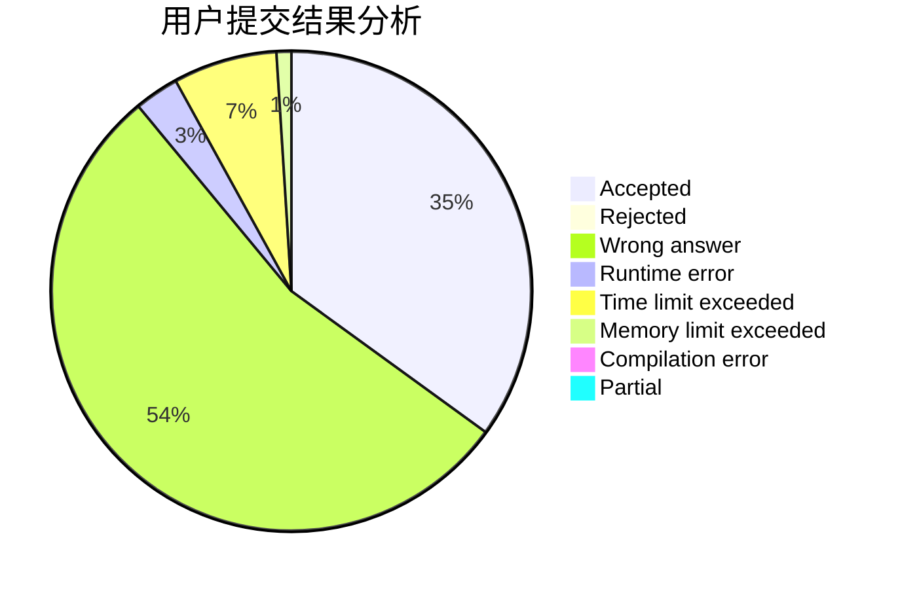
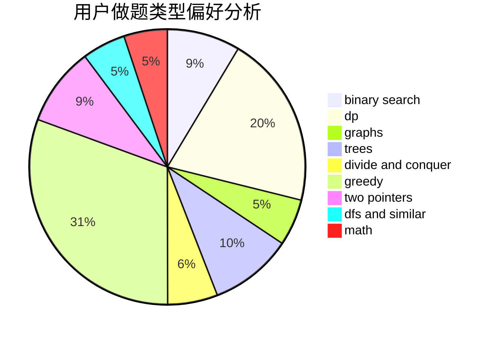

# DLUT_Zeratul

<!-- tabs:start -->

#### **用户提交结果分析**

#### **用户做题类型偏好分析**

<!-- tabs:end -->
# 推荐题目
[1384A](https://codeforces.com/contest/1384/problem/A)
[772D](https://codeforces.com/contest/772/problem/D)
[11841](https://codeforces.com/contest/1184/problem/1)
[773D](https://codeforces.com/contest/773/problem/D)
[25E](https://codeforces.com/contest/25/problem/E)
[722C](https://codeforces.com/contest/722/problem/C)
[656F](https://codeforces.com/contest/656/problem/F)
[1175D](https://codeforces.com/contest/1175/problem/D)
[1408H](https://codeforces.com/contest/1408/problem/H)
[772E](https://codeforces.com/contest/772/problem/E)
