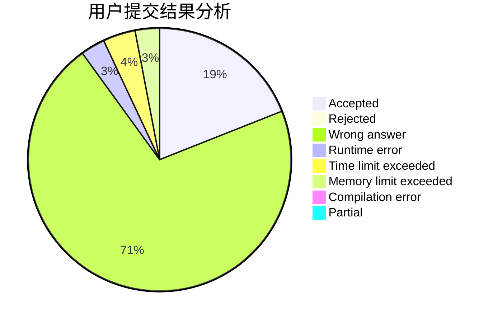
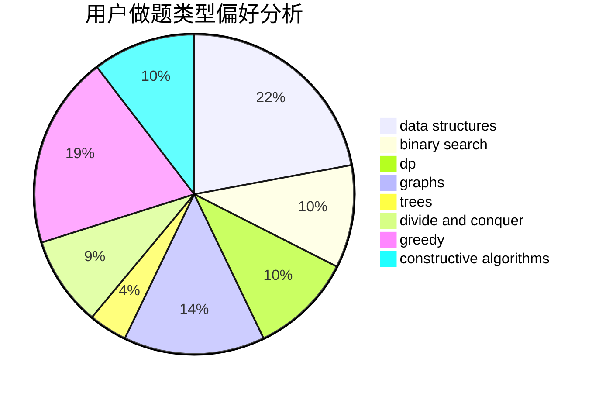
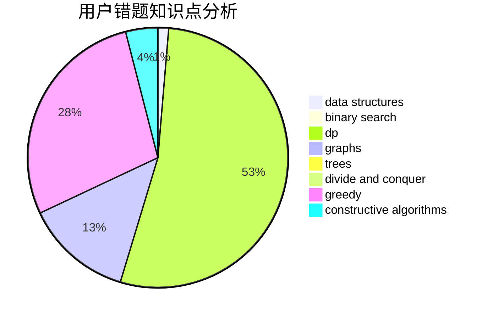

# DLU_Pyxis

<!-- tabs:start -->

#### **用户提交结果分析**

#### **用户做题类型偏好分析**

#### **用户错题知识点分析**

<!-- tabs:end -->
# 推荐题目
[13841](https://codeforces.com/contest/1384/problem/1)		dsu,graphs,sortings,trees		  
[1183H](https://codeforces.com/contest/1183/problem/H)		dp,
                        strings		  
[1446E](https://codeforces.com/contest/1446/problem/E)		constructive algorithms,
                        dfs and similar		  
[261D](https://codeforces.com/contest/261/problem/D)		dp		  
[1198F](https://codeforces.com/contest/1198/problem/F)		greedy,
                        number theory,
                        probabilities		  
[139A](https://codeforces.com/contest/139/problem/A)		implementation		  
[344A](https://codeforces.com/contest/344/problem/A)		implementation		  
[431E](https://codeforces.com/contest/431/problem/E)		binary search,
                        data structures,
                        ternary search		  
[1070L](https://codeforces.com/contest/1070/problem/L)		constructive algorithms		  
[1054G](https://codeforces.com/contest/1054/problem/G)		constructive algorithms,
                        greedy,
                        math		  
