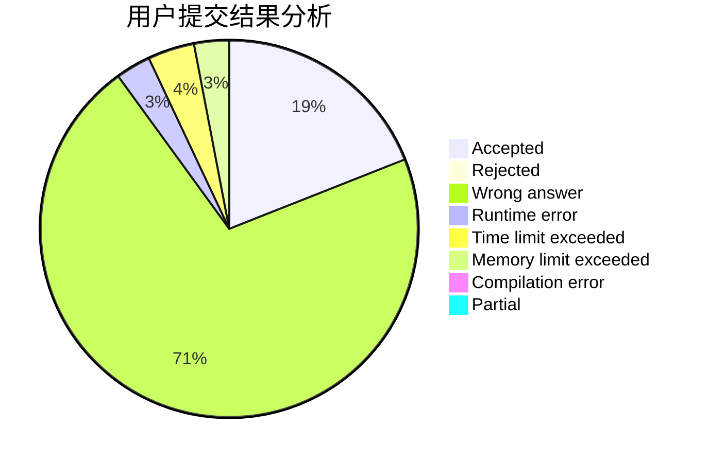
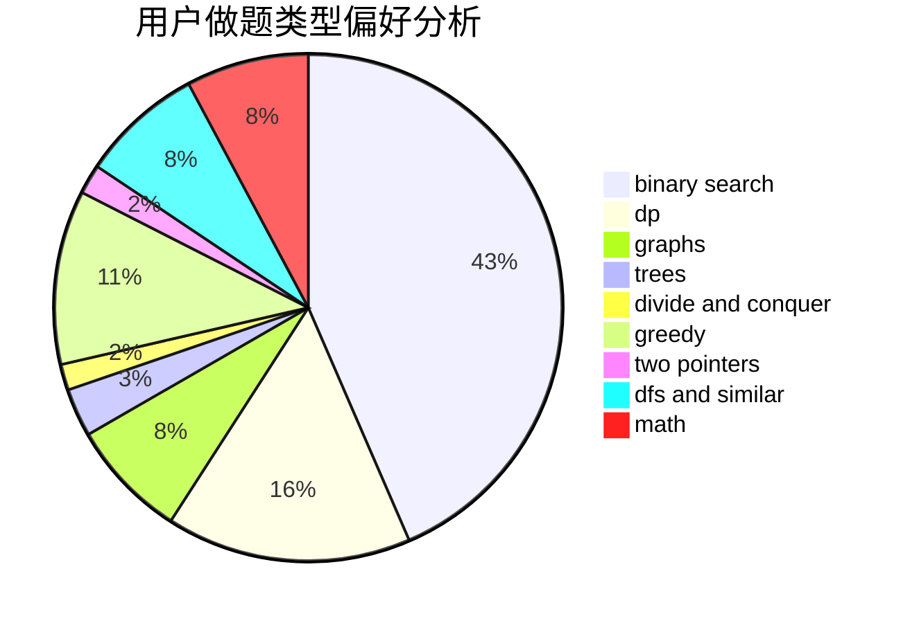

# DLU_Pyxis

<!-- tabs:start -->

#### **用户提交结果分析**

#### **用户做题类型偏好分析**

<!-- tabs:end -->
# 推荐题目
[13841](https://codeforces.com/contest/1384/problem/1)
[1183H](https://codeforces.com/contest/1183/problem/H)
[1446E](https://codeforces.com/contest/1446/problem/E)
[261D](https://codeforces.com/contest/261/problem/D)
[1198F](https://codeforces.com/contest/1198/problem/F)
[139A](https://codeforces.com/contest/139/problem/A)
[344A](https://codeforces.com/contest/344/problem/A)
[431E](https://codeforces.com/contest/431/problem/E)
[1070L](https://codeforces.com/contest/1070/problem/L)
[1054G](https://codeforces.com/contest/1054/problem/G)
