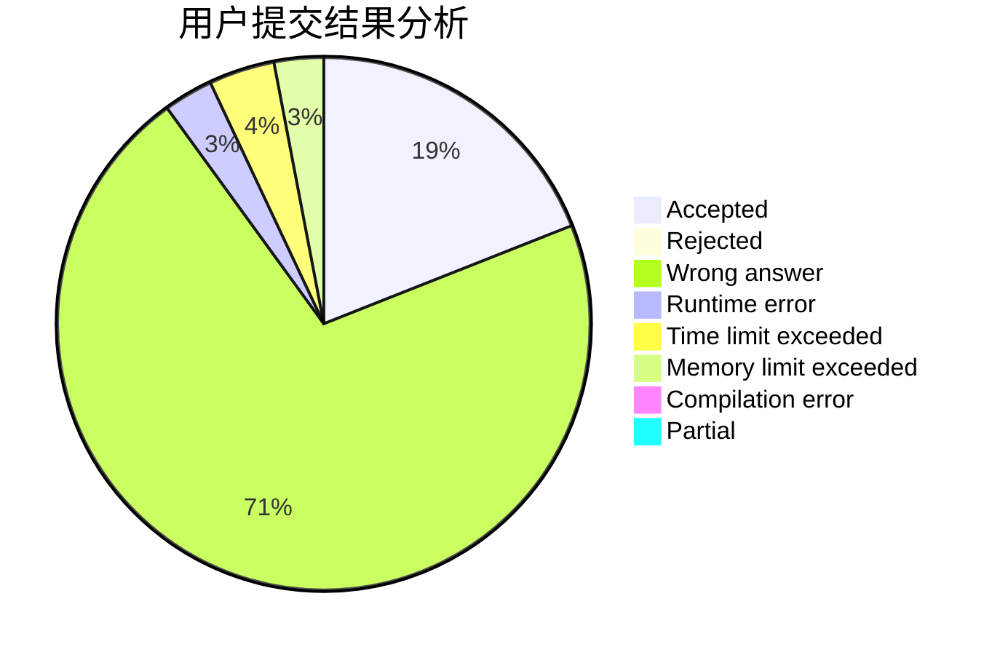
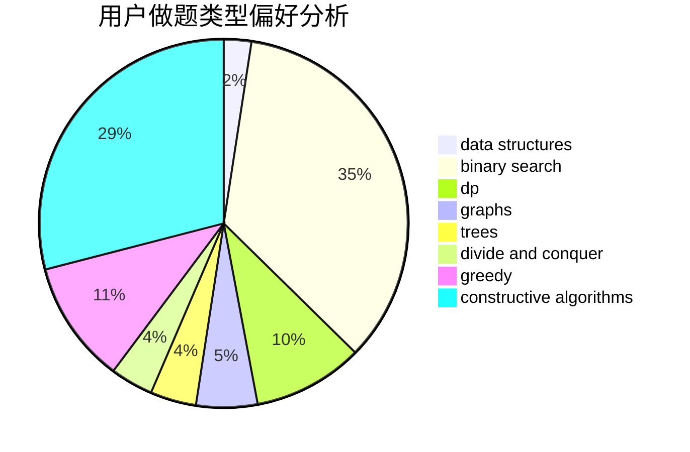
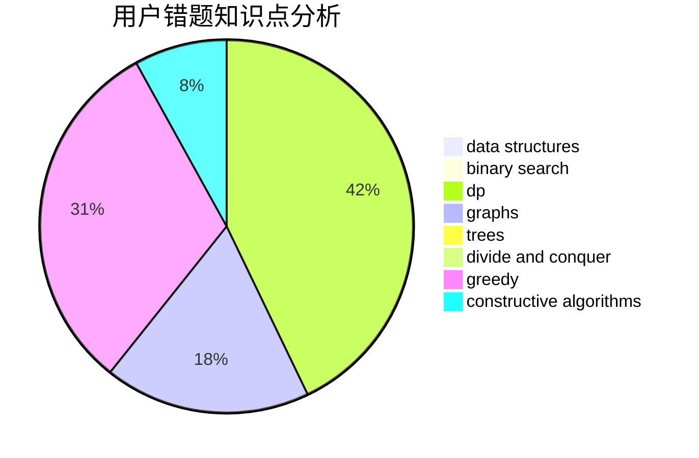

# DLU_Pyxis

<!-- tabs:start -->

#### **用户提交结果分析**

#### **用户做题类型偏好分析**

#### **用户错题知识点分析**

<!-- tabs:end -->
# 推荐题目
[1375A](https://codeforces.com/contest/1375/problem/A)		constructive algorithms,
                        math		  
[1181C](https://codeforces.com/contest/1181/problem/C)		brute force,
                        combinatorics,
                        dp,
                        implementation		  
[1436F](https://codeforces.com/contest/1436/problem/F)		combinatorics,
                        math,
                        number theory		  
[240F](https://codeforces.com/contest/240/problem/F)		data structures		  
[1194D](https://codeforces.com/contest/1194/problem/D)		games,
                        math		  
[1391C](https://codeforces.com/contest/1391/problem/C)		combinatorics,
                        dp,
                        graphs,
                        math		  
[316G1](https://codeforces.com/contest/316G/problem/1)		hashing,
                        strings		  
[403E](https://codeforces.com/contest/403/problem/E)		data structures,
                        implementation,
                        trees		  
[1070I](https://codeforces.com/contest/1070/problem/I)		flows,
                        graph matchings,
                        graphs		  
[1054C](https://codeforces.com/contest/1054/problem/C)		constructive algorithms,
                        implementation		  
