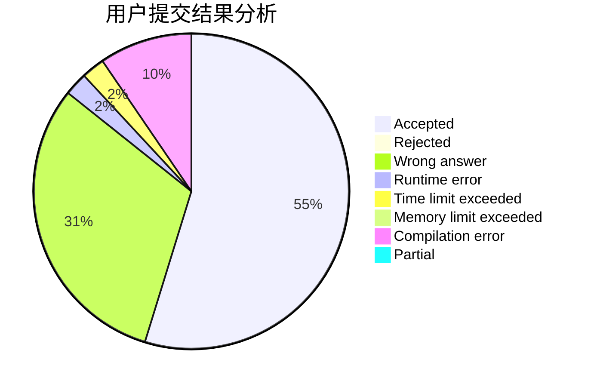
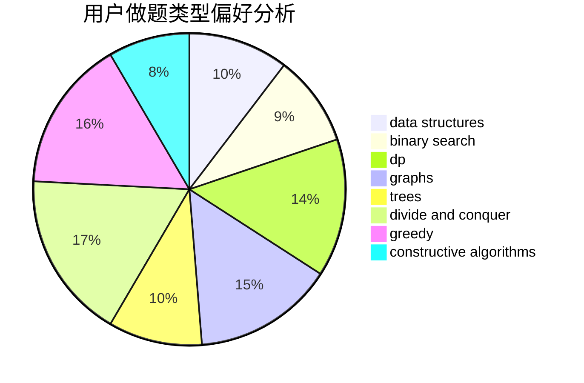
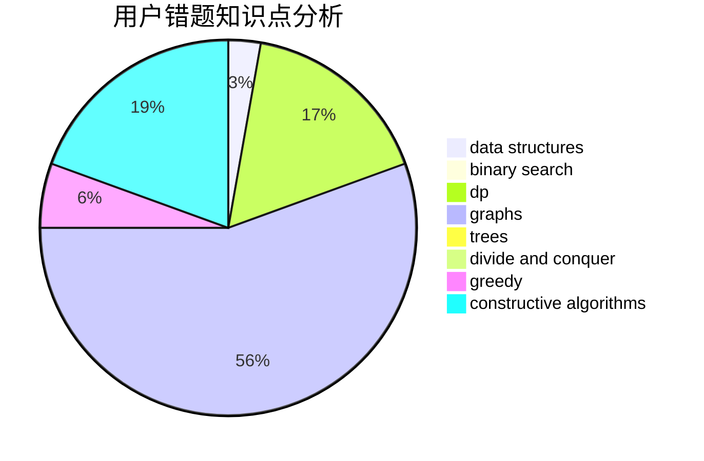

# DOLT_JUSTIN

<!-- tabs:start -->

#### **用户提交结果分析**

#### **用户做题类型偏好分析**

#### **用户错题知识点分析**

<!-- tabs:end -->
# 推荐题目
[266A](https://codeforces.com/contest/266/problem/A)		implementation		  
[1360F](https://codeforces.com/contest/1360/problem/F)		bitmasks,
                        brute force,
                        constructive algorithms,
                        dp,
                        hashing,
                        strings		  
[269E](https://codeforces.com/contest/269/problem/E)		nan		  
[1190D](https://codeforces.com/contest/1190/problem/D)		data structures,
                        divide and conquer,
                        sortings,
                        two pointers		  
[1173D](https://codeforces.com/contest/1173/problem/D)		dsu,graphs,sortings,trees		  
[1194F](https://codeforces.com/contest/1194/problem/F)		combinatorics,
                        dp,
                        number theory,
                        probabilities,
                        two pointers		  
[650D](https://codeforces.com/contest/650/problem/D)		binary search,
                        data structures,
                        dp,
                        hashing		  
[716A](https://codeforces.com/contest/716/problem/A)		implementation		  
[1007C](https://codeforces.com/contest/1007/problem/C)		binary search,
                        interactive		  
[1187E](https://codeforces.com/contest/1187/problem/E)		dfs and similar,
                        dp,
                        trees		  
