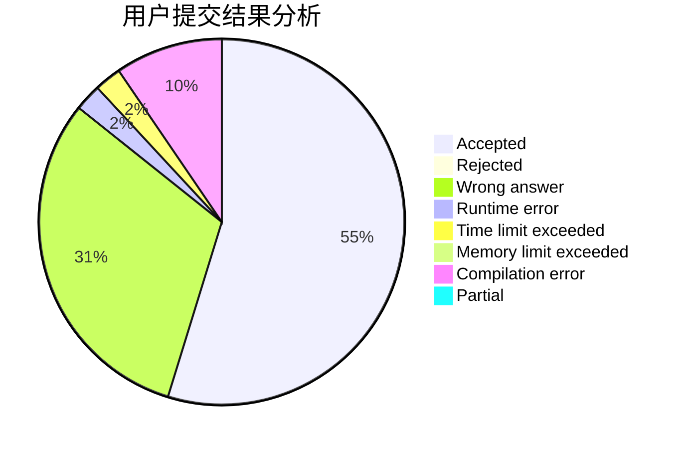
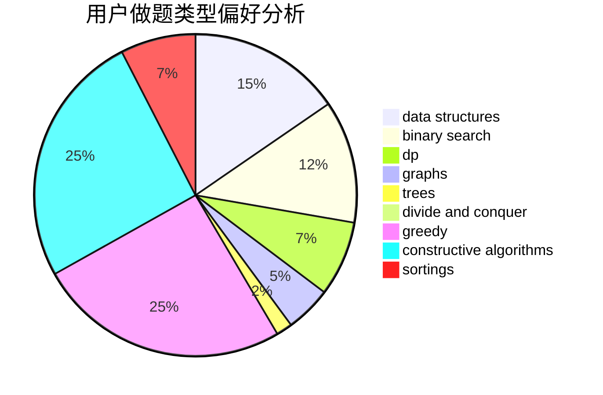
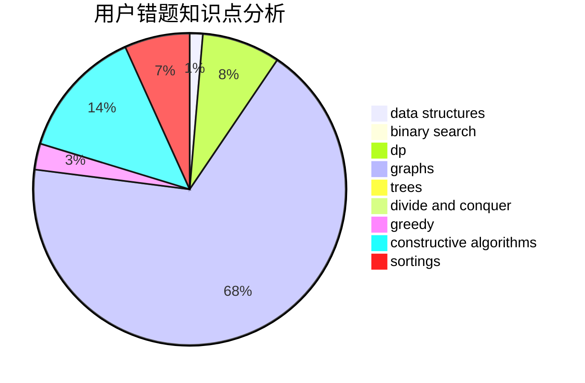

# DOLT_JUSTIN
<!-- tabs:start -->
#### **用户提交结果分析**

#### **用户做题类型偏好分析**

#### **用户错题知识点分析**

<!-- tabs:end -->
# 推荐题目
[699B](http://codeforces.com/problemset/problem/699/B)		implementation		  
[487C](http://codeforces.com/problemset/problem/487/C)		constructive algorithms,
                        math,
                        number theory		  
[1184B2](http://codeforces.com/problemset/problem/1184/B2)		flows,
                        graph matchings,
                        graphs,
                        shortest paths,
                        sortings		  
[508D](http://codeforces.com/problemset/problem/508/D)		dfs and similar,
                        graphs		  
[1189D1](https://codeforces.com/contest/1189/problem/D1)		trees		  
[1297D](http://codeforces.com/problemset/problem/1297/D)		*special problem,
                        binary search,
                        greedy,
                        sortings		  
[251C](http://codeforces.com/problemset/problem/251/C)		dp,
                        greedy,
                        number theory		  
[757E](http://codeforces.com/problemset/problem/757/E)		brute force,
                        combinatorics,
                        dp,
                        number theory		  
[758E](http://codeforces.com/problemset/problem/758/E)		dfs and similar,
                        dp,
                        graphs,
                        greedy,
                        trees		  
[758B](http://codeforces.com/problemset/problem/758/B)		brute force,
                        implementation,
                        number theory		  
<!-- tabs:start -->
#### **data structures**
[1266D](http://codeforces.com/problemset/problem/1266/D)		constructive algorithms,
                        data structures,
                        graphs,
                        greedy,
                        implementation,
                        math,
                        two pointers		  
[1073D](http://codeforces.com/problemset/problem/1073/D)		binary search,
                        brute force,
                        data structures,
                        greedy		  
[633C](http://codeforces.com/problemset/problem/633/C)		data structures,
                        dp,
                        hashing,
                        implementation,
                        sortings,
                        string suffix structures,
                        strings		  
[757F](http://codeforces.com/problemset/problem/757/F)		data structures,
                        graphs,
                        shortest paths		  
[757G](http://codeforces.com/problemset/problem/757/G)		data structures,
                        divide and conquer,
                        graphs,
                        trees		  
[1492C](http://codeforces.com/problemset/problem/1492/C)		binary search,
                        data structures,
                        dp,
                        greedy,
                        two pointers		  
[1490G](http://codeforces.com/problemset/problem/1490/G)		binary search,
                        data structures,
                        math		  
[1479D](http://codeforces.com/problemset/problem/1479/D)		binary search,
                        bitmasks,
                        brute force,
                        data structures,
                        probabilities,
                        trees		  
[1497A](http://codeforces.com/problemset/problem/1497/A)		brute force,
                        data structures,
                        greedy,
                        sortings		  
[1491C](http://codeforces.com/problemset/problem/1491/C)		brute force,
                        data structures,
                        dp,
                        greedy,
                        implementation		  
#### **binary search**
[1297D](http://codeforces.com/problemset/problem/1297/D)		*special problem,
                        binary search,
                        greedy,
                        sortings		  
[1108F](http://codeforces.com/problemset/problem/1108/F)		binary search,
                        dsu,
                        graphs,
                        greedy		  
[1354B](http://codeforces.com/problemset/problem/1354/B)		binary search,
                        dp,
                        implementation,
                        two pointers		  
[1073D](http://codeforces.com/problemset/problem/1073/D)		binary search,
                        brute force,
                        data structures,
                        greedy		  
[1169C](https://codeforces.com/contest/1169/problem/C)		binary search,
                        greedy		  
[1187B](http://codeforces.com/problemset/problem/1187/B)		binary search,
                        implementation,
                        strings		  
[1492C](http://codeforces.com/problemset/problem/1492/C)		binary search,
                        data structures,
                        dp,
                        greedy,
                        two pointers		  
[1463D](http://codeforces.com/problemset/problem/1463/D)		binary search,
                        constructive algorithms,
                        greedy,
                        two pointers		  
[1490G](http://codeforces.com/problemset/problem/1490/G)		binary search,
                        data structures,
                        math		  
[1479D](http://codeforces.com/problemset/problem/1479/D)		binary search,
                        bitmasks,
                        brute force,
                        data structures,
                        probabilities,
                        trees		  
#### **dp**
[251C](http://codeforces.com/problemset/problem/251/C)		dp,
                        greedy,
                        number theory		  
[757E](http://codeforces.com/problemset/problem/757/E)		brute force,
                        combinatorics,
                        dp,
                        number theory		  
[758E](http://codeforces.com/problemset/problem/758/E)		dfs and similar,
                        dp,
                        graphs,
                        greedy,
                        trees		  
[1033C](http://codeforces.com/problemset/problem/1033/C)		brute force,
                        dp,
                        games		  
[1012F](http://codeforces.com/problemset/problem/1012/F)		dp,
                        implementation		  
[1408G](http://codeforces.com/problemset/problem/1408/G)		combinatorics,
                        dp,
                        dsu,
                        fft,
                        graphs,
                        trees		  
[1342F](http://codeforces.com/problemset/problem/1342/F)		bitmasks,
                        brute force,
                        dp		  
[758D](http://codeforces.com/problemset/problem/758/D)		constructive algorithms,
                        dp,
                        greedy,
                        math,
                        strings		  
[1354B](http://codeforces.com/problemset/problem/1354/B)		binary search,
                        dp,
                        implementation,
                        two pointers		  
[633C](http://codeforces.com/problemset/problem/633/C)		data structures,
                        dp,
                        hashing,
                        implementation,
                        sortings,
                        string suffix structures,
                        strings		  
#### **graph**
[1184B2](http://codeforces.com/problemset/problem/1184/B2)		flows,
                        graph matchings,
                        graphs,
                        shortest paths,
                        sortings		  
[508D](http://codeforces.com/problemset/problem/508/D)		dfs and similar,
                        graphs		  
[758E](http://codeforces.com/problemset/problem/758/E)		dfs and similar,
                        dp,
                        graphs,
                        greedy,
                        trees		  
[331E1](http://codeforces.com/problemset/problem/331/E1)		constructive algorithms,
                        graphs,
                        implementation		  
[1408G](http://codeforces.com/problemset/problem/1408/G)		combinatorics,
                        dp,
                        dsu,
                        fft,
                        graphs,
                        trees		  
[1108F](http://codeforces.com/problemset/problem/1108/F)		binary search,
                        dsu,
                        graphs,
                        greedy		  
[1266D](http://codeforces.com/problemset/problem/1266/D)		constructive algorithms,
                        data structures,
                        graphs,
                        greedy,
                        implementation,
                        math,
                        two pointers		  
[757F](http://codeforces.com/problemset/problem/757/F)		data structures,
                        graphs,
                        shortest paths		  
[757G](http://codeforces.com/problemset/problem/757/G)		data structures,
                        divide and conquer,
                        graphs,
                        trees		  
[1006E](http://codeforces.com/problemset/problem/1006/E)		dfs and similar,
                        graphs,
                        trees		  
#### **trees**
[1189D1](https://codeforces.com/contest/1189/problem/D1)		trees		  
[758E](http://codeforces.com/problemset/problem/758/E)		dfs and similar,
                        dp,
                        graphs,
                        greedy,
                        trees		  
[1408G](http://codeforces.com/problemset/problem/1408/G)		combinatorics,
                        dp,
                        dsu,
                        fft,
                        graphs,
                        trees		  
[757G](http://codeforces.com/problemset/problem/757/G)		data structures,
                        divide and conquer,
                        graphs,
                        trees		  
[1006E](http://codeforces.com/problemset/problem/1006/E)		dfs and similar,
                        graphs,
                        trees		  
[1479D](http://codeforces.com/problemset/problem/1479/D)		binary search,
                        bitmasks,
                        brute force,
                        data structures,
                        probabilities,
                        trees		  
[1511C](http://codeforces.com/problemset/problem/1511/C)		brute force,
                        data structures,
                        implementation,
                        trees		  
[1499F](http://codeforces.com/problemset/problem/1499/F)		combinatorics,
                        dfs and similar,
                        dp,
                        trees		  
[1491E](http://codeforces.com/problemset/problem/1491/E)		brute force,
                        dfs and similar,
                        divide and conquer,
                        number theory,
                        trees		  
[1466D](http://codeforces.com/problemset/problem/1466/D)		data structures,
                        greedy,
                        sortings,
                        trees		  
#### **divide and conquer**
[757G](http://codeforces.com/problemset/problem/757/G)		data structures,
                        divide and conquer,
                        graphs,
                        trees		  
[1461D](http://codeforces.com/problemset/problem/1461/D)		binary search,
                        brute force,
                        data structures,
                        divide and conquer,
                        implementation,
                        sortings		  
[1466G](http://codeforces.com/problemset/problem/1466/G)		combinatorics,
                        divide and conquer,
                        hashing,
                        math,
                        string suffix structures,
                        strings		  
[1490D](http://codeforces.com/problemset/problem/1490/D)		dfs and similar,
                        divide and conquer,
                        implementation		  
[1483C](https://codeforces.com/contest/1483/problem/C)		data structures,
                        divide and conquer,
                        dp		  
[1491E](http://codeforces.com/problemset/problem/1491/E)		brute force,
                        dfs and similar,
                        divide and conquer,
                        number theory,
                        trees		  
[1303G](http://codeforces.com/problemset/problem/1303/G)		data structures,
                        divide and conquer,
                        geometry,
                        trees		  
[1494D](http://codeforces.com/problemset/problem/1494/D)		constructive algorithms,
                        data structures,
                        dfs and similar,
                        divide and conquer,
                        dsu,
                        greedy,
                        sortings,
                        trees		  
[1482E](http://codeforces.com/problemset/problem/1482/E)		data structures,
                        divide and conquer,
                        dp		  
[566C](http://codeforces.com/problemset/problem/566/C)		dfs and similar,
                        divide and conquer,
                        trees		  
#### **greedy**
[1297D](http://codeforces.com/problemset/problem/1297/D)		*special problem,
                        binary search,
                        greedy,
                        sortings		  
[251C](http://codeforces.com/problemset/problem/251/C)		dp,
                        greedy,
                        number theory		  
[758E](http://codeforces.com/problemset/problem/758/E)		dfs and similar,
                        dp,
                        graphs,
                        greedy,
                        trees		  
[1108F](http://codeforces.com/problemset/problem/1108/F)		binary search,
                        dsu,
                        graphs,
                        greedy		  
[758D](http://codeforces.com/problemset/problem/758/D)		constructive algorithms,
                        dp,
                        greedy,
                        math,
                        strings		  
[1266D](http://codeforces.com/problemset/problem/1266/D)		constructive algorithms,
                        data structures,
                        graphs,
                        greedy,
                        implementation,
                        math,
                        two pointers		  
[1073D](http://codeforces.com/problemset/problem/1073/D)		binary search,
                        brute force,
                        data structures,
                        greedy		  
[1510I](http://codeforces.com/problemset/problem/1510/I)		greedy,
                        interactive,
                        math,
                        probabilities		  
[1169C](https://codeforces.com/contest/1169/problem/C)		binary search,
                        greedy		  
[1311A](http://codeforces.com/problemset/problem/1311/A)		greedy,
                        implementation,
                        math		  
#### **constructive algorithms**
[487C](http://codeforces.com/problemset/problem/487/C)		constructive algorithms,
                        math,
                        number theory		  
[331E1](http://codeforces.com/problemset/problem/331/E1)		constructive algorithms,
                        graphs,
                        implementation		  
[758D](http://codeforces.com/problemset/problem/758/D)		constructive algorithms,
                        dp,
                        greedy,
                        math,
                        strings		  
[1266D](http://codeforces.com/problemset/problem/1266/D)		constructive algorithms,
                        data structures,
                        graphs,
                        greedy,
                        implementation,
                        math,
                        two pointers		  
[316F3](http://codeforces.com/problemset/problem/316/F3)		constructive algorithms,
                        dfs and similar,
                        implementation		  
[622D](http://codeforces.com/problemset/problem/622/D)		constructive algorithms		  
[1493A](http://codeforces.com/problemset/problem/1493/A)		constructive algorithms,
                        greedy		  
[1463D](http://codeforces.com/problemset/problem/1463/D)		binary search,
                        constructive algorithms,
                        greedy,
                        two pointers		  
[1456B](https://codeforces.com/contest/1456/problem/B)		bitmasks,
                        brute force,
                        constructive algorithms		  
[1492D](http://codeforces.com/problemset/problem/1492/D)		bitmasks,
                        constructive algorithms,
                        greedy,
                        math		  
#### **sortings**
[1184B2](http://codeforces.com/problemset/problem/1184/B2)		flows,
                        graph matchings,
                        graphs,
                        shortest paths,
                        sortings		  
[1297D](http://codeforces.com/problemset/problem/1297/D)		*special problem,
                        binary search,
                        greedy,
                        sortings		  
[599C](http://codeforces.com/problemset/problem/599/C)		sortings		  
[633C](http://codeforces.com/problemset/problem/633/C)		data structures,
                        dp,
                        hashing,
                        implementation,
                        sortings,
                        string suffix structures,
                        strings		  
[1213D2](http://codeforces.com/problemset/problem/1213/D2)		brute force,
                        math,
                        sortings		  
[1496C](https://codeforces.com/contest/1496/problem/C)		geometry,
                        greedy,
                        math,
                        sortings		  
[1495A](http://codeforces.com/problemset/problem/1495/A)		geometry,
                        greedy,
                        math,
                        sortings		  
[1497A](http://codeforces.com/problemset/problem/1497/A)		brute force,
                        data structures,
                        greedy,
                        sortings		  
[1427A](http://codeforces.com/problemset/problem/1427/A)		math,
                        sortings		  
[1461D](http://codeforces.com/problemset/problem/1461/D)		binary search,
                        brute force,
                        data structures,
                        divide and conquer,
                        implementation,
                        sortings		  
<!-- tabs:end -->
