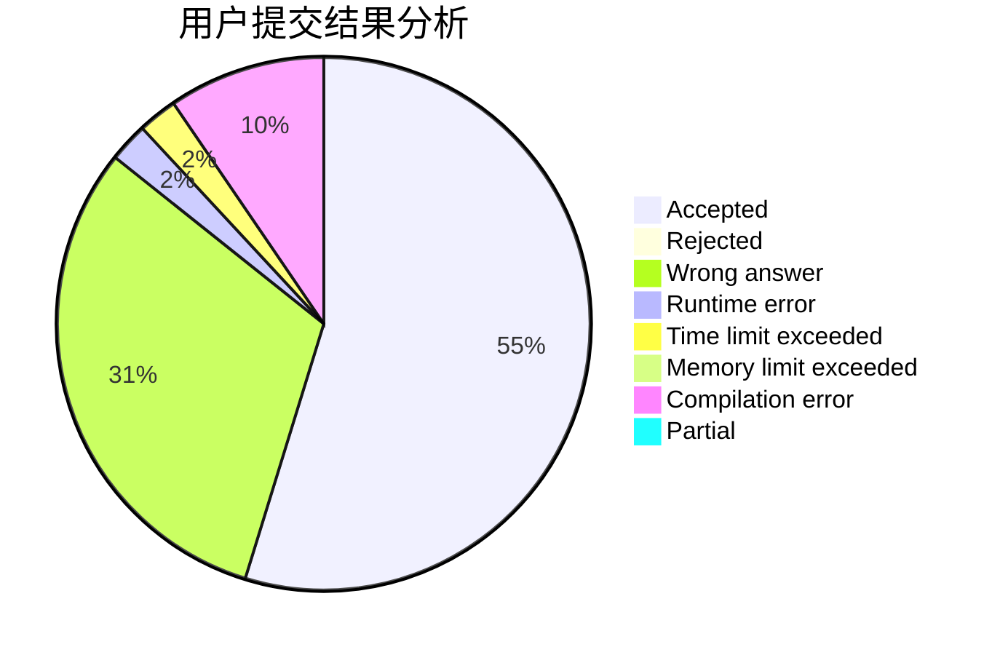
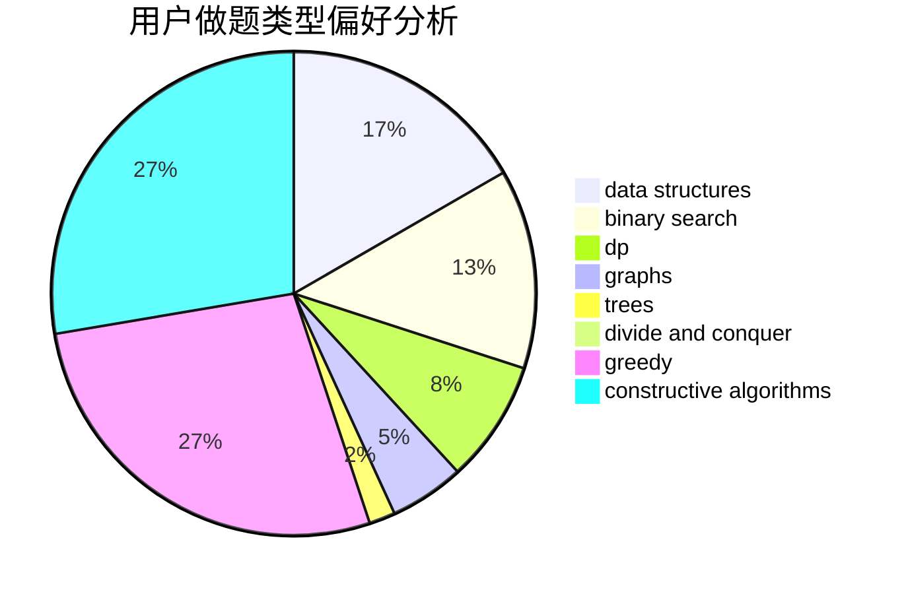
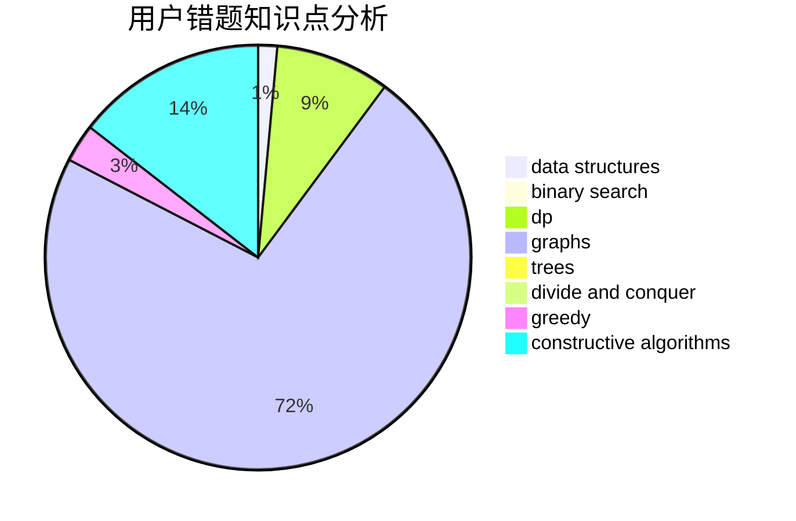

# DOLT_JUSTIN
<!-- tabs:start -->
#### **用户提交结果分析**

#### **用户做题类型偏好分析**

#### **用户错题知识点分析**

<!-- tabs:end -->
# 推荐题目
[One Bomb](http://codeforces.com/problemset/problem/699/B)		implementation		  
[Prefix Product Sequence](http://codeforces.com/problemset/problem/487/C)		constructive algorithms,
                        math,
                        number theory		  
[The Doctor Meets Vader (Medium)](http://codeforces.com/problemset/problem/1184/B2)		flows,
                        graph matchings,
                        graphs,
                        shortest paths,
                        sortings		  
[Tanya and Password](http://codeforces.com/problemset/problem/508/D)		dfs and similar,
                        graphs		  
[Add on a Tree](https://codeforces.com/contest/1189/problem/D1)		trees		  
[Bonus Distribution](http://codeforces.com/problemset/problem/1297/D)		*special problem,
                        binary search,
                        greedy,
                        sortings		  
[Number Transformation](http://codeforces.com/problemset/problem/251/C)		dp,
                        greedy,
                        number theory		  
[Bash Plays with Functions](http://codeforces.com/problemset/problem/757/E)		brute force,
                        combinatorics,
                        dp,
                        number theory		  
[Broken Tree](http://codeforces.com/problemset/problem/758/E)		dfs and similar,
                        dp,
                        graphs,
                        greedy,
                        trees		  
[Blown Garland](http://codeforces.com/problemset/problem/758/B)		brute force,
                        implementation,
                        number theory		  
<!-- tabs:start -->
#### **data structures**
[Decreasing Debts](http://codeforces.com/problemset/problem/1266/D)		constructive algorithms,
                        data structures,
                        graphs,
                        greedy,
                        implementation,
                        math,
                        two pointers		  
[Berland Fair](http://codeforces.com/problemset/problem/1073/D)		binary search,
                        brute force,
                        data structures,
                        greedy		  
[Spy Syndrome 2](http://codeforces.com/problemset/problem/633/C)		data structures,
                        dp,
                        hashing,
                        implementation,
                        sortings,
                        string suffix structures,
                        strings		  
[Team Rocket Rises Again](http://codeforces.com/problemset/problem/757/F)		data structures,
                        graphs,
                        shortest paths		  
[Can Bash Save the Day?](http://codeforces.com/problemset/problem/757/G)		data structures,
                        divide and conquer,
                        graphs,
                        trees		  
[Maximum width](http://codeforces.com/problemset/problem/1492/C)		binary search,
                        data structures,
                        dp,
                        greedy,
                        two pointers		  
[Old Floppy Drive](http://codeforces.com/problemset/problem/1490/G)		binary search,
                        data structures,
                        math		  
[Odd Mineral Resource](http://codeforces.com/problemset/problem/1479/D)		binary search,
                        bitmasks,
                        brute force,
                        data structures,
                        probabilities,
                        trees		  
[Meximization](http://codeforces.com/problemset/problem/1497/A)		brute force,
                        data structures,
                        greedy,
                        sortings		  
[Pekora and Trampoline](http://codeforces.com/problemset/problem/1491/C)		brute force,
                        data structures,
                        dp,
                        greedy,
                        implementation		  
#### **binary search**
[Bonus Distribution](http://codeforces.com/problemset/problem/1297/D)		*special problem,
                        binary search,
                        greedy,
                        sortings		  
[MST Unification](http://codeforces.com/problemset/problem/1108/F)		binary search,
                        dsu,
                        graphs,
                        greedy		  
[Ternary String](http://codeforces.com/problemset/problem/1354/B)		binary search,
                        dp,
                        implementation,
                        two pointers		  
[Berland Fair](http://codeforces.com/problemset/problem/1073/D)		binary search,
                        brute force,
                        data structures,
                        greedy		  
[Increasing by Modulo](https://codeforces.com/contest/1169/problem/C)		binary search,
                        greedy		  
[Letters Shop](http://codeforces.com/problemset/problem/1187/B)		binary search,
                        implementation,
                        strings		  
[Maximum width](http://codeforces.com/problemset/problem/1492/C)		binary search,
                        data structures,
                        dp,
                        greedy,
                        two pointers		  
[Pairs](http://codeforces.com/problemset/problem/1463/D)		binary search,
                        constructive algorithms,
                        greedy,
                        two pointers		  
[Old Floppy Drive](http://codeforces.com/problemset/problem/1490/G)		binary search,
                        data structures,
                        math		  
[Odd Mineral Resource](http://codeforces.com/problemset/problem/1479/D)		binary search,
                        bitmasks,
                        brute force,
                        data structures,
                        probabilities,
                        trees		  
#### **dp**
[Number Transformation](http://codeforces.com/problemset/problem/251/C)		dp,
                        greedy,
                        number theory		  
[Bash Plays with Functions](http://codeforces.com/problemset/problem/757/E)		brute force,
                        combinatorics,
                        dp,
                        number theory		  
[Broken Tree](http://codeforces.com/problemset/problem/758/E)		dfs and similar,
                        dp,
                        graphs,
                        greedy,
                        trees		  
[Permutation Game](http://codeforces.com/problemset/problem/1033/C)		brute force,
                        dp,
                        games		  
[Passports](http://codeforces.com/problemset/problem/1012/F)		dp,
                        implementation		  
[Clusterization Counting](http://codeforces.com/problemset/problem/1408/G)		combinatorics,
                        dp,
                        dsu,
                        fft,
                        graphs,
                        trees		  
[Make It Ascending](http://codeforces.com/problemset/problem/1342/F)		bitmasks,
                        brute force,
                        dp		  
[Ability To Convert](http://codeforces.com/problemset/problem/758/D)		constructive algorithms,
                        dp,
                        greedy,
                        math,
                        strings		  
[Ternary String](http://codeforces.com/problemset/problem/1354/B)		binary search,
                        dp,
                        implementation,
                        two pointers		  
[Spy Syndrome 2](http://codeforces.com/problemset/problem/633/C)		data structures,
                        dp,
                        hashing,
                        implementation,
                        sortings,
                        string suffix structures,
                        strings		  
#### **graph**
[The Doctor Meets Vader (Medium)](http://codeforces.com/problemset/problem/1184/B2)		flows,
                        graph matchings,
                        graphs,
                        shortest paths,
                        sortings		  
[Tanya and Password](http://codeforces.com/problemset/problem/508/D)		dfs and similar,
                        graphs		  
[Broken Tree](http://codeforces.com/problemset/problem/758/E)		dfs and similar,
                        dp,
                        graphs,
                        greedy,
                        trees		  
[Deja Vu](http://codeforces.com/problemset/problem/331/E1)		constructive algorithms,
                        graphs,
                        implementation		  
[Clusterization Counting](http://codeforces.com/problemset/problem/1408/G)		combinatorics,
                        dp,
                        dsu,
                        fft,
                        graphs,
                        trees		  
[MST Unification](http://codeforces.com/problemset/problem/1108/F)		binary search,
                        dsu,
                        graphs,
                        greedy		  
[Decreasing Debts](http://codeforces.com/problemset/problem/1266/D)		constructive algorithms,
                        data structures,
                        graphs,
                        greedy,
                        implementation,
                        math,
                        two pointers		  
[Team Rocket Rises Again](http://codeforces.com/problemset/problem/757/F)		data structures,
                        graphs,
                        shortest paths		  
[Can Bash Save the Day?](http://codeforces.com/problemset/problem/757/G)		data structures,
                        divide and conquer,
                        graphs,
                        trees		  
[Military Problem](http://codeforces.com/problemset/problem/1006/E)		dfs and similar,
                        graphs,
                        trees		  
#### **trees**
[Add on a Tree](https://codeforces.com/contest/1189/problem/D1)		trees		  
[Broken Tree](http://codeforces.com/problemset/problem/758/E)		dfs and similar,
                        dp,
                        graphs,
                        greedy,
                        trees		  
[Clusterization Counting](http://codeforces.com/problemset/problem/1408/G)		combinatorics,
                        dp,
                        dsu,
                        fft,
                        graphs,
                        trees		  
[Can Bash Save the Day?](http://codeforces.com/problemset/problem/757/G)		data structures,
                        divide and conquer,
                        graphs,
                        trees		  
[Military Problem](http://codeforces.com/problemset/problem/1006/E)		dfs and similar,
                        graphs,
                        trees		  
[Odd Mineral Resource](http://codeforces.com/problemset/problem/1479/D)		binary search,
                        bitmasks,
                        brute force,
                        data structures,
                        probabilities,
                        trees		  
[Yet Another Card Deck](http://codeforces.com/problemset/problem/1511/C)		brute force,
                        data structures,
                        implementation,
                        trees		  
[Diameter Cuts](http://codeforces.com/problemset/problem/1499/F)		combinatorics,
                        dfs and similar,
                        dp,
                        trees		  
[Fib-tree](http://codeforces.com/problemset/problem/1491/E)		brute force,
                        dfs and similar,
                        divide and conquer,
                        number theory,
                        trees		  
[13th Labour of Heracles](http://codeforces.com/problemset/problem/1466/D)		data structures,
                        greedy,
                        sortings,
                        trees		  
#### **divide and conquer**
[Can Bash Save the Day?](http://codeforces.com/problemset/problem/757/G)		data structures,
                        divide and conquer,
                        graphs,
                        trees		  
[Divide and Summarize](http://codeforces.com/problemset/problem/1461/D)		binary search,
                        brute force,
                        data structures,
                        divide and conquer,
                        implementation,
                        sortings		  
[Song of the Sirens](http://codeforces.com/problemset/problem/1466/G)		combinatorics,
                        divide and conquer,
                        hashing,
                        math,
                        string suffix structures,
                        strings		  
[Permutation Transformation](http://codeforces.com/problemset/problem/1490/D)		dfs and similar,
                        divide and conquer,
                        implementation		  
[Skyline Photo](https://codeforces.com/contest/1483/problem/C)		data structures,
                        divide and conquer,
                        dp		  
[Fib-tree](http://codeforces.com/problemset/problem/1491/E)		brute force,
                        dfs and similar,
                        divide and conquer,
                        number theory,
                        trees		  
[Sum of Prefix Sums](http://codeforces.com/problemset/problem/1303/G)		data structures,
                        divide and conquer,
                        geometry,
                        trees		  
[Dogeforces](http://codeforces.com/problemset/problem/1494/D)		constructive algorithms,
                        data structures,
                        dfs and similar,
                        divide and conquer,
                        dsu,
                        greedy,
                        sortings,
                        trees		  
[Logistical Questions](http://codeforces.com/problemset/problem/566/C)		dfs and similar,
                        divide and conquer,
                        trees		  
[Fruit Sequences](http://codeforces.com/problemset/problem/1428/F)		binary search,
                        data structures,
                        divide and conquer,
                        dp,
                        two pointers		  
#### **greedy**
[Bonus Distribution](http://codeforces.com/problemset/problem/1297/D)		*special problem,
                        binary search,
                        greedy,
                        sortings		  
[Number Transformation](http://codeforces.com/problemset/problem/251/C)		dp,
                        greedy,
                        number theory		  
[Broken Tree](http://codeforces.com/problemset/problem/758/E)		dfs and similar,
                        dp,
                        graphs,
                        greedy,
                        trees		  
[MST Unification](http://codeforces.com/problemset/problem/1108/F)		binary search,
                        dsu,
                        graphs,
                        greedy		  
[Ability To Convert](http://codeforces.com/problemset/problem/758/D)		constructive algorithms,
                        dp,
                        greedy,
                        math,
                        strings		  
[Decreasing Debts](http://codeforces.com/problemset/problem/1266/D)		constructive algorithms,
                        data structures,
                        graphs,
                        greedy,
                        implementation,
                        math,
                        two pointers		  
[Berland Fair](http://codeforces.com/problemset/problem/1073/D)		binary search,
                        brute force,
                        data structures,
                        greedy		  
[Is It Rated?](http://codeforces.com/problemset/problem/1510/I)		greedy,
                        interactive,
                        math,
                        probabilities		  
[Increasing by Modulo](https://codeforces.com/contest/1169/problem/C)		binary search,
                        greedy		  
[Add Odd or Subtract Even](http://codeforces.com/problemset/problem/1311/A)		greedy,
                        implementation,
                        math		  
#### **constructive algorithms**
[Prefix Product Sequence](http://codeforces.com/problemset/problem/487/C)		constructive algorithms,
                        math,
                        number theory		  
[Deja Vu](http://codeforces.com/problemset/problem/331/E1)		constructive algorithms,
                        graphs,
                        implementation		  
[Ability To Convert](http://codeforces.com/problemset/problem/758/D)		constructive algorithms,
                        dp,
                        greedy,
                        math,
                        strings		  
[Decreasing Debts](http://codeforces.com/problemset/problem/1266/D)		constructive algorithms,
                        data structures,
                        graphs,
                        greedy,
                        implementation,
                        math,
                        two pointers		  
[Suns and Rays](http://codeforces.com/problemset/problem/316/F3)		constructive algorithms,
                        dfs and similar,
                        implementation		  
[Optimal Number Permutation](http://codeforces.com/problemset/problem/622/D)		constructive algorithms		  
[Anti-knapsack](http://codeforces.com/problemset/problem/1493/A)		constructive algorithms,
                        greedy		  
[Pairs](http://codeforces.com/problemset/problem/1463/D)		binary search,
                        constructive algorithms,
                        greedy,
                        two pointers		  
[XOR-gun](https://codeforces.com/contest/1456/problem/B)		bitmasks,
                        brute force,
                        constructive algorithms		  
[Genius's Gambit](http://codeforces.com/problemset/problem/1492/D)		bitmasks,
                        constructive algorithms,
                        greedy,
                        math		  
#### **sortings**
[The Doctor Meets Vader (Medium)](http://codeforces.com/problemset/problem/1184/B2)		flows,
                        graph matchings,
                        graphs,
                        shortest paths,
                        sortings		  
[Bonus Distribution](http://codeforces.com/problemset/problem/1297/D)		*special problem,
                        binary search,
                        greedy,
                        sortings		  
[Day at the Beach](http://codeforces.com/problemset/problem/599/C)		sortings		  
[Spy Syndrome 2](http://codeforces.com/problemset/problem/633/C)		data structures,
                        dp,
                        hashing,
                        implementation,
                        sortings,
                        string suffix structures,
                        strings		  
[Equalizing by Division (hard version)](http://codeforces.com/problemset/problem/1213/D2)		brute force,
                        math,
                        sortings		  
[Diamond Miner](https://codeforces.com/contest/1496/problem/C)		geometry,
                        greedy,
                        math,
                        sortings		  
[Meximization](http://codeforces.com/problemset/problem/1497/A)		brute force,
                        data structures,
                        greedy,
                        sortings		  
[Avoiding Zero](http://codeforces.com/problemset/problem/1427/A)		math,
                        sortings		  
[Divide and Summarize](http://codeforces.com/problemset/problem/1461/D)		binary search,
                        brute force,
                        data structures,
                        divide and conquer,
                        implementation,
                        sortings		  
[Chef Monocarp](http://codeforces.com/problemset/problem/1437/C)		dp,
                        flows,
                        graph matchings,
                        greedy,
                        math,
                        sortings		  
<!-- tabs:end -->
