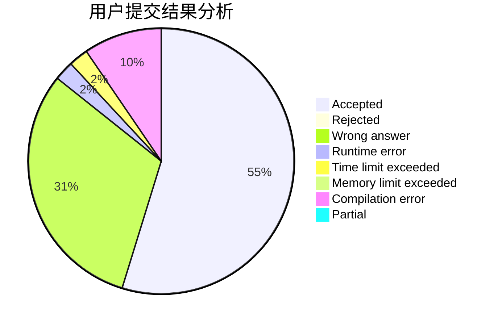
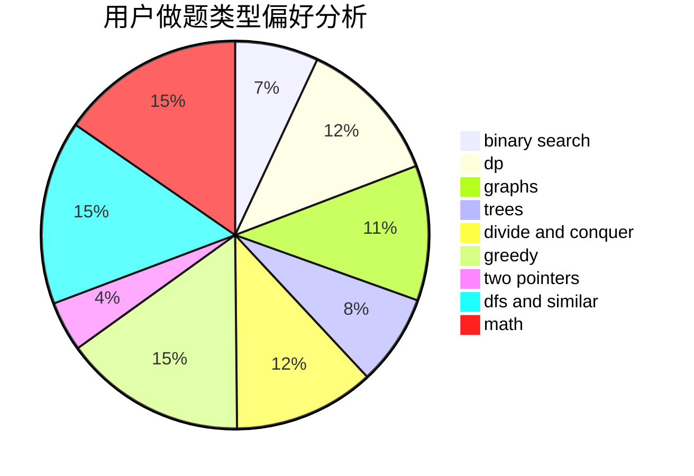

# DOLT_JUSTIN

<!-- tabs:start -->

#### **用户提交结果分析**

#### **用户做题类型偏好分析**

<!-- tabs:end -->
# 推荐题目
[266A](https://codeforces.com/contest/266/problem/A)
[1360F](https://codeforces.com/contest/1360/problem/F)
[269E](https://codeforces.com/contest/269/problem/E)
[1190D](https://codeforces.com/contest/1190/problem/D)
[1173D](https://codeforces.com/contest/1173/problem/D)
[1194F](https://codeforces.com/contest/1194/problem/F)
[650D](https://codeforces.com/contest/650/problem/D)
[716A](https://codeforces.com/contest/716/problem/A)
[1007C](https://codeforces.com/contest/1007/problem/C)
[1187E](https://codeforces.com/contest/1187/problem/E)
