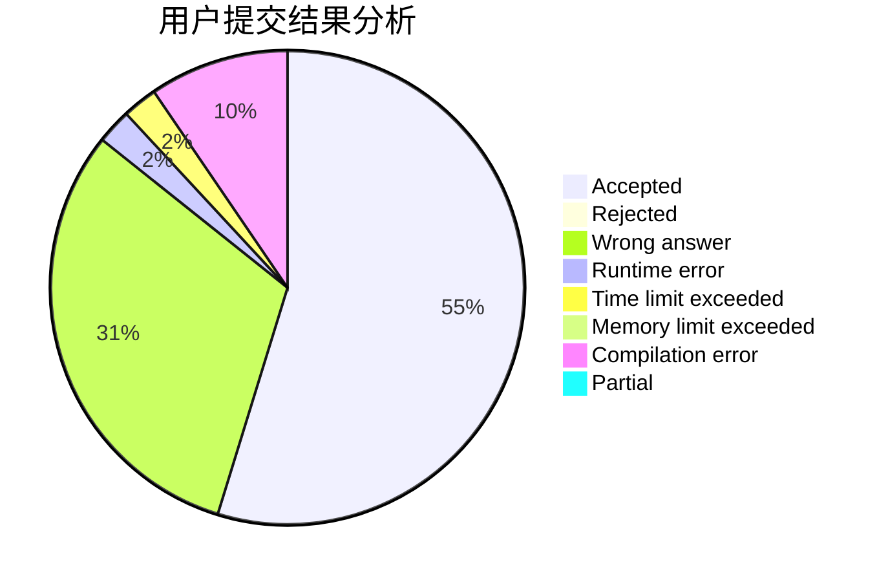
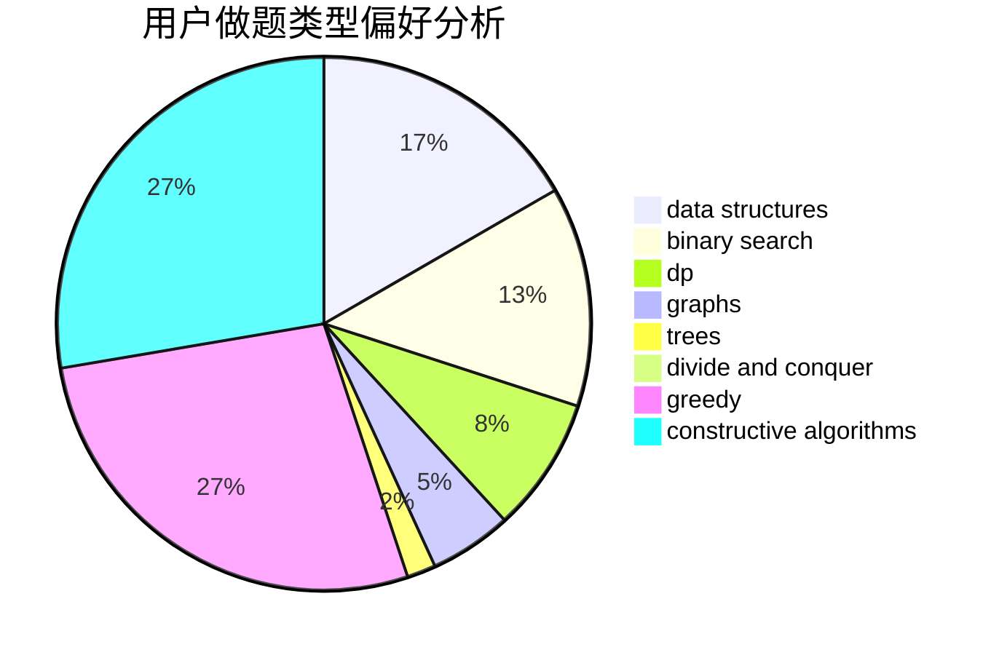
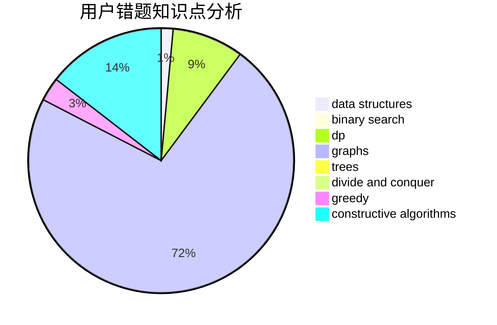

# DOLT_JUSTIN

<!-- tabs:start -->

#### **用户提交结果分析**

#### **用户做题类型偏好分析**

#### **用户错题知识点分析**

<!-- tabs:end -->
# 推荐题目
[245A](https://codeforces.com/contest/245/problem/A)		implementation		  
[1354B](https://codeforces.com/contest/1354/problem/B)		binary search,
                        dp,
                        implementation,
                        two pointers		  
[251C](https://codeforces.com/contest/251/problem/C)		dp,
                        greedy,
                        number theory		  
[1187B](https://codeforces.com/contest/1187/problem/B)		binary search,
                        implementation,
                        strings		  
[1169C](https://codeforces.com/contest/1169/problem/C)		dsu,graphs,sortings,trees		  
[1189D1](https://codeforces.com/contest/1189D/problem/1)		dsu,graphs,sortings,trees		  
[622D](https://codeforces.com/contest/622/problem/D)		constructive algorithms		  
[699B](https://codeforces.com/contest/699/problem/B)		implementation		  
[1006E](https://codeforces.com/contest/1006/problem/E)		dfs and similar,
                        graphs,
                        trees		  
[1184B2](https://codeforces.com/contest/1184B/problem/2)		flows,
                        graph matchings,
                        graphs,
                        shortest paths,
                        sortings		  
