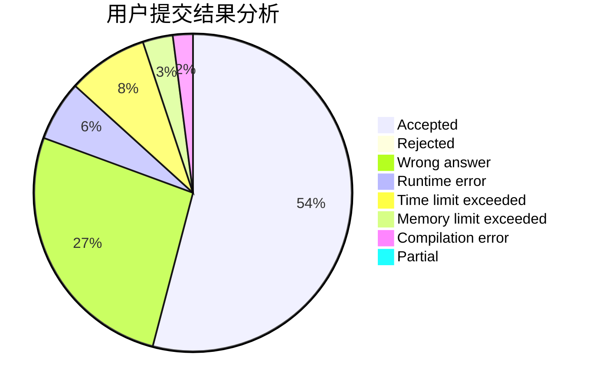
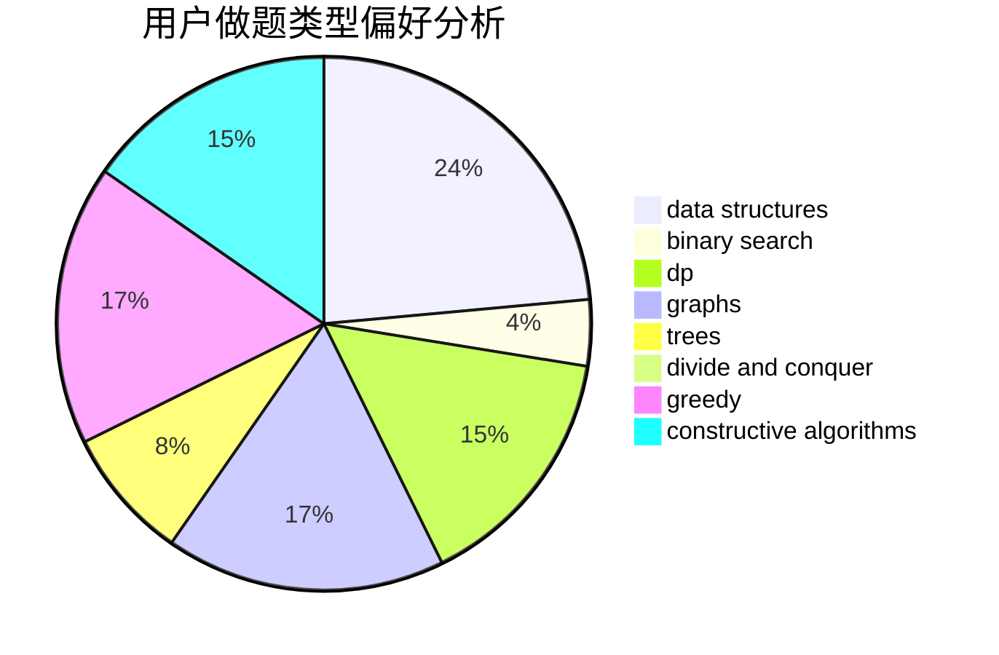
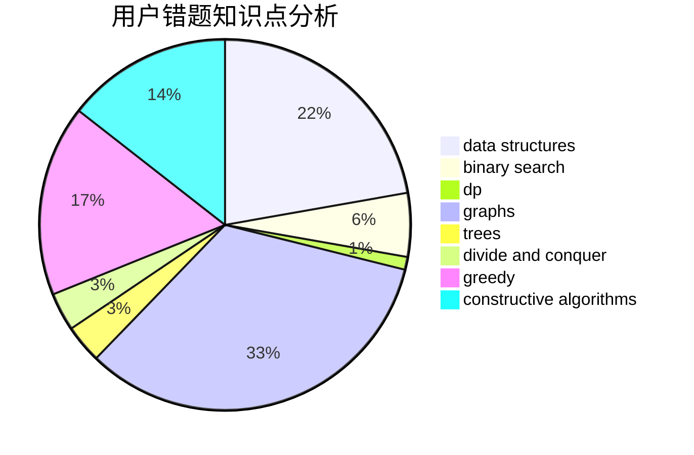

# DPair
<!-- tabs:start -->
#### **用户提交结果分析**

#### **用户做题类型偏好分析**

#### **用户错题知识点分析**

<!-- tabs:end -->
# 推荐题目
[Game On Leaves](http://codeforces.com/problemset/problem/1363/C)		games,
                        trees		  
[Caesar's Legions](http://codeforces.com/problemset/problem/118/D)		dp		  
[Data Center](http://codeforces.com/problemset/problem/1250/F)		brute force,
                        implementation		  
[Permutation Game](http://codeforces.com/problemset/problem/1033/C)		brute force,
                        dp,
                        games		  
[Anton and Lines](http://codeforces.com/problemset/problem/593/B)		geometry,
                        sortings		  
[Zero Array](http://codeforces.com/problemset/problem/1201/B)		greedy,
                        math		  
[Intergalactic Sliding Puzzle](http://codeforces.com/problemset/problem/1280/F)		combinatorics,
                        constructive algorithms,
                        math		  
[Good Substrings](http://codeforces.com/problemset/problem/271/D)		data structures,
                        strings		  
[Tree Constructing](http://codeforces.com/problemset/problem/1003/E)		constructive algorithms,
                        graphs		  
[Table with Letters - 2](http://codeforces.com/problemset/problem/253/D)		brute force,
                        two pointers		  
<!-- tabs:start -->
#### **data structures**
[Good Substrings](http://codeforces.com/problemset/problem/271/D)		data structures,
                        strings		  
[Buses](http://codeforces.com/problemset/problem/101/B)		binary search,
                        data structures,
                        dp		  
[Queue](http://codeforces.com/problemset/problem/38/G)		data structures		  
[Nikita and stack](https://codeforces.com/contest/759/problem/C)		data structures		  
[Mike and Friends](http://codeforces.com/problemset/problem/547/E)		data structures,
                        string suffix structures,
                        strings,
                        trees		  
[Present](http://codeforces.com/problemset/problem/1322/B)		binary search,
                        bitmasks,
                        constructive algorithms,
                        data structures,
                        math,
                        sortings		  
[Maximum width](http://codeforces.com/problemset/problem/1492/C)		binary search,
                        data structures,
                        dp,
                        greedy,
                        two pointers		  
[Old Floppy Drive](http://codeforces.com/problemset/problem/1490/G)		binary search,
                        data structures,
                        math		  
[Odd Mineral Resource](http://codeforces.com/problemset/problem/1479/D)		binary search,
                        bitmasks,
                        brute force,
                        data structures,
                        probabilities,
                        trees		  
[Meximization](http://codeforces.com/problemset/problem/1497/A)		brute force,
                        data structures,
                        greedy,
                        sortings		  
#### **binary search**
[Perform Easily](http://codeforces.com/problemset/problem/1413/C)		binary search,
                        brute force,
                        dp,
                        implementation,
                        sortings,
                        two pointers		  
[Buses](http://codeforces.com/problemset/problem/101/B)		binary search,
                        data structures,
                        dp		  
[Travel Card](https://codeforces.com/contest/759/problem/B)		binary search,
                        dp		  
[Graph](http://codeforces.com/problemset/problem/1387/A)		*special problem,
                        binary search,
                        dfs and similar,
                        dp,
                        math,
                        ternary search		  
[Present](http://codeforces.com/problemset/problem/1322/B)		binary search,
                        bitmasks,
                        constructive algorithms,
                        data structures,
                        math,
                        sortings		  
[Maximum width](http://codeforces.com/problemset/problem/1492/C)		binary search,
                        data structures,
                        dp,
                        greedy,
                        two pointers		  
[Pairs](http://codeforces.com/problemset/problem/1463/D)		binary search,
                        constructive algorithms,
                        greedy,
                        two pointers		  
[Old Floppy Drive](http://codeforces.com/problemset/problem/1490/G)		binary search,
                        data structures,
                        math		  
[Odd Mineral Resource](http://codeforces.com/problemset/problem/1479/D)		binary search,
                        bitmasks,
                        brute force,
                        data structures,
                        probabilities,
                        trees		  
[Complicated Computations](http://codeforces.com/problemset/problem/1436/E)		binary search,
                        data structures,
                        two pointers		  
#### **dp**
[Caesar's Legions](http://codeforces.com/problemset/problem/118/D)		dp		  
[Permutation Game](http://codeforces.com/problemset/problem/1033/C)		brute force,
                        dp,
                        games		  
[Perform Easily](http://codeforces.com/problemset/problem/1413/C)		binary search,
                        brute force,
                        dp,
                        implementation,
                        sortings,
                        two pointers		  
[Buses](http://codeforces.com/problemset/problem/101/B)		binary search,
                        data structures,
                        dp		  
[Travel Card](https://codeforces.com/contest/759/problem/B)		binary search,
                        dp		  
[Double Elimination](https://codeforces.com/contest/1314/problem/B)		dp,
                        implementation		  
[Make Equal](http://codeforces.com/problemset/problem/1188/D)		dp		  
[Graph](http://codeforces.com/problemset/problem/1387/A)		*special problem,
                        binary search,
                        dfs and similar,
                        dp,
                        math,
                        ternary search		  
[Almost Arithmetical Progression](http://codeforces.com/problemset/problem/255/C)		brute force,
                        dp		  
[Compress String](http://codeforces.com/problemset/problem/1120/C)		dp,
                        strings		  
#### **graph**
[Tree Constructing](http://codeforces.com/problemset/problem/1003/E)		constructive algorithms,
                        graphs		  
[President and Roads](http://codeforces.com/problemset/problem/567/E)		dfs and similar,
                        graphs,
                        hashing,
                        shortest paths		  
[Foolprüf Security](http://codeforces.com/problemset/problem/1267/F)		graphs		  
[Ant Man](http://codeforces.com/problemset/problem/704/B)		dp,
                        graphs,
                        greedy		  
[Minimum Ties](http://codeforces.com/problemset/problem/1487/C)		brute force,
                        constructive algorithms,
                        dfs and similar,
                        graphs,
                        greedy,
                        implementation,
                        math		  
[Chef Monocarp](http://codeforces.com/problemset/problem/1437/C)		dp,
                        flows,
                        graph matchings,
                        greedy,
                        math,
                        sortings		  
[Strange Housing](http://codeforces.com/problemset/problem/1470/D)		constructive algorithms,
                        dfs and similar,
                        graph matchings,
                        graphs,
                        greedy		  
[Longest Simple Cycle](http://codeforces.com/problemset/problem/1476/C)		dp,
                        graphs,
                        greedy		  
[Shortest and Longest LIS](http://codeforces.com/problemset/problem/1304/D)		constructive algorithms,
                        graphs,
                        greedy,
                        two pointers		  
[Ball in Berland](http://codeforces.com/problemset/problem/1475/C)		combinatorics,
                        graphs,
                        math		  
#### **trees**
[Game On Leaves](http://codeforces.com/problemset/problem/1363/C)		games,
                        trees		  
[Add on a Tree](http://codeforces.com/problemset/problem/1188/A1)		trees		  
[Mike and Friends](http://codeforces.com/problemset/problem/547/E)		data structures,
                        string suffix structures,
                        strings,
                        trees		  
[Odd Mineral Resource](http://codeforces.com/problemset/problem/1479/D)		binary search,
                        bitmasks,
                        brute force,
                        data structures,
                        probabilities,
                        trees		  
[Yet Another Card Deck](http://codeforces.com/problemset/problem/1511/C)		brute force,
                        data structures,
                        implementation,
                        trees		  
[Diameter Cuts](http://codeforces.com/problemset/problem/1499/F)		combinatorics,
                        dfs and similar,
                        dp,
                        trees		  
[Fib-tree](http://codeforces.com/problemset/problem/1491/E)		brute force,
                        dfs and similar,
                        divide and conquer,
                        number theory,
                        trees		  
[13th Labour of Heracles](http://codeforces.com/problemset/problem/1466/D)		data structures,
                        greedy,
                        sortings,
                        trees		  
[BFS Trees](http://codeforces.com/problemset/problem/1495/D)		combinatorics,
                        dfs and similar,
                        graphs,
                        math,
                        shortest paths,
                        trees		  
[Sum of Prefix Sums](http://codeforces.com/problemset/problem/1303/G)		data structures,
                        divide and conquer,
                        geometry,
                        trees		  
#### **divide and conquer**
[Divide and Summarize](http://codeforces.com/problemset/problem/1461/D)		binary search,
                        brute force,
                        data structures,
                        divide and conquer,
                        implementation,
                        sortings		  
[Song of the Sirens](http://codeforces.com/problemset/problem/1466/G)		combinatorics,
                        divide and conquer,
                        hashing,
                        math,
                        string suffix structures,
                        strings		  
[Permutation Transformation](http://codeforces.com/problemset/problem/1490/D)		dfs and similar,
                        divide and conquer,
                        implementation		  
[Skyline Photo](https://codeforces.com/contest/1483/problem/C)		data structures,
                        divide and conquer,
                        dp		  
[Fib-tree](http://codeforces.com/problemset/problem/1491/E)		brute force,
                        dfs and similar,
                        divide and conquer,
                        number theory,
                        trees		  
[Sum of Prefix Sums](http://codeforces.com/problemset/problem/1303/G)		data structures,
                        divide and conquer,
                        geometry,
                        trees		  
[Dogeforces](http://codeforces.com/problemset/problem/1494/D)		constructive algorithms,
                        data structures,
                        dfs and similar,
                        divide and conquer,
                        dsu,
                        greedy,
                        sortings,
                        trees		  
[Skyline Photo](http://codeforces.com/problemset/problem/1482/E)		data structures,
                        divide and conquer,
                        dp		  
[Logistical Questions](http://codeforces.com/problemset/problem/566/C)		dfs and similar,
                        divide and conquer,
                        trees		  
[Fruit Sequences](http://codeforces.com/problemset/problem/1428/F)		binary search,
                        data structures,
                        divide and conquer,
                        dp,
                        two pointers		  
#### **greedy**
[Zero Array](http://codeforces.com/problemset/problem/1201/B)		greedy,
                        math		  
[Tournament](http://codeforces.com/problemset/problem/27/B)		bitmasks,
                        brute force,
                        dfs and similar,
                        greedy		  
[Number Circle](http://codeforces.com/problemset/problem/1189/B)		greedy,
                        math,
                        sortings		  
[Assigning to Classes](http://codeforces.com/problemset/problem/1300/B)		greedy,
                        implementation,
                        sortings		  
[Ant Man](http://codeforces.com/problemset/problem/704/B)		dp,
                        graphs,
                        greedy		  
[Solo mid Oracle](https://codeforces.com/contest/1435/problem/E)		greedy,
                        math,
                        ternary search		  
[Maximum width](http://codeforces.com/problemset/problem/1492/C)		binary search,
                        data structures,
                        dp,
                        greedy,
                        two pointers		  
[Diamond Miner](https://codeforces.com/contest/1496/problem/C)		geometry,
                        greedy,
                        math,
                        sortings		  
[Anti-knapsack](http://codeforces.com/problemset/problem/1493/A)		constructive algorithms,
                        greedy		  
[Pairs](http://codeforces.com/problemset/problem/1463/D)		binary search,
                        constructive algorithms,
                        greedy,
                        two pointers		  
#### **constructive algorithms**
[Intergalactic Sliding Puzzle](http://codeforces.com/problemset/problem/1280/F)		combinatorics,
                        constructive algorithms,
                        math		  
[Tree Constructing](http://codeforces.com/problemset/problem/1003/E)		constructive algorithms,
                        graphs		  
[Pavel and barbecue](https://codeforces.com/contest/759/problem/A)		constructive algorithms,
                        dfs and similar		  
[Madhouse (Hard version)](http://codeforces.com/problemset/problem/1286/C2)		brute force,
                        constructive algorithms,
                        hashing,
                        interactive,
                        math		  
[Vika and Squares](http://codeforces.com/problemset/problem/610/B)		constructive algorithms,
                        implementation		  
[Candy Boxes](http://codeforces.com/problemset/problem/488/B)		brute force,
                        constructive algorithms,
                        math		  
[Cards with Numbers](http://codeforces.com/problemset/problem/254/A)		constructive algorithms,
                        sortings		  
[Nezzar and Board](https://codeforces.com/contest/1478/problem/D)		constructive algorithms,
                        math,
                        number theory		  
[Present](http://codeforces.com/problemset/problem/1322/B)		binary search,
                        bitmasks,
                        constructive algorithms,
                        data structures,
                        math,
                        sortings		  
[Anti-knapsack](http://codeforces.com/problemset/problem/1493/A)		constructive algorithms,
                        greedy		  
#### **sortings**
[Anton and Lines](http://codeforces.com/problemset/problem/593/B)		geometry,
                        sortings		  
[Perform Easily](http://codeforces.com/problemset/problem/1413/C)		binary search,
                        brute force,
                        dp,
                        implementation,
                        sortings,
                        two pointers		  
[Cards with Numbers](http://codeforces.com/problemset/problem/254/A)		constructive algorithms,
                        sortings		  
[Number Circle](http://codeforces.com/problemset/problem/1189/B)		greedy,
                        math,
                        sortings		  
[Assigning to Classes](http://codeforces.com/problemset/problem/1300/B)		greedy,
                        implementation,
                        sortings		  
[Present](http://codeforces.com/problemset/problem/1322/B)		binary search,
                        bitmasks,
                        constructive algorithms,
                        data structures,
                        math,
                        sortings		  
[Diamond Miner](https://codeforces.com/contest/1496/problem/C)		geometry,
                        greedy,
                        math,
                        sortings		  
[Diamond Miner](http://codeforces.com/problemset/problem/1495/A)		geometry,
                        greedy,
                        math,
                        sortings		  
[Meximization](http://codeforces.com/problemset/problem/1497/A)		brute force,
                        data structures,
                        greedy,
                        sortings		  
[Avoiding Zero](http://codeforces.com/problemset/problem/1427/A)		math,
                        sortings		  
<!-- tabs:end -->
