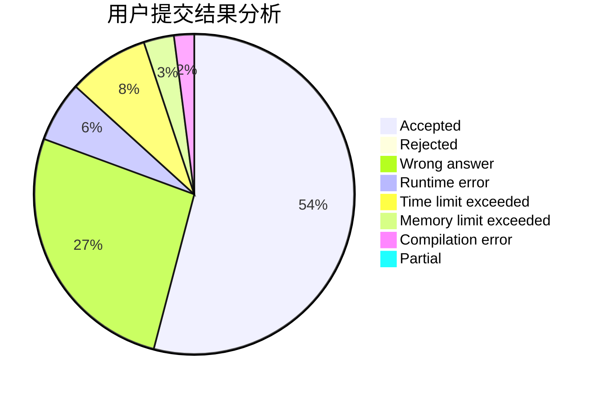
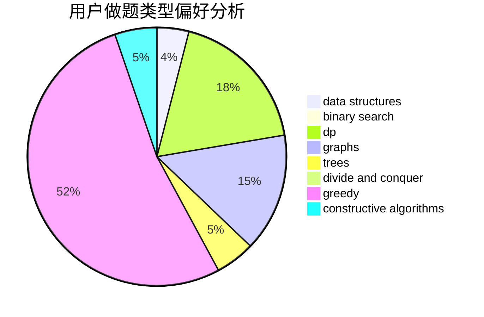
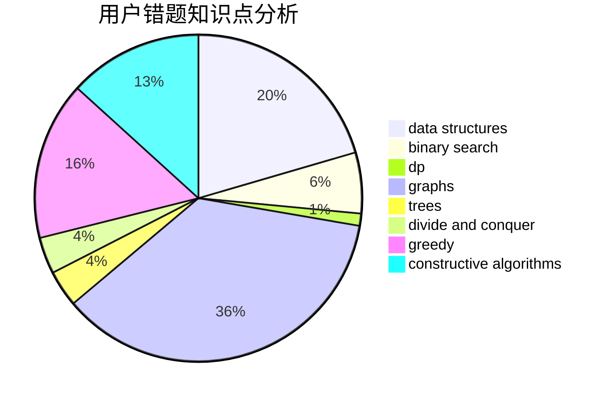

# DPair

<!-- tabs:start -->

#### **用户提交结果分析**

#### **用户做题类型偏好分析**

#### **用户错题知识点分析**

<!-- tabs:end -->
# 推荐题目
[1354A](https://codeforces.com/contest/1354/problem/A)		math		  
[573B](https://codeforces.com/contest/573/problem/B)		binary search,
                        data structures,
                        dp,
                        math		  
[1194D](https://codeforces.com/contest/1194/problem/D)		games,
                        math		  
[611H](https://codeforces.com/contest/611/problem/H)		constructive algorithms,
                        flows,
                        graphs		  
[1254E](https://codeforces.com/contest/1254/problem/E)		combinatorics,
                        dfs and similar,
                        dsu,
                        trees		  
[723B](https://codeforces.com/contest/723/problem/B)		expression parsing,
                        implementation,
                        strings		  
[12871](https://codeforces.com/contest/1287/problem/1)		dsu,graphs,sortings,trees		  
[273E](https://codeforces.com/contest/273/problem/E)		dp,
                        games		  
[295A](https://codeforces.com/contest/295/problem/A)		data structures,
                        implementation		  
[271D](https://codeforces.com/contest/271/problem/D)		data structures,
                        strings		  
