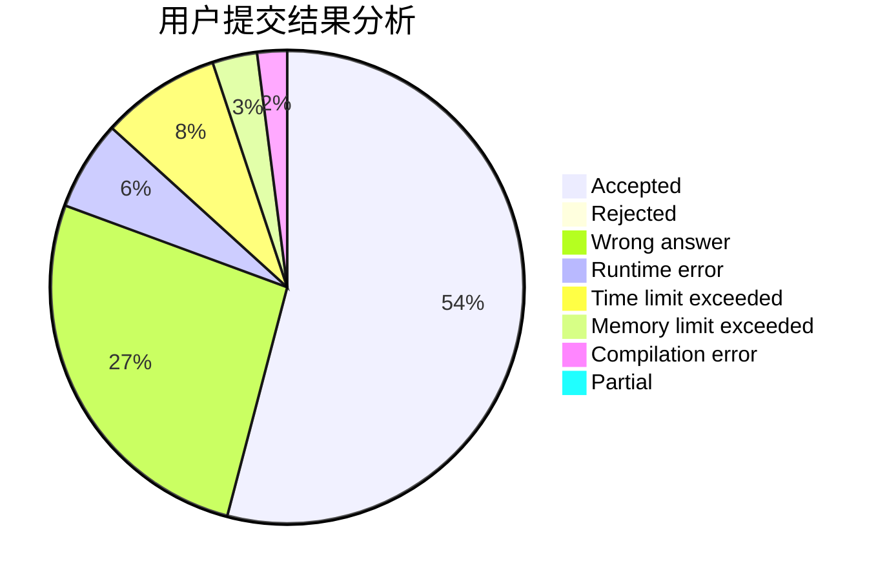
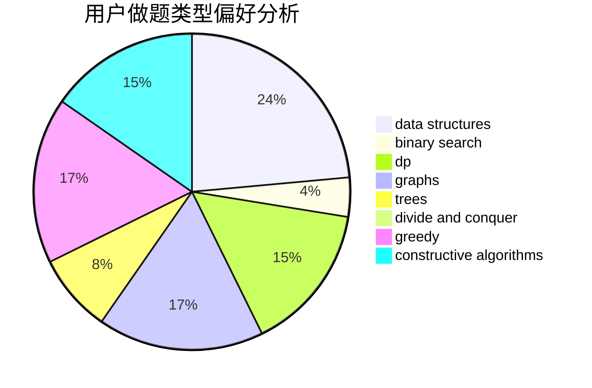
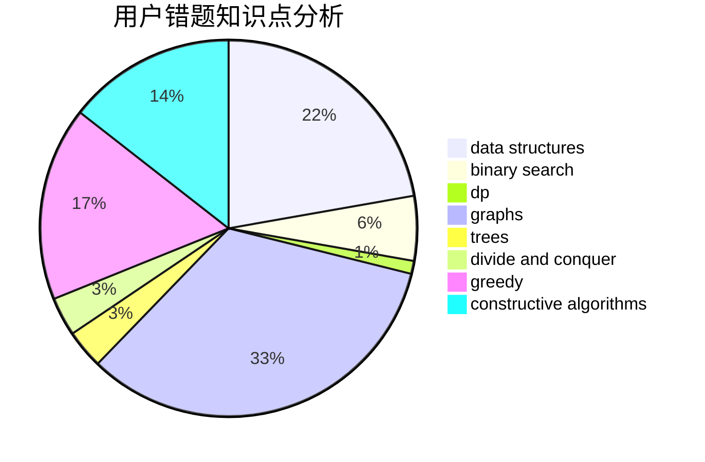

# DPair

<!-- tabs:start -->

#### **用户提交结果分析**

#### **用户做题类型偏好分析**

#### **用户错题知识点分析**

<!-- tabs:end -->
# 推荐题目
[1347B](https://codeforces.com/contest/1347/problem/B)		dsu,graphs,sortings,trees		  
[547E](https://codeforces.com/contest/547/problem/E)		data structures,
                        string suffix structures,
                        strings,
                        trees		  
[1189B](https://codeforces.com/contest/1189/problem/B)		greedy,
                        math,
                        sortings		  
[593B](https://codeforces.com/contest/593/problem/B)		geometry,
                        sortings		  
[1250F](https://codeforces.com/contest/1250/problem/F)		brute force,
                        implementation		  
[704B](https://codeforces.com/contest/704/problem/B)		dp,
                        graphs,
                        greedy		  
[1280F](https://codeforces.com/contest/1280/problem/F)		combinatorics,
                        constructive algorithms,
                        math		  
[255C](https://codeforces.com/contest/255/problem/C)		brute force,
                        dp		  
[27B](https://codeforces.com/contest/27/problem/B)		bitmasks,
                        brute force,
                        dfs and similar,
                        greedy		  
[253D](https://codeforces.com/contest/253/problem/D)		brute force,
                        two pointers		  
