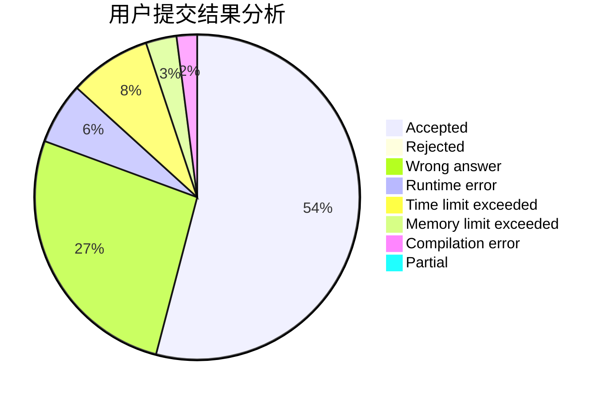
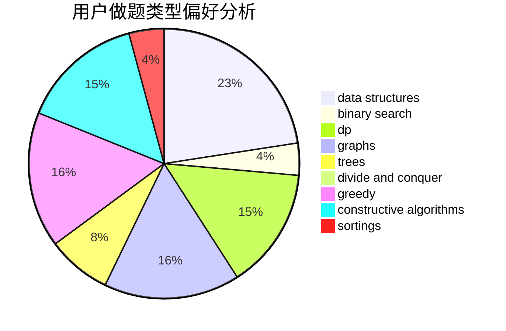
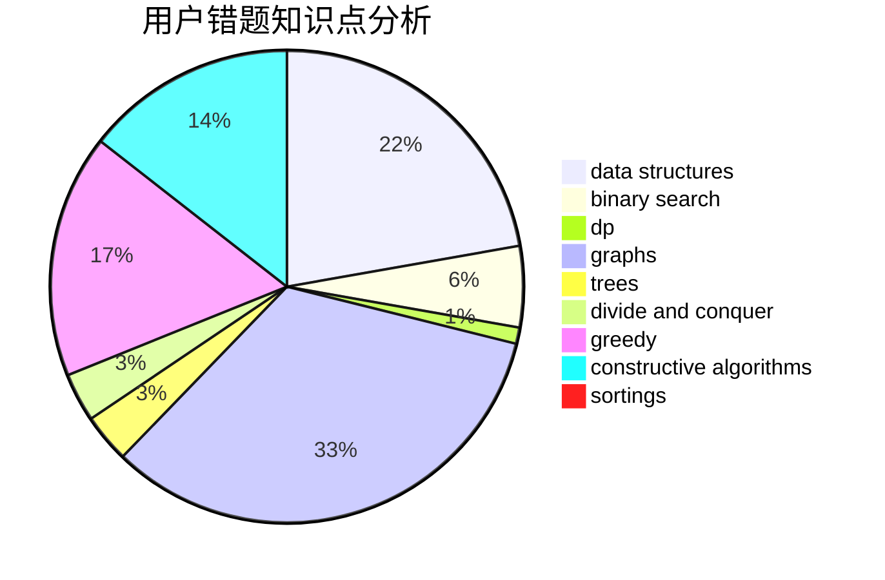

# DPair
<!-- tabs:start -->
#### **用户提交结果分析**

#### **用户做题类型偏好分析**

#### **用户错题知识点分析**

<!-- tabs:end -->
# 推荐题目
[1363C](http://codeforces.com/problemset/problem/1363/C)		games,
                        trees		  
[118D](http://codeforces.com/problemset/problem/118/D)		dp		  
[1250F](http://codeforces.com/problemset/problem/1250/F)		brute force,
                        implementation		  
[1033C](http://codeforces.com/problemset/problem/1033/C)		brute force,
                        dp,
                        games		  
[593B](http://codeforces.com/problemset/problem/593/B)		geometry,
                        sortings		  
[1201B](http://codeforces.com/problemset/problem/1201/B)		greedy,
                        math		  
[1280F](http://codeforces.com/problemset/problem/1280/F)		combinatorics,
                        constructive algorithms,
                        math		  
[271D](http://codeforces.com/problemset/problem/271/D)		data structures,
                        strings		  
[1003E](http://codeforces.com/problemset/problem/1003/E)		constructive algorithms,
                        graphs		  
[253D](http://codeforces.com/problemset/problem/253/D)		brute force,
                        two pointers		  
<!-- tabs:start -->
#### **data structures**
[271D](http://codeforces.com/problemset/problem/271/D)		data structures,
                        strings		  
[101B](http://codeforces.com/problemset/problem/101/B)		binary search,
                        data structures,
                        dp		  
[38G](http://codeforces.com/problemset/problem/38/G)		data structures		  
[759C](https://codeforces.com/contest/759/problem/C)		data structures		  
[547E](http://codeforces.com/problemset/problem/547/E)		data structures,
                        string suffix structures,
                        strings,
                        trees		  
[1322B](http://codeforces.com/problemset/problem/1322/B)		binary search,
                        bitmasks,
                        constructive algorithms,
                        data structures,
                        math,
                        sortings		  
[1492C](http://codeforces.com/problemset/problem/1492/C)		binary search,
                        data structures,
                        dp,
                        greedy,
                        two pointers		  
[1490G](http://codeforces.com/problemset/problem/1490/G)		binary search,
                        data structures,
                        math		  
[1479D](http://codeforces.com/problemset/problem/1479/D)		binary search,
                        bitmasks,
                        brute force,
                        data structures,
                        probabilities,
                        trees		  
[1497A](http://codeforces.com/problemset/problem/1497/A)		brute force,
                        data structures,
                        greedy,
                        sortings		  
#### **binary search**
[1413C](http://codeforces.com/problemset/problem/1413/C)		binary search,
                        brute force,
                        dp,
                        implementation,
                        sortings,
                        two pointers		  
[101B](http://codeforces.com/problemset/problem/101/B)		binary search,
                        data structures,
                        dp		  
[759B](https://codeforces.com/contest/759/problem/B)		binary search,
                        dp		  
[1387A](http://codeforces.com/problemset/problem/1387/A)		*special problem,
                        binary search,
                        dfs and similar,
                        dp,
                        math,
                        ternary search		  
[1322B](http://codeforces.com/problemset/problem/1322/B)		binary search,
                        bitmasks,
                        constructive algorithms,
                        data structures,
                        math,
                        sortings		  
[1492C](http://codeforces.com/problemset/problem/1492/C)		binary search,
                        data structures,
                        dp,
                        greedy,
                        two pointers		  
[1463D](http://codeforces.com/problemset/problem/1463/D)		binary search,
                        constructive algorithms,
                        greedy,
                        two pointers		  
[1490G](http://codeforces.com/problemset/problem/1490/G)		binary search,
                        data structures,
                        math		  
[1479D](http://codeforces.com/problemset/problem/1479/D)		binary search,
                        bitmasks,
                        brute force,
                        data structures,
                        probabilities,
                        trees		  
[1436E](http://codeforces.com/problemset/problem/1436/E)		binary search,
                        data structures,
                        two pointers		  
#### **dp**
[118D](http://codeforces.com/problemset/problem/118/D)		dp		  
[1033C](http://codeforces.com/problemset/problem/1033/C)		brute force,
                        dp,
                        games		  
[1413C](http://codeforces.com/problemset/problem/1413/C)		binary search,
                        brute force,
                        dp,
                        implementation,
                        sortings,
                        two pointers		  
[101B](http://codeforces.com/problemset/problem/101/B)		binary search,
                        data structures,
                        dp		  
[759B](https://codeforces.com/contest/759/problem/B)		binary search,
                        dp		  
[1314B](https://codeforces.com/contest/1314/problem/B)		dp,
                        implementation		  
[1188D](http://codeforces.com/problemset/problem/1188/D)		dp		  
[1387A](http://codeforces.com/problemset/problem/1387/A)		*special problem,
                        binary search,
                        dfs and similar,
                        dp,
                        math,
                        ternary search		  
[255C](http://codeforces.com/problemset/problem/255/C)		brute force,
                        dp		  
[1120C](http://codeforces.com/problemset/problem/1120/C)		dp,
                        strings		  
#### **graph**
[1003E](http://codeforces.com/problemset/problem/1003/E)		constructive algorithms,
                        graphs		  
[567E](http://codeforces.com/problemset/problem/567/E)		dfs and similar,
                        graphs,
                        hashing,
                        shortest paths		  
[1267F](http://codeforces.com/problemset/problem/1267/F)		graphs		  
[704B](http://codeforces.com/problemset/problem/704/B)		dp,
                        graphs,
                        greedy		  
[1487C](http://codeforces.com/problemset/problem/1487/C)		brute force,
                        constructive algorithms,
                        dfs and similar,
                        graphs,
                        greedy,
                        implementation,
                        math		  
[1437C](http://codeforces.com/problemset/problem/1437/C)		dp,
                        flows,
                        graph matchings,
                        greedy,
                        math,
                        sortings		  
[1470D](http://codeforces.com/problemset/problem/1470/D)		constructive algorithms,
                        dfs and similar,
                        graph matchings,
                        graphs,
                        greedy		  
[1476C](http://codeforces.com/problemset/problem/1476/C)		dp,
                        graphs,
                        greedy		  
[1304D](http://codeforces.com/problemset/problem/1304/D)		constructive algorithms,
                        graphs,
                        greedy,
                        two pointers		  
[1475C](http://codeforces.com/problemset/problem/1475/C)		combinatorics,
                        graphs,
                        math		  
#### **trees**
[1363C](http://codeforces.com/problemset/problem/1363/C)		games,
                        trees		  
[1188A1](http://codeforces.com/problemset/problem/1188/A1)		trees		  
[547E](http://codeforces.com/problemset/problem/547/E)		data structures,
                        string suffix structures,
                        strings,
                        trees		  
[1479D](http://codeforces.com/problemset/problem/1479/D)		binary search,
                        bitmasks,
                        brute force,
                        data structures,
                        probabilities,
                        trees		  
[1511C](http://codeforces.com/problemset/problem/1511/C)		brute force,
                        data structures,
                        implementation,
                        trees		  
[1499F](http://codeforces.com/problemset/problem/1499/F)		combinatorics,
                        dfs and similar,
                        dp,
                        trees		  
[1491E](http://codeforces.com/problemset/problem/1491/E)		brute force,
                        dfs and similar,
                        divide and conquer,
                        number theory,
                        trees		  
[1466D](http://codeforces.com/problemset/problem/1466/D)		data structures,
                        greedy,
                        sortings,
                        trees		  
[1495D](http://codeforces.com/problemset/problem/1495/D)		combinatorics,
                        dfs and similar,
                        graphs,
                        math,
                        shortest paths,
                        trees		  
[1303G](http://codeforces.com/problemset/problem/1303/G)		data structures,
                        divide and conquer,
                        geometry,
                        trees		  
#### **divide and conquer**
[1461D](http://codeforces.com/problemset/problem/1461/D)		binary search,
                        brute force,
                        data structures,
                        divide and conquer,
                        implementation,
                        sortings		  
[1466G](http://codeforces.com/problemset/problem/1466/G)		combinatorics,
                        divide and conquer,
                        hashing,
                        math,
                        string suffix structures,
                        strings		  
[1490D](http://codeforces.com/problemset/problem/1490/D)		dfs and similar,
                        divide and conquer,
                        implementation		  
[1483C](https://codeforces.com/contest/1483/problem/C)		data structures,
                        divide and conquer,
                        dp		  
[1491E](http://codeforces.com/problemset/problem/1491/E)		brute force,
                        dfs and similar,
                        divide and conquer,
                        number theory,
                        trees		  
[1303G](http://codeforces.com/problemset/problem/1303/G)		data structures,
                        divide and conquer,
                        geometry,
                        trees		  
[1494D](http://codeforces.com/problemset/problem/1494/D)		constructive algorithms,
                        data structures,
                        dfs and similar,
                        divide and conquer,
                        dsu,
                        greedy,
                        sortings,
                        trees		  
[1482E](http://codeforces.com/problemset/problem/1482/E)		data structures,
                        divide and conquer,
                        dp		  
[566C](http://codeforces.com/problemset/problem/566/C)		dfs and similar,
                        divide and conquer,
                        trees		  
[1428F](http://codeforces.com/problemset/problem/1428/F)		binary search,
                        data structures,
                        divide and conquer,
                        dp,
                        two pointers		  
#### **greedy**
[1201B](http://codeforces.com/problemset/problem/1201/B)		greedy,
                        math		  
[27B](http://codeforces.com/problemset/problem/27/B)		bitmasks,
                        brute force,
                        dfs and similar,
                        greedy		  
[1189B](http://codeforces.com/problemset/problem/1189/B)		greedy,
                        math,
                        sortings		  
[1300B](http://codeforces.com/problemset/problem/1300/B)		greedy,
                        implementation,
                        sortings		  
[704B](http://codeforces.com/problemset/problem/704/B)		dp,
                        graphs,
                        greedy		  
[1435E](https://codeforces.com/contest/1435/problem/E)		greedy,
                        math,
                        ternary search		  
[1492C](http://codeforces.com/problemset/problem/1492/C)		binary search,
                        data structures,
                        dp,
                        greedy,
                        two pointers		  
[1496C](https://codeforces.com/contest/1496/problem/C)		geometry,
                        greedy,
                        math,
                        sortings		  
[1493A](http://codeforces.com/problemset/problem/1493/A)		constructive algorithms,
                        greedy		  
[1463D](http://codeforces.com/problemset/problem/1463/D)		binary search,
                        constructive algorithms,
                        greedy,
                        two pointers		  
#### **constructive algorithms**
[1280F](http://codeforces.com/problemset/problem/1280/F)		combinatorics,
                        constructive algorithms,
                        math		  
[1003E](http://codeforces.com/problemset/problem/1003/E)		constructive algorithms,
                        graphs		  
[759A](https://codeforces.com/contest/759/problem/A)		constructive algorithms,
                        dfs and similar		  
[1286C2](http://codeforces.com/problemset/problem/1286/C2)		brute force,
                        constructive algorithms,
                        hashing,
                        interactive,
                        math		  
[610B](http://codeforces.com/problemset/problem/610/B)		constructive algorithms,
                        implementation		  
[488B](http://codeforces.com/problemset/problem/488/B)		brute force,
                        constructive algorithms,
                        math		  
[254A](http://codeforces.com/problemset/problem/254/A)		constructive algorithms,
                        sortings		  
[1478D](https://codeforces.com/contest/1478/problem/D)		constructive algorithms,
                        math,
                        number theory		  
[1322B](http://codeforces.com/problemset/problem/1322/B)		binary search,
                        bitmasks,
                        constructive algorithms,
                        data structures,
                        math,
                        sortings		  
[1493A](http://codeforces.com/problemset/problem/1493/A)		constructive algorithms,
                        greedy		  
#### **sortings**
[593B](http://codeforces.com/problemset/problem/593/B)		geometry,
                        sortings		  
[1413C](http://codeforces.com/problemset/problem/1413/C)		binary search,
                        brute force,
                        dp,
                        implementation,
                        sortings,
                        two pointers		  
[254A](http://codeforces.com/problemset/problem/254/A)		constructive algorithms,
                        sortings		  
[1189B](http://codeforces.com/problemset/problem/1189/B)		greedy,
                        math,
                        sortings		  
[1300B](http://codeforces.com/problemset/problem/1300/B)		greedy,
                        implementation,
                        sortings		  
[1322B](http://codeforces.com/problemset/problem/1322/B)		binary search,
                        bitmasks,
                        constructive algorithms,
                        data structures,
                        math,
                        sortings		  
[1496C](https://codeforces.com/contest/1496/problem/C)		geometry,
                        greedy,
                        math,
                        sortings		  
[1495A](http://codeforces.com/problemset/problem/1495/A)		geometry,
                        greedy,
                        math,
                        sortings		  
[1497A](http://codeforces.com/problemset/problem/1497/A)		brute force,
                        data structures,
                        greedy,
                        sortings		  
[1427A](http://codeforces.com/problemset/problem/1427/A)		math,
                        sortings		  
<!-- tabs:end -->
