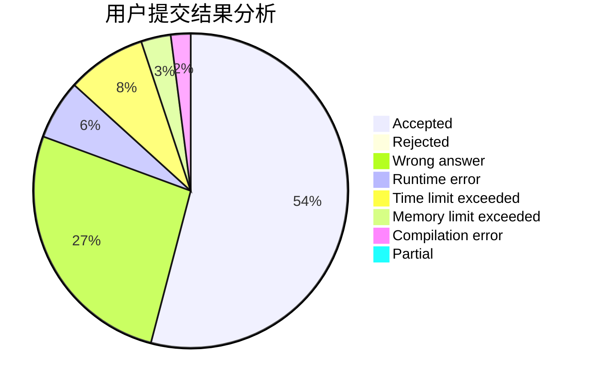
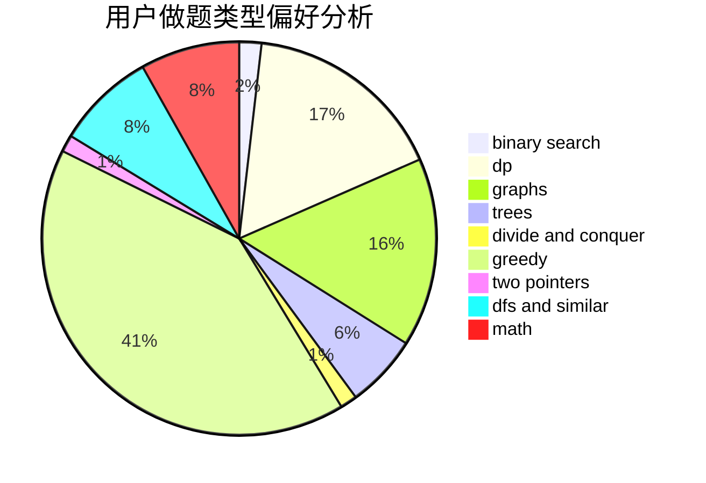

# DPair

<!-- tabs:start -->

#### **用户提交结果分析**

#### **用户做题类型偏好分析**

<!-- tabs:end -->
# 推荐题目
[1354A](https://codeforces.com/contest/1354/problem/A)
[573B](https://codeforces.com/contest/573/problem/B)
[1194D](https://codeforces.com/contest/1194/problem/D)
[611H](https://codeforces.com/contest/611/problem/H)
[1254E](https://codeforces.com/contest/1254/problem/E)
[723B](https://codeforces.com/contest/723/problem/B)
[12871](https://codeforces.com/contest/1287/problem/1)
[273E](https://codeforces.com/contest/273/problem/E)
[295A](https://codeforces.com/contest/295/problem/A)
[271D](https://codeforces.com/contest/271/problem/D)
