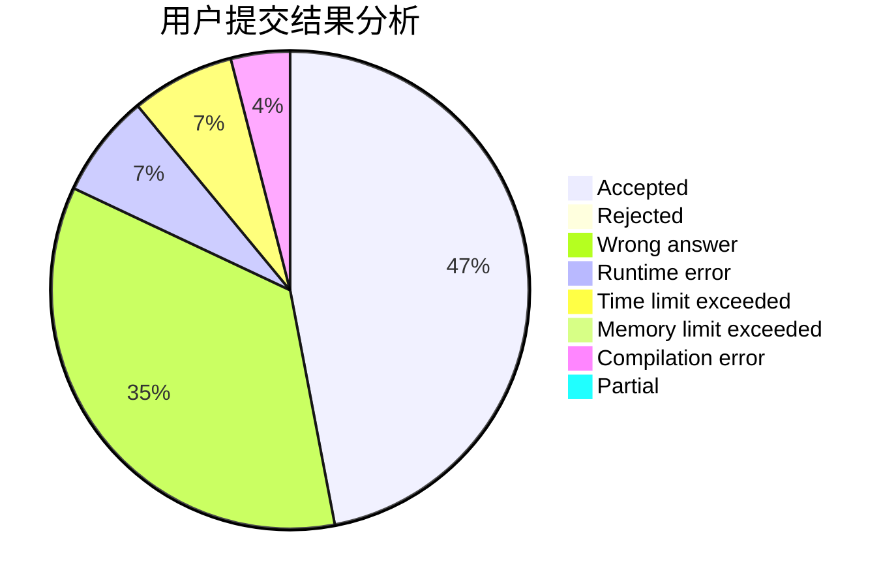
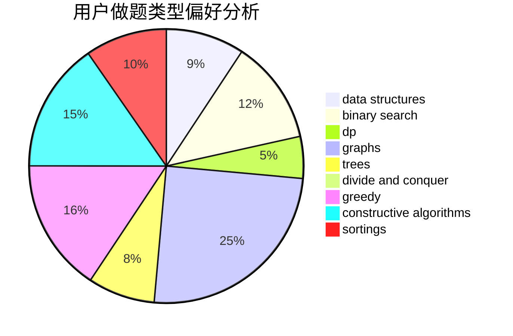

# DSGkvz
<!-- tabs:start -->
#### **用户提交结果分析**

#### **用户做题类型偏好分析**

#### **用户错题知识点分析**

<!-- tabs:end -->
# 推荐题目
[600F](http://codeforces.com/problemset/problem/600/F)		graphs		  
[1434E](http://codeforces.com/problemset/problem/1434/E)		dsu,
                        games		  
[1119F](http://codeforces.com/problemset/problem/1119/F)		data structures,
                        dp,
                        trees		  
[171C](http://codeforces.com/problemset/problem/171/C)		*special problem,
                        implementation		  
[1197A](http://codeforces.com/problemset/problem/1197/A)		greedy,
                        math,
                        sortings		  
[27A](http://codeforces.com/problemset/problem/27/A)		implementation,
                        sortings		  
[1423C](http://codeforces.com/problemset/problem/1423/C)		divide and conquer,
                        graphs,
                        trees		  
[1196C](http://codeforces.com/problemset/problem/1196/C)		implementation		  
[759E](https://codeforces.com/contest/759/problem/E)		combinatorics,
                        dp,
                        math		  
[1199A](http://codeforces.com/problemset/problem/1199/A)		implementation		  
<!-- tabs:start -->
#### **data structures**
[1119F](http://codeforces.com/problemset/problem/1119/F)		data structures,
                        dp,
                        trees		  
[1197E](http://codeforces.com/problemset/problem/1197/E)		binary search,
                        combinatorics,
                        data structures,
                        dp,
                        shortest paths,
                        sortings		  
[464E](http://codeforces.com/problemset/problem/464/E)		data structures,
                        graphs,
                        shortest paths		  
[1483F](https://codeforces.com/contest/1483/problem/F)		data structures,
                        string suffix structures,
                        trees		  
[231E](http://codeforces.com/problemset/problem/231/E)		data structures,
                        dfs and similar,
                        dp,
                        graphs,
                        trees		  
[1296E2](http://codeforces.com/problemset/problem/1296/E2)		data structures,
                        dp		  
[1492C](http://codeforces.com/problemset/problem/1492/C)		binary search,
                        data structures,
                        dp,
                        greedy,
                        two pointers		  
[1490G](http://codeforces.com/problemset/problem/1490/G)		binary search,
                        data structures,
                        math		  
[1479D](http://codeforces.com/problemset/problem/1479/D)		binary search,
                        bitmasks,
                        brute force,
                        data structures,
                        probabilities,
                        trees		  
[1497A](http://codeforces.com/problemset/problem/1497/A)		brute force,
                        data structures,
                        greedy,
                        sortings		  
#### **binary search**
[1197E](http://codeforces.com/problemset/problem/1197/E)		binary search,
                        combinatorics,
                        data structures,
                        dp,
                        shortest paths,
                        sortings		  
[1492C](http://codeforces.com/problemset/problem/1492/C)		binary search,
                        data structures,
                        dp,
                        greedy,
                        two pointers		  
[1463D](http://codeforces.com/problemset/problem/1463/D)		binary search,
                        constructive algorithms,
                        greedy,
                        two pointers		  
[1490G](http://codeforces.com/problemset/problem/1490/G)		binary search,
                        data structures,
                        math		  
[1479D](http://codeforces.com/problemset/problem/1479/D)		binary search,
                        bitmasks,
                        brute force,
                        data structures,
                        probabilities,
                        trees		  
[1436E](http://codeforces.com/problemset/problem/1436/E)		binary search,
                        data structures,
                        two pointers		  
[1461D](http://codeforces.com/problemset/problem/1461/D)		binary search,
                        brute force,
                        data structures,
                        divide and conquer,
                        implementation,
                        sortings		  
[1493C](http://codeforces.com/problemset/problem/1493/C)		binary search,
                        brute force,
                        constructive algorithms,
                        greedy,
                        strings		  
[1487D](http://codeforces.com/problemset/problem/1487/D)		binary search,
                        brute force,
                        math,
                        number theory		  
[1486B](http://codeforces.com/problemset/problem/1486/B)		binary search,
                        geometry,
                        shortest paths,
                        sortings		  
#### **dp**
[1119F](http://codeforces.com/problemset/problem/1119/F)		data structures,
                        dp,
                        trees		  
[759E](https://codeforces.com/contest/759/problem/E)		combinatorics,
                        dp,
                        math		  
[494B](http://codeforces.com/problemset/problem/494/B)		dp,
                        strings		  
[1423J](http://codeforces.com/problemset/problem/1423/J)		bitmasks,
                        constructive algorithms,
                        dp,
                        math		  
[1197E](http://codeforces.com/problemset/problem/1197/E)		binary search,
                        combinatorics,
                        data structures,
                        dp,
                        shortest paths,
                        sortings		  
[1073F](http://codeforces.com/problemset/problem/1073/F)		dfs and similar,
                        dp,
                        greedy,
                        trees		  
[1296E1](http://codeforces.com/problemset/problem/1296/E1)		constructive algorithms,
                        dp,
                        graphs,
                        greedy,
                        sortings		  
[1349F2](http://codeforces.com/problemset/problem/1349/F2)		dp,
                        fft,
                        math		  
[759D](https://codeforces.com/contest/759/problem/D)		brute force,
                        combinatorics,
                        dp,
                        string suffix structures		  
[231E](http://codeforces.com/problemset/problem/231/E)		data structures,
                        dfs and similar,
                        dp,
                        graphs,
                        trees		  
#### **graph**
[600F](http://codeforces.com/problemset/problem/600/F)		graphs		  
[1423C](http://codeforces.com/problemset/problem/1423/C)		divide and conquer,
                        graphs,
                        trees		  
[1217D](http://codeforces.com/problemset/problem/1217/D)		constructive algorithms,
                        dfs and similar,
                        graphs		  
[464E](http://codeforces.com/problemset/problem/464/E)		data structures,
                        graphs,
                        shortest paths		  
[1296E1](http://codeforces.com/problemset/problem/1296/E1)		constructive algorithms,
                        dp,
                        graphs,
                        greedy,
                        sortings		  
[1239D](http://codeforces.com/problemset/problem/1239/D)		2-sat,
                        dfs and similar,
                        graph matchings,
                        graphs		  
[601A](http://codeforces.com/problemset/problem/601/A)		graphs,
                        shortest paths		  
[231E](http://codeforces.com/problemset/problem/231/E)		data structures,
                        dfs and similar,
                        dp,
                        graphs,
                        trees		  
[1487C](http://codeforces.com/problemset/problem/1487/C)		brute force,
                        constructive algorithms,
                        dfs and similar,
                        graphs,
                        greedy,
                        implementation,
                        math		  
[1437C](http://codeforces.com/problemset/problem/1437/C)		dp,
                        flows,
                        graph matchings,
                        greedy,
                        math,
                        sortings		  
#### **trees**
[1119F](http://codeforces.com/problemset/problem/1119/F)		data structures,
                        dp,
                        trees		  
[1423C](http://codeforces.com/problemset/problem/1423/C)		divide and conquer,
                        graphs,
                        trees		  
[1073F](http://codeforces.com/problemset/problem/1073/F)		dfs and similar,
                        dp,
                        greedy,
                        trees		  
[1483F](https://codeforces.com/contest/1483/problem/F)		data structures,
                        string suffix structures,
                        trees		  
[231E](http://codeforces.com/problemset/problem/231/E)		data structures,
                        dfs and similar,
                        dp,
                        graphs,
                        trees		  
[1479D](http://codeforces.com/problemset/problem/1479/D)		binary search,
                        bitmasks,
                        brute force,
                        data structures,
                        probabilities,
                        trees		  
[1511C](http://codeforces.com/problemset/problem/1511/C)		brute force,
                        data structures,
                        implementation,
                        trees		  
[1499F](http://codeforces.com/problemset/problem/1499/F)		combinatorics,
                        dfs and similar,
                        dp,
                        trees		  
[1491E](http://codeforces.com/problemset/problem/1491/E)		brute force,
                        dfs and similar,
                        divide and conquer,
                        number theory,
                        trees		  
[1466D](http://codeforces.com/problemset/problem/1466/D)		data structures,
                        greedy,
                        sortings,
                        trees		  
#### **divide and conquer**
[1423C](http://codeforces.com/problemset/problem/1423/C)		divide and conquer,
                        graphs,
                        trees		  
[120J](http://codeforces.com/problemset/problem/120/J)		divide and conquer,
                        geometry,
                        sortings		  
[1461D](http://codeforces.com/problemset/problem/1461/D)		binary search,
                        brute force,
                        data structures,
                        divide and conquer,
                        implementation,
                        sortings		  
[1466G](http://codeforces.com/problemset/problem/1466/G)		combinatorics,
                        divide and conquer,
                        hashing,
                        math,
                        string suffix structures,
                        strings		  
[1490D](http://codeforces.com/problemset/problem/1490/D)		dfs and similar,
                        divide and conquer,
                        implementation		  
[1483C](https://codeforces.com/contest/1483/problem/C)		data structures,
                        divide and conquer,
                        dp		  
[1491E](http://codeforces.com/problemset/problem/1491/E)		brute force,
                        dfs and similar,
                        divide and conquer,
                        number theory,
                        trees		  
[1303G](http://codeforces.com/problemset/problem/1303/G)		data structures,
                        divide and conquer,
                        geometry,
                        trees		  
[1494D](http://codeforces.com/problemset/problem/1494/D)		constructive algorithms,
                        data structures,
                        dfs and similar,
                        divide and conquer,
                        dsu,
                        greedy,
                        sortings,
                        trees		  
[1482E](http://codeforces.com/problemset/problem/1482/E)		data structures,
                        divide and conquer,
                        dp		  
#### **greedy**
[1197A](http://codeforces.com/problemset/problem/1197/A)		greedy,
                        math,
                        sortings		  
[1073F](http://codeforces.com/problemset/problem/1073/F)		dfs and similar,
                        dp,
                        greedy,
                        trees		  
[1296E1](http://codeforces.com/problemset/problem/1296/E1)		constructive algorithms,
                        dp,
                        graphs,
                        greedy,
                        sortings		  
[1492C](http://codeforces.com/problemset/problem/1492/C)		binary search,
                        data structures,
                        dp,
                        greedy,
                        two pointers		  
[1496C](https://codeforces.com/contest/1496/problem/C)		geometry,
                        greedy,
                        math,
                        sortings		  
[1493A](http://codeforces.com/problemset/problem/1493/A)		constructive algorithms,
                        greedy		  
[1463D](http://codeforces.com/problemset/problem/1463/D)		binary search,
                        constructive algorithms,
                        greedy,
                        two pointers		  
[1462C](http://codeforces.com/problemset/problem/1462/C)		brute force,
                        greedy,
                        math		  
[1494B](http://codeforces.com/problemset/problem/1494/B)		bitmasks,
                        brute force,
                        greedy,
                        implementation		  
[1492D](http://codeforces.com/problemset/problem/1492/D)		bitmasks,
                        constructive algorithms,
                        greedy,
                        math		  
#### **constructive algorithms**
[1256F](http://codeforces.com/problemset/problem/1256/F)		constructive algorithms,
                        sortings,
                        strings		  
[1090D](http://codeforces.com/problemset/problem/1090/D)		constructive algorithms		  
[1217D](http://codeforces.com/problemset/problem/1217/D)		constructive algorithms,
                        dfs and similar,
                        graphs		  
[1423J](http://codeforces.com/problemset/problem/1423/J)		bitmasks,
                        constructive algorithms,
                        dp,
                        math		  
[1296E1](http://codeforces.com/problemset/problem/1296/E1)		constructive algorithms,
                        dp,
                        graphs,
                        greedy,
                        sortings		  
[1288F](http://codeforces.com/problemset/problem/1288/F)		constructive algorithms,
                        flows		  
[1447A](http://codeforces.com/problemset/problem/1447/A)		constructive algorithms,
                        math		  
[1510J](http://codeforces.com/problemset/problem/1510/J)		constructive algorithms,
                        math		  
[1493A](http://codeforces.com/problemset/problem/1493/A)		constructive algorithms,
                        greedy		  
[1463D](http://codeforces.com/problemset/problem/1463/D)		binary search,
                        constructive algorithms,
                        greedy,
                        two pointers		  
#### **sortings**
[1197A](http://codeforces.com/problemset/problem/1197/A)		greedy,
                        math,
                        sortings		  
[27A](http://codeforces.com/problemset/problem/27/A)		implementation,
                        sortings		  
[1256F](http://codeforces.com/problemset/problem/1256/F)		constructive algorithms,
                        sortings,
                        strings		  
[120J](http://codeforces.com/problemset/problem/120/J)		divide and conquer,
                        geometry,
                        sortings		  
[1197E](http://codeforces.com/problemset/problem/1197/E)		binary search,
                        combinatorics,
                        data structures,
                        dp,
                        shortest paths,
                        sortings		  
[1296E1](http://codeforces.com/problemset/problem/1296/E1)		constructive algorithms,
                        dp,
                        graphs,
                        greedy,
                        sortings		  
[1496C](https://codeforces.com/contest/1496/problem/C)		geometry,
                        greedy,
                        math,
                        sortings		  
[1495A](http://codeforces.com/problemset/problem/1495/A)		geometry,
                        greedy,
                        math,
                        sortings		  
[1497A](http://codeforces.com/problemset/problem/1497/A)		brute force,
                        data structures,
                        greedy,
                        sortings		  
[1427A](http://codeforces.com/problemset/problem/1427/A)		math,
                        sortings		  
<!-- tabs:end -->
