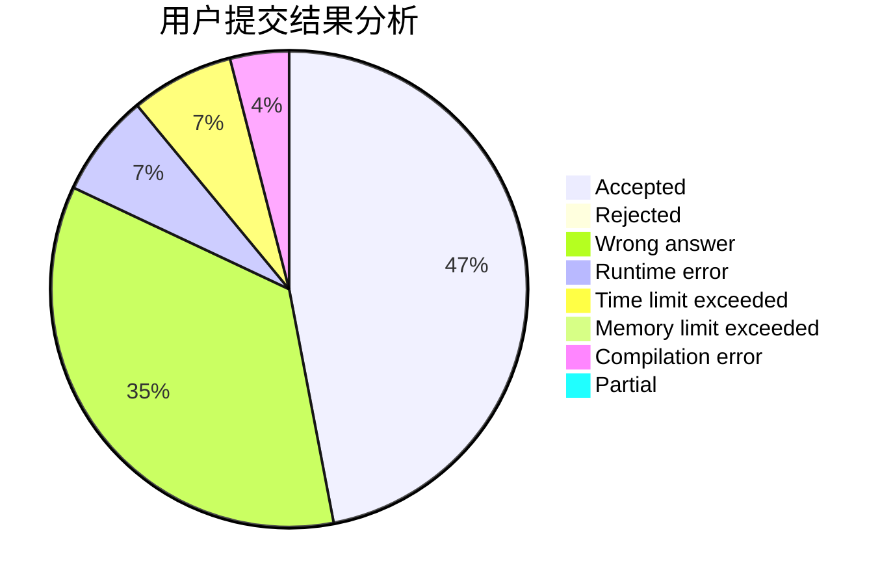
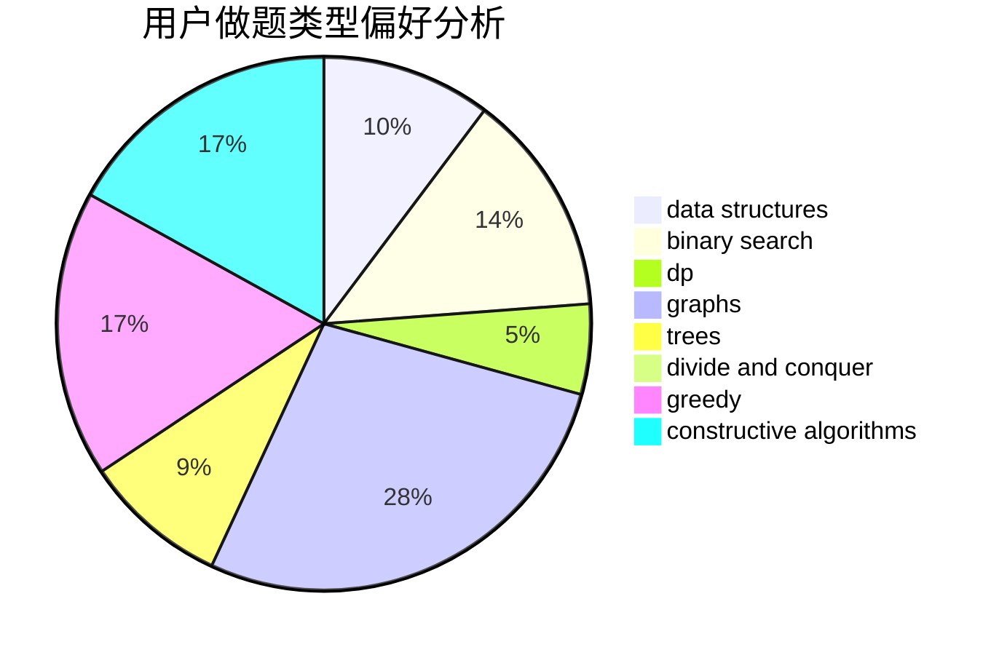

# DSGkvz

<!-- tabs:start -->

#### **用户提交结果分析**

#### **用户做题类型偏好分析**

#### **用户错题知识点分析**

<!-- tabs:end -->
# 推荐题目
[494B](https://codeforces.com/contest/494/problem/B)		dp,
                        strings		  
[171C](https://codeforces.com/contest/171/problem/C)		*special problem,
                        implementation		  
[1434E](https://codeforces.com/contest/1434/problem/E)		dsu,
                        games		  
[1119F](https://codeforces.com/contest/1119/problem/F)		data structures,
                        dp,
                        trees		  
[1217D](https://codeforces.com/contest/1217/problem/D)		constructive algorithms,
                        dfs and similar,
                        graphs		  
[600F](https://codeforces.com/contest/600/problem/F)		graphs		  
[464E](https://codeforces.com/contest/464/problem/E)		data structures,
                        graphs,
                        shortest paths		  
[1510J](https://codeforces.com/contest/1510/problem/J)		constructive algorithms,
                        math		  
[1196D1](https://codeforces.com/contest/1196D/problem/1)		implementation		  
[1349F2](https://codeforces.com/contest/1349F/problem/2)		dp,
                        fft,
                        math		  
