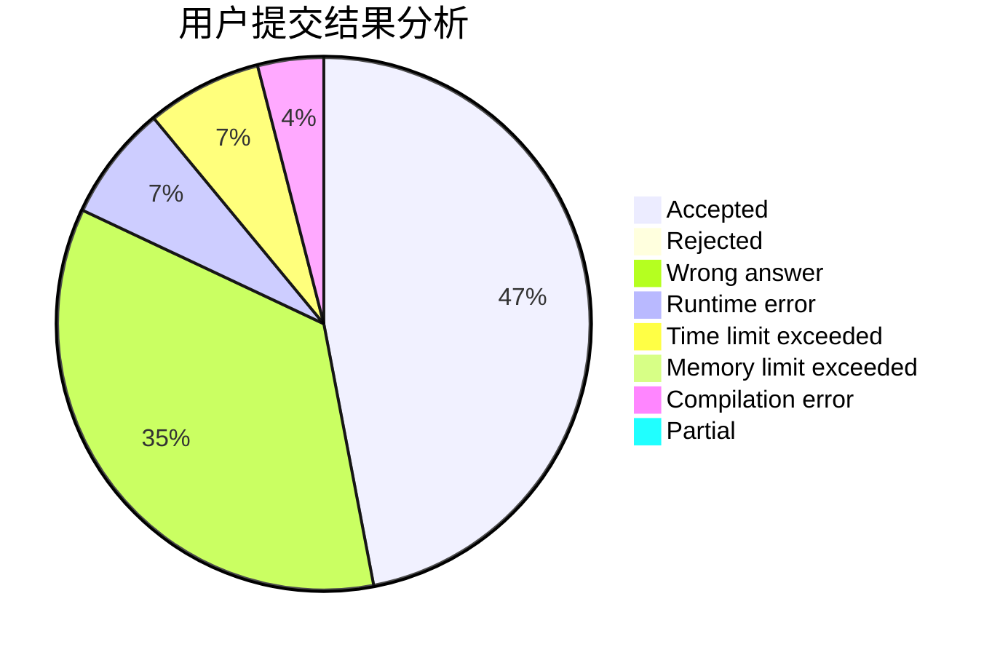
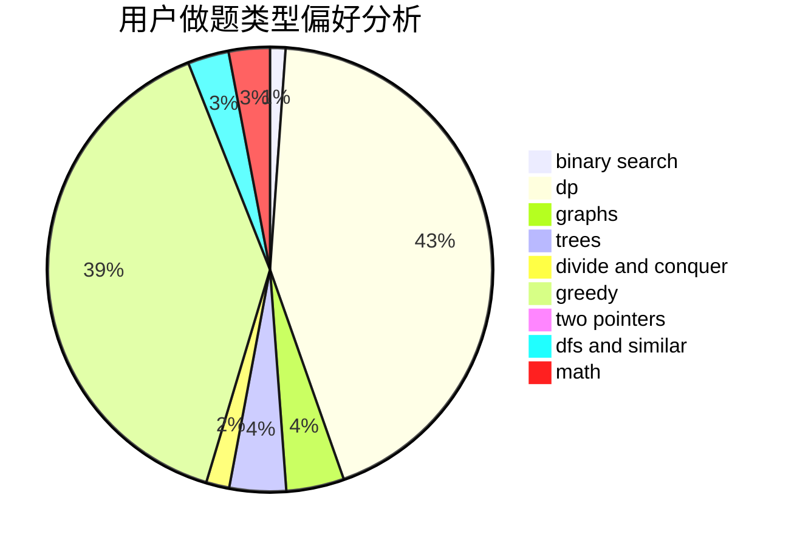

# DSGkvz

<!-- tabs:start -->

#### **用户提交结果分析**

#### **用户做题类型偏好分析**

<!-- tabs:end -->
# 推荐题目
[514C](https://codeforces.com/contest/514/problem/C)
[198C](https://codeforces.com/contest/198/problem/C)
[1444E](https://codeforces.com/contest/1444/problem/E)
[1129B](https://codeforces.com/contest/1129/problem/B)
[1225A](https://codeforces.com/contest/1225/problem/A)
[620B](https://codeforces.com/contest/620/problem/B)
[484D](https://codeforces.com/contest/484/problem/D)
[166C](https://codeforces.com/contest/166/problem/C)
[11E](https://codeforces.com/contest/11/problem/E)
[13572](https://codeforces.com/contest/1357/problem/2)
