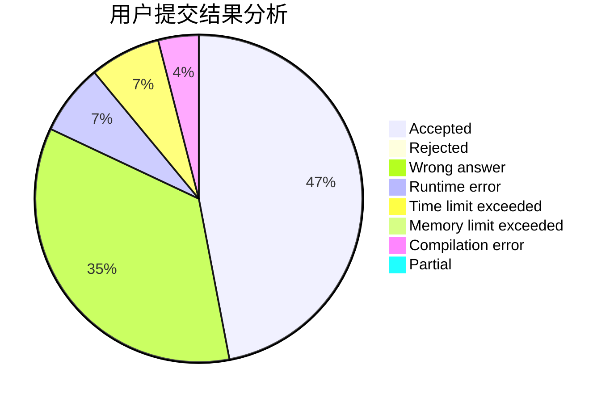
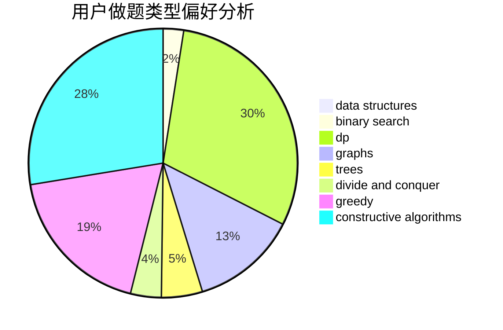

# DSGkvz

<!-- tabs:start -->

#### **用户提交结果分析**

#### **用户做题类型偏好分析**

#### **用户错题知识点分析**

<!-- tabs:end -->
# 推荐题目
[514C](https://codeforces.com/contest/514/problem/C)		binary search,
                        data structures,
                        hashing,
                        string suffix structures,
                        strings		  
[198C](https://codeforces.com/contest/198/problem/C)		binary search,
                        geometry		  
[1444E](https://codeforces.com/contest/1444/problem/E)		brute force,
                        dfs and similar,
                        dp,
                        interactive,
                        trees		  
[1129B](https://codeforces.com/contest/1129/problem/B)		constructive algorithms		  
[1225A](https://codeforces.com/contest/1225/problem/A)		math		  
[620B](https://codeforces.com/contest/620/problem/B)		implementation		  
[484D](https://codeforces.com/contest/484/problem/D)		data structures,
                        dp,
                        greedy		  
[166C](https://codeforces.com/contest/166/problem/C)		greedy,
                        math,
                        sortings		  
[11E](https://codeforces.com/contest/11/problem/E)		binary search,
                        dp,
                        greedy		  
[13572](https://codeforces.com/contest/1357/problem/2)		dsu,graphs,sortings,trees		  
