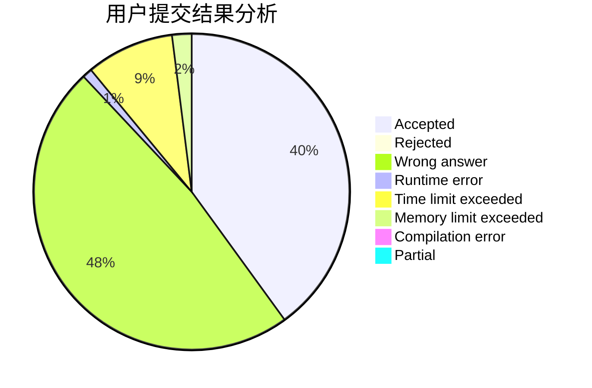
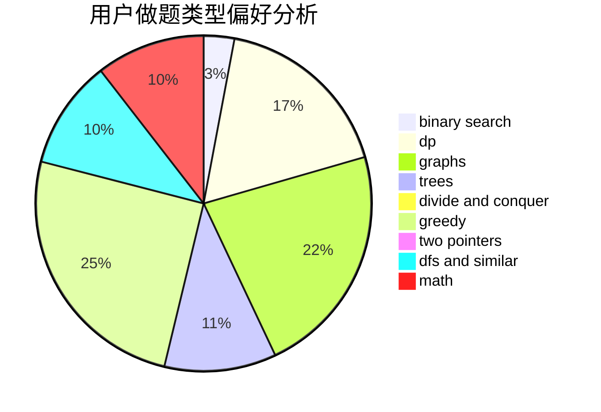

# DWAE86

<!-- tabs:start -->

#### **用户提交结果分析**

#### **用户做题类型偏好分析**

<!-- tabs:end -->
# 推荐题目
[691C](https://codeforces.com/contest/691/problem/C)
[1060F](https://codeforces.com/contest/1060/problem/F)
[279B](https://codeforces.com/contest/279/problem/B)
[1419B](https://codeforces.com/contest/1419/problem/B)
[772A](https://codeforces.com/contest/772/problem/A)
[292E](https://codeforces.com/contest/292/problem/E)
[160B](https://codeforces.com/contest/160/problem/B)
[1095B](https://codeforces.com/contest/1095/problem/B)
[1089M](https://codeforces.com/contest/1089/problem/M)
[1191F](https://codeforces.com/contest/1191/problem/F)
