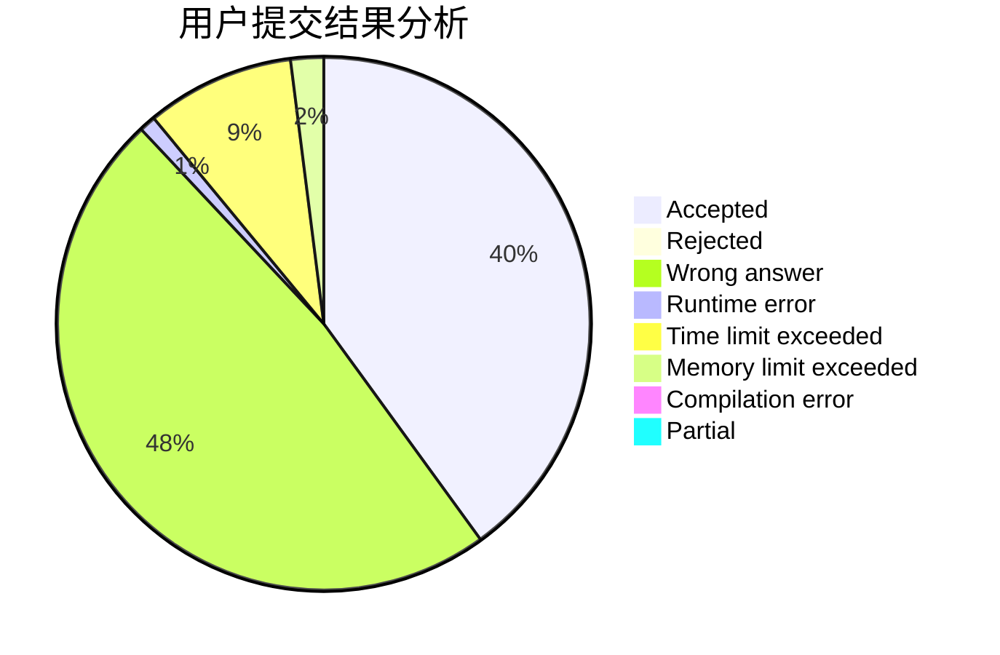
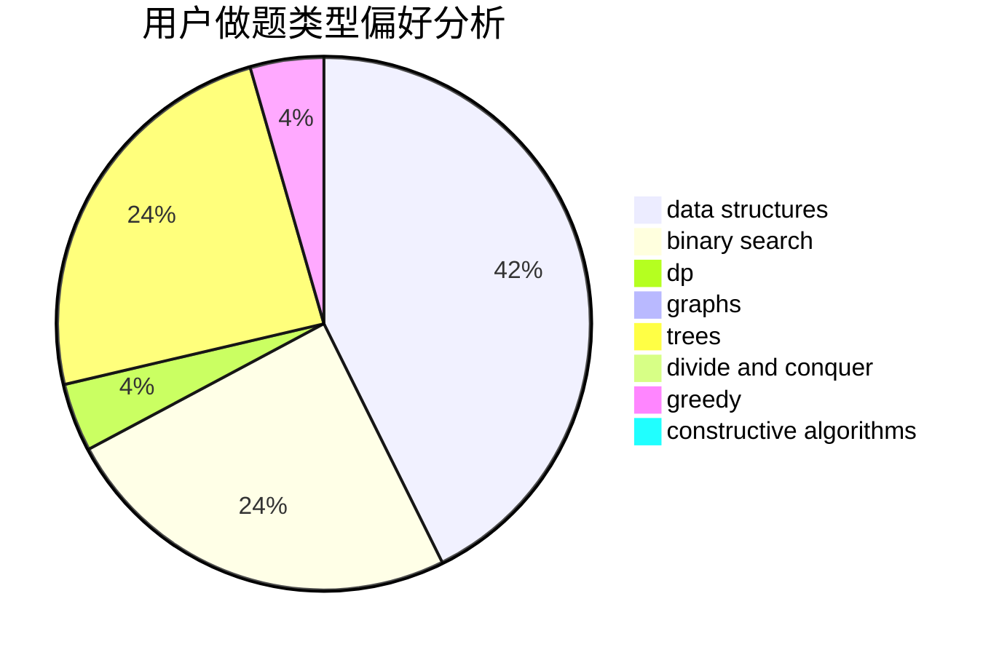

# DWAE86

<!-- tabs:start -->

#### **用户提交结果分析**

#### **用户做题类型偏好分析**

#### **用户错题知识点分析**

<!-- tabs:end -->
# 推荐题目
[669C](https://codeforces.com/contest/669/problem/C)		dsu,graphs,sortings,trees		  
[1060C](https://codeforces.com/contest/1060/problem/C)		binary search,
                        implementation,
                        two pointers		  
[260D](https://codeforces.com/contest/260/problem/D)		constructive algorithms,
                        dsu,
                        graphs,
                        greedy,
                        trees		  
[1408G](https://codeforces.com/contest/1408/problem/G)		combinatorics,
                        dp,
                        dsu,
                        fft,
                        graphs,
                        trees		  
[754A](https://codeforces.com/contest/754/problem/A)		constructive algorithms,
                        greedy,
                        implementation		  
[277D](https://codeforces.com/contest/277/problem/D)		dp,
                        probabilities		  
[1509D](https://codeforces.com/contest/1509/problem/D)		dsu,graphs,sortings,trees		  
[1093F](https://codeforces.com/contest/1093/problem/F)		dp		  
[1089I](https://codeforces.com/contest/1089/problem/I)		nan		  
[1188A2](https://codeforces.com/contest/1188A/problem/2)		constructive algorithms,
                        dfs and similar,
                        implementation,
                        trees		  
