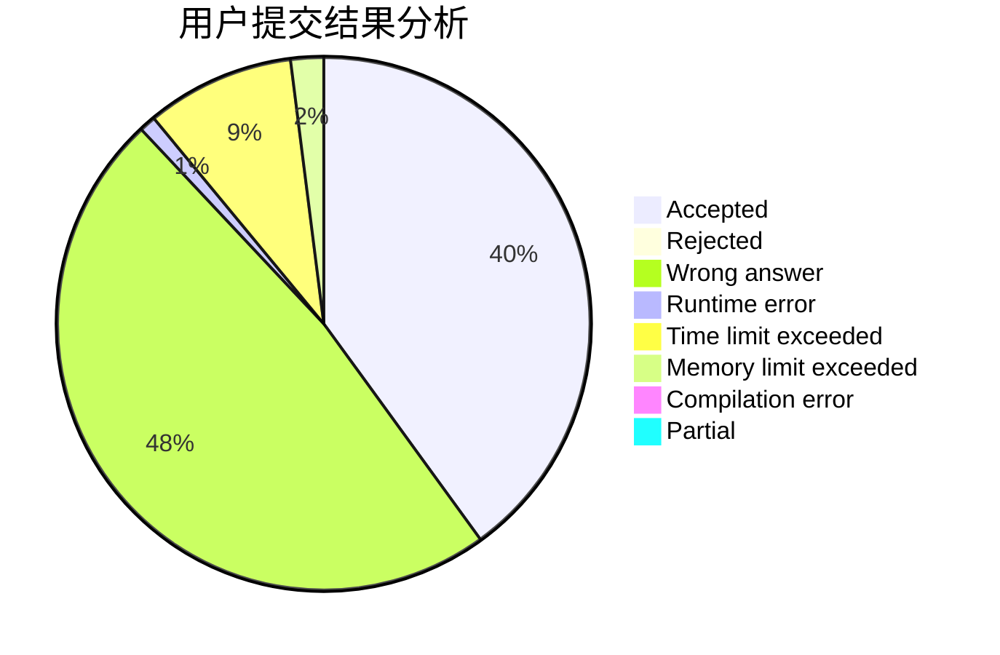
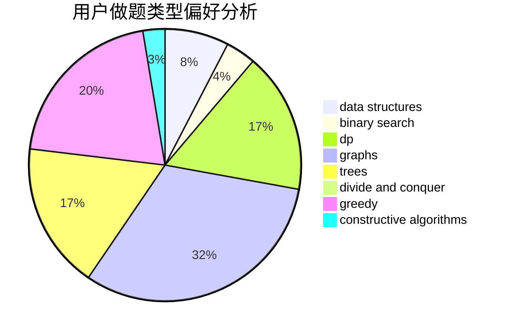

# DWAE86

<!-- tabs:start -->

#### **用户提交结果分析**

#### **用户做题类型偏好分析**

#### **用户错题知识点分析**

<!-- tabs:end -->
# 推荐题目
[691C](https://codeforces.com/contest/691/problem/C)		implementation,
                        strings		  
[1060F](https://codeforces.com/contest/1060/problem/F)		combinatorics,
                        dp		  
[279B](https://codeforces.com/contest/279/problem/B)		binary search,
                        brute force,
                        implementation,
                        two pointers		  
[1419B](https://codeforces.com/contest/1419/problem/B)		brute force,
                        constructive algorithms,
                        greedy,
                        implementation,
                        math		  
[772A](https://codeforces.com/contest/772/problem/A)		binary search,
                        math		  
[292E](https://codeforces.com/contest/292/problem/E)		data structures		  
[160B](https://codeforces.com/contest/160/problem/B)		greedy,
                        sortings		  
[1095B](https://codeforces.com/contest/1095/problem/B)		implementation		  
[1089M](https://codeforces.com/contest/1089/problem/M)		constructive algorithms,
                        graphs		  
[1191F](https://codeforces.com/contest/1191/problem/F)		dsu,graphs,sortings,trees		  
