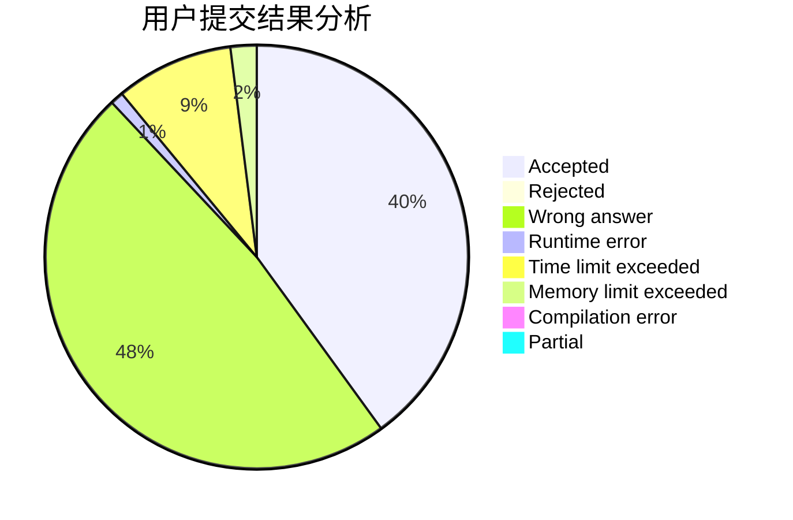
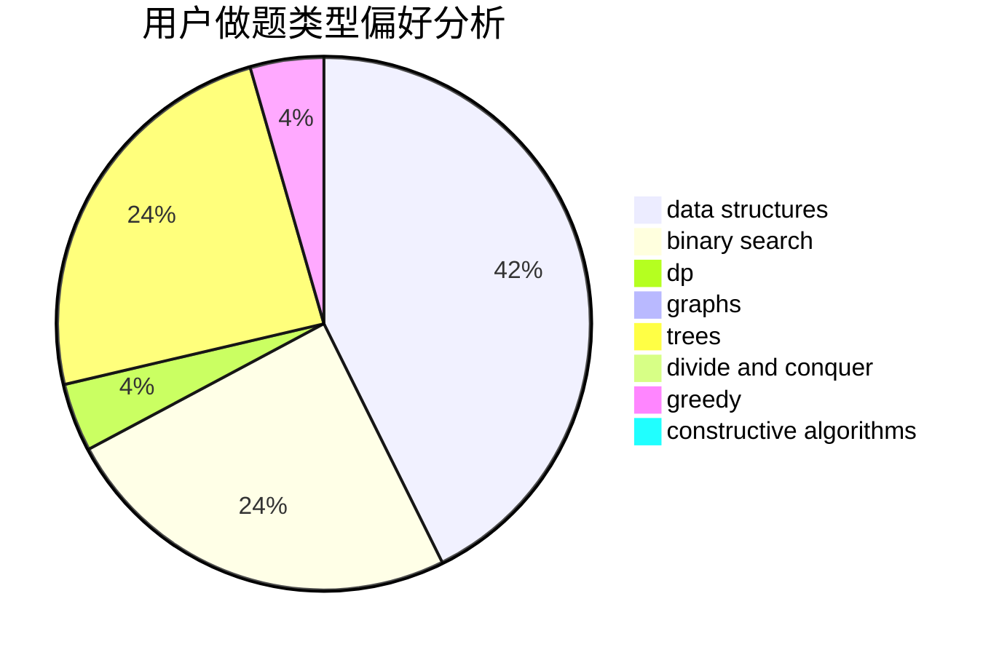

# DWAE86
<!-- tabs:start -->
#### **用户提交结果分析**

#### **用户做题类型偏好分析**

#### **用户错题知识点分析**

<!-- tabs:end -->
# 推荐题目
[Little Artem and Matrix](https://codeforces.com/contest/669/problem/C)		implementation		  
[Black and White Tree](http://codeforces.com/problemset/problem/260/D)		constructive algorithms,
                        dsu,
                        graphs,
                        greedy,
                        trees		  
[Quantum Classification - Dataset 6](http://codeforces.com/problemset/problem/1357/D4)		nan		  
[Jumping Jack](http://codeforces.com/problemset/problem/11/B)		math		  
[Interval-Free Permutations](http://codeforces.com/problemset/problem/1089/I)		nan		  
[Google Code Jam](http://codeforces.com/problemset/problem/277/D)		dp,
                        probabilities		  
[The New Year: Meeting Friends](http://codeforces.com/problemset/problem/723/A)		implementation,
                        math,
                        sortings		  
[Clusterization Counting](http://codeforces.com/problemset/problem/1408/G)		combinatorics,
                        dp,
                        dsu,
                        fft,
                        graphs,
                        trees		  
[Character Swap (Easy Version)](http://codeforces.com/problemset/problem/1243/B1)		strings		  
[Maximum Subrectangle](http://codeforces.com/problemset/problem/1060/C)		binary search,
                        implementation,
                        two pointers		  
<!-- tabs:start -->
#### **data structures**
[Little Artem and Matrix](http://codeforces.com/problemset/problem/1200/A)		brute force,
                        data structures,
                        implementation		  
[Black and White Tree](http://codeforces.com/problemset/problem/1492/C)		binary search,
                        data structures,
                        dp,
                        greedy,
                        two pointers		  
[Quantum Classification - Dataset 6](http://codeforces.com/problemset/problem/1490/G)		binary search,
                        data structures,
                        math		  
[Jumping Jack](http://codeforces.com/problemset/problem/1479/D)		binary search,
                        bitmasks,
                        brute force,
                        data structures,
                        probabilities,
                        trees		  
[Interval-Free Permutations](http://codeforces.com/problemset/problem/1497/A)		brute force,
                        data structures,
                        greedy,
                        sortings		  
[Google Code Jam](http://codeforces.com/problemset/problem/1491/C)		brute force,
                        data structures,
                        dp,
                        greedy,
                        implementation		  
[The New Year: Meeting Friends](http://codeforces.com/problemset/problem/1492/B)		data structures,
                        greedy,
                        math		  
[Clusterization Counting](http://codeforces.com/problemset/problem/1436/E)		binary search,
                        data structures,
                        two pointers		  
[Character Swap (Easy Version)](http://codeforces.com/problemset/problem/1461/D)		binary search,
                        brute force,
                        data structures,
                        divide and conquer,
                        implementation,
                        sortings		  
[Maximum Subrectangle](http://codeforces.com/problemset/problem/1511/C)		brute force,
                        data structures,
                        implementation,
                        trees		  
#### **binary search**
[Little Artem and Matrix](http://codeforces.com/problemset/problem/1060/C)		binary search,
                        implementation,
                        two pointers		  
[Black and White Tree](http://codeforces.com/problemset/problem/11/E)		binary search,
                        dp,
                        greedy		  
[Quantum Classification - Dataset 6](http://codeforces.com/problemset/problem/1492/C)		binary search,
                        data structures,
                        dp,
                        greedy,
                        two pointers		  
[Jumping Jack](http://codeforces.com/problemset/problem/1463/D)		binary search,
                        constructive algorithms,
                        greedy,
                        two pointers		  
[Interval-Free Permutations](http://codeforces.com/problemset/problem/1490/G)		binary search,
                        data structures,
                        math		  
[Google Code Jam](http://codeforces.com/problemset/problem/1479/D)		binary search,
                        bitmasks,
                        brute force,
                        data structures,
                        probabilities,
                        trees		  
[The New Year: Meeting Friends](http://codeforces.com/problemset/problem/1436/E)		binary search,
                        data structures,
                        two pointers		  
[Clusterization Counting](http://codeforces.com/problemset/problem/1461/D)		binary search,
                        brute force,
                        data structures,
                        divide and conquer,
                        implementation,
                        sortings		  
[Character Swap (Easy Version)](http://codeforces.com/problemset/problem/1493/C)		binary search,
                        brute force,
                        constructive algorithms,
                        greedy,
                        strings		  
[Maximum Subrectangle](http://codeforces.com/problemset/problem/1487/D)		binary search,
                        brute force,
                        math,
                        number theory		  
#### **dp**
[Little Artem and Matrix](http://codeforces.com/problemset/problem/277/D)		dp,
                        probabilities		  
[Black and White Tree](http://codeforces.com/problemset/problem/1408/G)		combinatorics,
                        dp,
                        dsu,
                        fft,
                        graphs,
                        trees		  
[Quantum Classification - Dataset 6](http://codeforces.com/problemset/problem/1093/F)		dp		  
[Jumping Jack](http://codeforces.com/problemset/problem/11/E)		binary search,
                        dp,
                        greedy		  
[Interval-Free Permutations](http://codeforces.com/problemset/problem/1492/C)		binary search,
                        data structures,
                        dp,
                        greedy,
                        two pointers		  
[Google Code Jam](https://codeforces.com/contest/1457/problem/C)		brute force,
                        dp,
                        implementation		  
[The New Year: Meeting Friends](http://codeforces.com/problemset/problem/1491/C)		brute force,
                        data structures,
                        dp,
                        greedy,
                        implementation		  
[Clusterization Counting](http://codeforces.com/problemset/problem/1437/C)		dp,
                        flows,
                        graph matchings,
                        greedy,
                        math,
                        sortings		  
[Character Swap (Easy Version)](http://codeforces.com/problemset/problem/1499/B)		brute force,
                        dp,
                        greedy,
                        implementation		  
[Maximum Subrectangle](http://codeforces.com/problemset/problem/1491/D)		bitmasks,
                        constructive algorithms,
                        dp,
                        greedy,
                        math		  
#### **graph**
[Little Artem and Matrix](http://codeforces.com/problemset/problem/260/D)		constructive algorithms,
                        dsu,
                        graphs,
                        greedy,
                        trees		  
[Black and White Tree](http://codeforces.com/problemset/problem/1408/G)		combinatorics,
                        dp,
                        dsu,
                        fft,
                        graphs,
                        trees		  
[Quantum Classification - Dataset 6](http://codeforces.com/problemset/problem/1487/C)		brute force,
                        constructive algorithms,
                        dfs and similar,
                        graphs,
                        greedy,
                        implementation,
                        math		  
[Jumping Jack](http://codeforces.com/problemset/problem/1437/C)		dp,
                        flows,
                        graph matchings,
                        greedy,
                        math,
                        sortings		  
[Interval-Free Permutations](http://codeforces.com/problemset/problem/1470/D)		constructive algorithms,
                        dfs and similar,
                        graph matchings,
                        graphs,
                        greedy		  
[Google Code Jam](http://codeforces.com/problemset/problem/1476/C)		dp,
                        graphs,
                        greedy		  
[The New Year: Meeting Friends](http://codeforces.com/problemset/problem/1304/D)		constructive algorithms,
                        graphs,
                        greedy,
                        two pointers		  
[Clusterization Counting](http://codeforces.com/problemset/problem/1475/C)		combinatorics,
                        graphs,
                        math		  
[Character Swap (Easy Version)](http://codeforces.com/problemset/problem/553/E)		dp,
                        fft,
                        graphs,
                        math,
                        probabilities		  
[Maximum Subrectangle](http://codeforces.com/problemset/problem/1495/C)		constructive algorithms,
                        graphs		  
#### **trees**
[Little Artem and Matrix](http://codeforces.com/problemset/problem/260/D)		constructive algorithms,
                        dsu,
                        graphs,
                        greedy,
                        trees		  
[Black and White Tree](http://codeforces.com/problemset/problem/1408/G)		combinatorics,
                        dp,
                        dsu,
                        fft,
                        graphs,
                        trees		  
[Quantum Classification - Dataset 6](http://codeforces.com/problemset/problem/1188/A2)		constructive algorithms,
                        dfs and similar,
                        implementation,
                        trees		  
[Jumping Jack](http://codeforces.com/problemset/problem/1479/D)		binary search,
                        bitmasks,
                        brute force,
                        data structures,
                        probabilities,
                        trees		  
[Interval-Free Permutations](http://codeforces.com/problemset/problem/1511/C)		brute force,
                        data structures,
                        implementation,
                        trees		  
[Google Code Jam](http://codeforces.com/problemset/problem/1499/F)		combinatorics,
                        dfs and similar,
                        dp,
                        trees		  
[The New Year: Meeting Friends](http://codeforces.com/problemset/problem/1491/E)		brute force,
                        dfs and similar,
                        divide and conquer,
                        number theory,
                        trees		  
[Clusterization Counting](http://codeforces.com/problemset/problem/1466/D)		data structures,
                        greedy,
                        sortings,
                        trees		  
[Character Swap (Easy Version)](http://codeforces.com/problemset/problem/1495/D)		combinatorics,
                        dfs and similar,
                        graphs,
                        math,
                        shortest paths,
                        trees		  
[Maximum Subrectangle](http://codeforces.com/problemset/problem/1303/G)		data structures,
                        divide and conquer,
                        geometry,
                        trees		  
#### **divide and conquer**
[Little Artem and Matrix](http://codeforces.com/problemset/problem/1461/D)		binary search,
                        brute force,
                        data structures,
                        divide and conquer,
                        implementation,
                        sortings		  
[Black and White Tree](http://codeforces.com/problemset/problem/1466/G)		combinatorics,
                        divide and conquer,
                        hashing,
                        math,
                        string suffix structures,
                        strings		  
[Quantum Classification - Dataset 6](http://codeforces.com/problemset/problem/1490/D)		dfs and similar,
                        divide and conquer,
                        implementation		  
[Jumping Jack](https://codeforces.com/contest/1483/problem/C)		data structures,
                        divide and conquer,
                        dp		  
[Interval-Free Permutations](http://codeforces.com/problemset/problem/1491/E)		brute force,
                        dfs and similar,
                        divide and conquer,
                        number theory,
                        trees		  
[Google Code Jam](http://codeforces.com/problemset/problem/1303/G)		data structures,
                        divide and conquer,
                        geometry,
                        trees		  
[The New Year: Meeting Friends](http://codeforces.com/problemset/problem/1494/D)		constructive algorithms,
                        data structures,
                        dfs and similar,
                        divide and conquer,
                        dsu,
                        greedy,
                        sortings,
                        trees		  
[Clusterization Counting](http://codeforces.com/problemset/problem/1482/E)		data structures,
                        divide and conquer,
                        dp		  
[Character Swap (Easy Version)](http://codeforces.com/problemset/problem/566/C)		dfs and similar,
                        divide and conquer,
                        trees		  
[Maximum Subrectangle](http://codeforces.com/problemset/problem/1428/F)		binary search,
                        data structures,
                        divide and conquer,
                        dp,
                        two pointers		  
#### **greedy**
[Little Artem and Matrix](http://codeforces.com/problemset/problem/260/D)		constructive algorithms,
                        dsu,
                        graphs,
                        greedy,
                        trees		  
[Black and White Tree](http://codeforces.com/problemset/problem/754/A)		constructive algorithms,
                        greedy,
                        implementation		  
[Quantum Classification - Dataset 6](https://codeforces.com/contest/1509/problem/D)		constructive algorithms,
                        greedy,
                        implementation,
                        math,
                        strings,
                        two pointers		  
[Jumping Jack](http://codeforces.com/problemset/problem/11/E)		binary search,
                        dp,
                        greedy		  
[Interval-Free Permutations](http://codeforces.com/problemset/problem/1282/C)		greedy,
                        sortings,
                        two pointers		  
[Google Code Jam](http://codeforces.com/problemset/problem/1348/A)		greedy,
                        math		  
[The New Year: Meeting Friends](http://codeforces.com/problemset/problem/1492/C)		binary search,
                        data structures,
                        dp,
                        greedy,
                        two pointers		  
[Clusterization Counting](https://codeforces.com/contest/1496/problem/C)		geometry,
                        greedy,
                        math,
                        sortings		  
[Character Swap (Easy Version)](http://codeforces.com/problemset/problem/1493/A)		constructive algorithms,
                        greedy		  
[Maximum Subrectangle](http://codeforces.com/problemset/problem/1463/D)		binary search,
                        constructive algorithms,
                        greedy,
                        two pointers		  
#### **constructive algorithms**
[Little Artem and Matrix](http://codeforces.com/problemset/problem/260/D)		constructive algorithms,
                        dsu,
                        graphs,
                        greedy,
                        trees		  
[Black and White Tree](http://codeforces.com/problemset/problem/754/A)		constructive algorithms,
                        greedy,
                        implementation		  
[Quantum Classification - Dataset 6](http://codeforces.com/problemset/problem/1188/A2)		constructive algorithms,
                        dfs and similar,
                        implementation,
                        trees		  
[Jumping Jack](https://codeforces.com/contest/1509/problem/D)		constructive algorithms,
                        greedy,
                        implementation,
                        math,
                        strings,
                        two pointers		  
[Interval-Free Permutations](http://codeforces.com/problemset/problem/1493/A)		constructive algorithms,
                        greedy		  
[Google Code Jam](http://codeforces.com/problemset/problem/1463/D)		binary search,
                        constructive algorithms,
                        greedy,
                        two pointers		  
[The New Year: Meeting Friends](https://codeforces.com/contest/1456/problem/B)		bitmasks,
                        brute force,
                        constructive algorithms		  
[Clusterization Counting](http://codeforces.com/problemset/problem/1492/D)		bitmasks,
                        constructive algorithms,
                        greedy,
                        math		  
[Character Swap (Easy Version)](https://codeforces.com/contest/1504/problem/D)		constructive algorithms,
                        games,
                        interactive		  
[Maximum Subrectangle](https://codeforces.com/contest/1483/problem/A)		brute force,
                        constructive algorithms,
                        greedy,
                        implementation		  
#### **sortings**
[Little Artem and Matrix](http://codeforces.com/problemset/problem/723/A)		implementation,
                        math,
                        sortings		  
[Black and White Tree](http://codeforces.com/problemset/problem/1282/C)		greedy,
                        sortings,
                        two pointers		  
[Quantum Classification - Dataset 6](https://codeforces.com/contest/1496/problem/C)		geometry,
                        greedy,
                        math,
                        sortings		  
[Jumping Jack](http://codeforces.com/problemset/problem/1495/A)		geometry,
                        greedy,
                        math,
                        sortings		  
[Interval-Free Permutations](http://codeforces.com/problemset/problem/1497/A)		brute force,
                        data structures,
                        greedy,
                        sortings		  
[Google Code Jam](http://codeforces.com/problemset/problem/1427/A)		math,
                        sortings		  
[The New Year: Meeting Friends](http://codeforces.com/problemset/problem/1461/D)		binary search,
                        brute force,
                        data structures,
                        divide and conquer,
                        implementation,
                        sortings		  
[Clusterization Counting](http://codeforces.com/problemset/problem/1437/C)		dp,
                        flows,
                        graph matchings,
                        greedy,
                        math,
                        sortings		  
[Character Swap (Easy Version)](http://codeforces.com/problemset/problem/1473/A)		greedy,
                        implementation,
                        math,
                        sortings		  
[Maximum Subrectangle](http://codeforces.com/problemset/problem/1486/B)		binary search,
                        geometry,
                        shortest paths,
                        sortings		  
<!-- tabs:end -->
