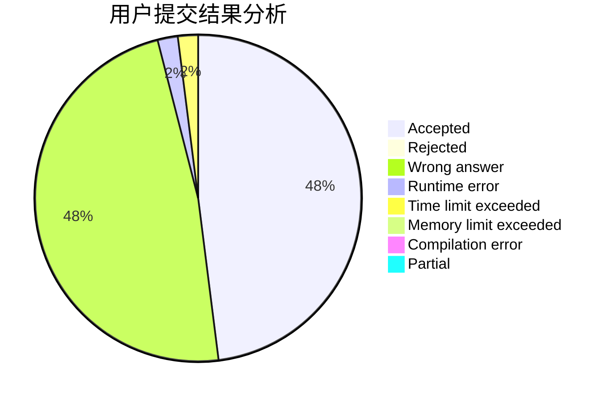
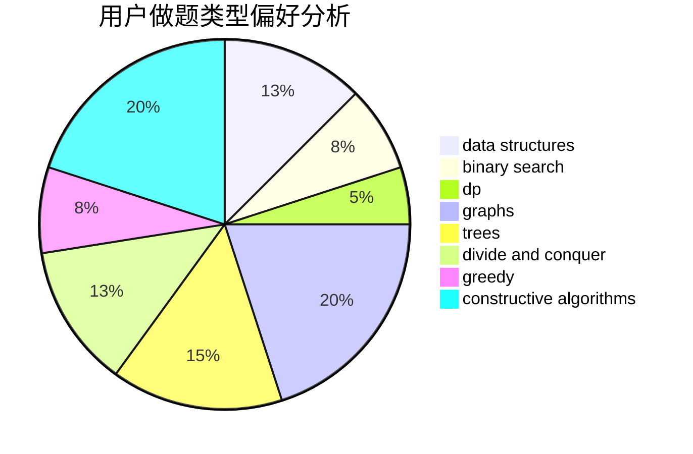

# DW_Zhouyu

<!-- tabs:start -->

#### **用户提交结果分析**

#### **用户做题类型偏好分析**

#### **用户错题知识点分析**

<!-- tabs:end -->
# 推荐题目
[77B](https://codeforces.com/contest/77/problem/B)		math,
                        probabilities		  
[780B](https://codeforces.com/contest/780/problem/B)		binary search		  
[16B](https://codeforces.com/contest/16/problem/B)		greedy,
                        implementation,
                        sortings		  
[77E](https://codeforces.com/contest/77/problem/E)		geometry		  
[780C](https://codeforces.com/contest/780/problem/C)		dfs and similar,
                        graphs,
                        greedy,
                        trees		  
[779E](https://codeforces.com/contest/779/problem/E)		dsu,graphs,sortings,trees		  
[780D](https://codeforces.com/contest/780/problem/D)		2-sat,
                        graphs,
                        greedy,
                        implementation,
                        shortest paths,
                        strings		  
[521E](https://codeforces.com/contest/521/problem/E)		dfs and similar,
                        graphs		  
[754E](https://codeforces.com/contest/754/problem/E)		bitmasks,
                        brute force,
                        fft,
                        strings,
                        trees		  
[780A](https://codeforces.com/contest/780/problem/A)		implementation		  
