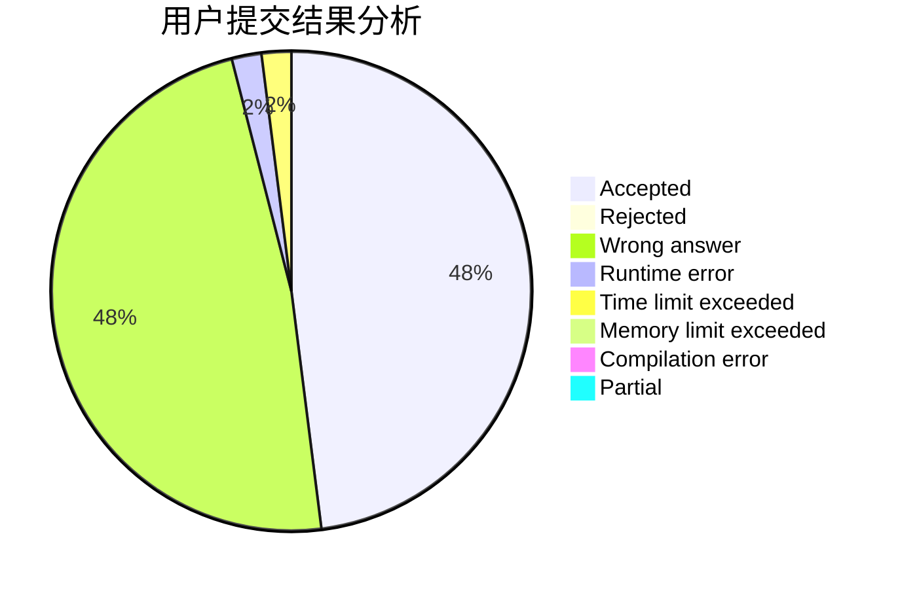
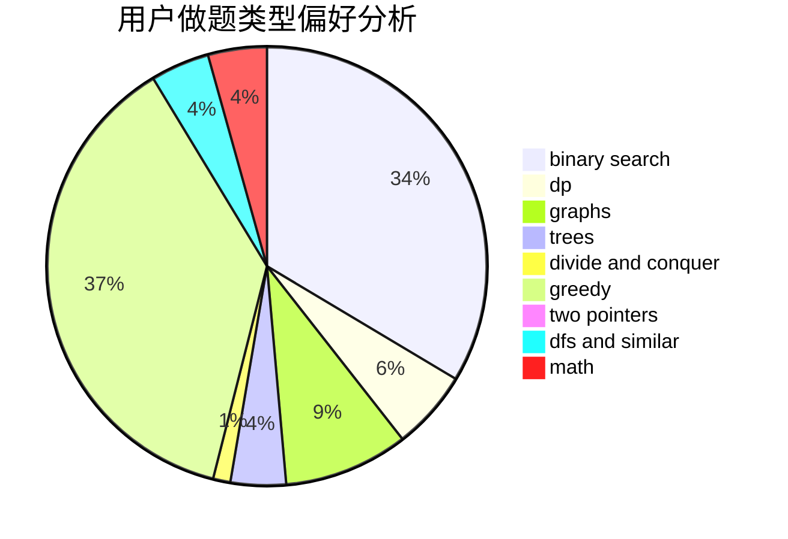

# DW_Zhouyu

<!-- tabs:start -->

#### **用户提交结果分析**

#### **用户做题类型偏好分析**

<!-- tabs:end -->
# 推荐题目
[77B](https://codeforces.com/contest/77/problem/B)
[780B](https://codeforces.com/contest/780/problem/B)
[16B](https://codeforces.com/contest/16/problem/B)
[77E](https://codeforces.com/contest/77/problem/E)
[780C](https://codeforces.com/contest/780/problem/C)
[779E](https://codeforces.com/contest/779/problem/E)
[780D](https://codeforces.com/contest/780/problem/D)
[521E](https://codeforces.com/contest/521/problem/E)
[754E](https://codeforces.com/contest/754/problem/E)
[780A](https://codeforces.com/contest/780/problem/A)
